# TA渲染方向

# 大纲

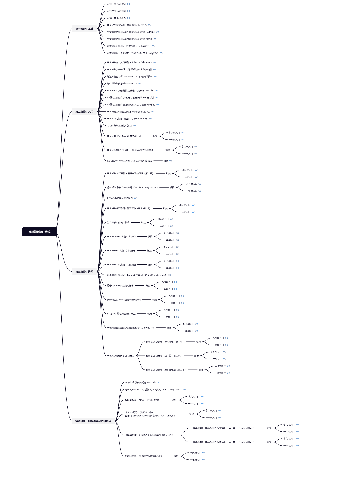

# 

# 数学软件

https://www.mathcha.io/wa

# [Unity基础](TA渲染方向/unity基础.md)

# [设计模式](TA渲染方向/设计模式.md)

基本方法：

1、封装复杂的方法，隐藏细节

2、对于经常修改的需求提取抽象接口

3、分层解耦

设计模式C++版  
观察者模式  
游戏设计中的设计模式

## 项目

### [红警](TA渲染方向/设计模式/红警.md)

- 状态模式
- 外观模式
- 单例模式
- 中介者模式
- 桥接模式
- 模板模式
- 策略模式
- 模板方法模式
- 工厂模式
- 建造者模式
- 享元模式
- 组合模式
- 命令模式
- 责任链模式
- 观察者模式
- 备忘录模式
- 访问者模式
- 适配器模式

[笔记]: notes\设计模式\学习笔记.md

# 光线追踪

[Whitted风格]: md\whitted风格光线追踪.md
[辐射度量学]: md\辐射度量学.md

# 光线步进

## 未完成

# 算法

## 未完成

[代码随想录]: md\代码随想录.md
[KMP]: md\KMP.md

# C#基础

[C#]: md\C#.md
[unity中的c#]: md\unity中的c#.md

# 骨骼动画

[DynamicBone]: 骨骼动画\DynamicBone.md

# Shader

# 课程笔记

## 未完成

[Kerry]: md\技术美术.md

# 项目

[re4]: re4\re4.md

‍

### Blender导出设置

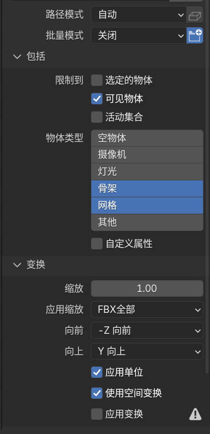

### Avatar替身系统

#### spine transform has bone length of zero 问题

检查模型骨骼是否有遮挡

#### 创建avatar

#### 使用动画

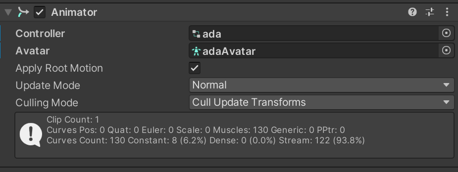

### Animation Rigging

#### 骨骼绘制

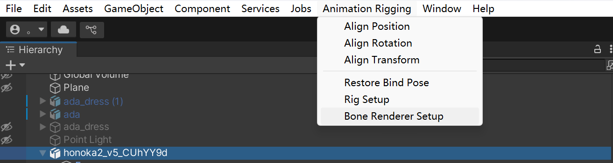

### ShaderGraph

### Magica Cloth

依赖：

com.unity.jobs

burst

#### 目录结构

#### 画笔修正

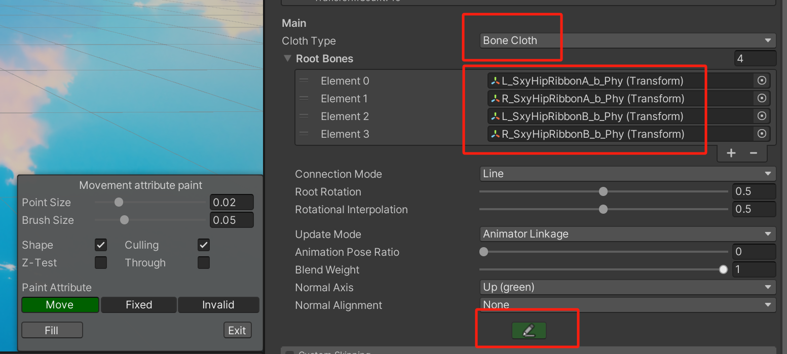

#### 参数

##### 主要参数

###### Root Rotation

根骨是否旋转，一般0.5

###### Animation Pose Ratio

自动蒙皮解算，一般0，消耗大

###### Rotation Interpolation

0.5

##### 布料效果

###### Force

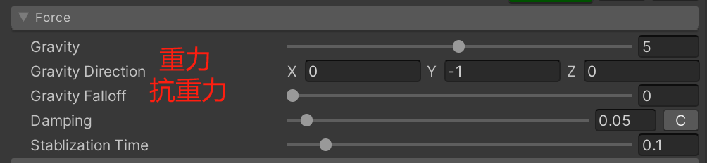

damping（阻力）较小时显得布料比较重

StablizationTime 形变恢复时间

###### Angle Restoration

stiffness（刚性）越大布料越硬

Velocity Attenuation（速度衰减）越小越Q弹

Gravity Falloff能够使倒立的状态下维持布料形态，头发应该为1

###### Angle Limit

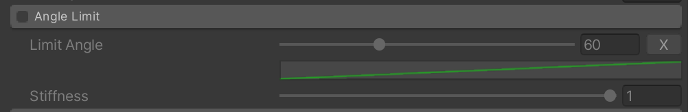

Limit Angle 限制晃动的角度

Stiffness 相当于限制的权重

###### Inertia 惯性

###### 惯性限制

防止速度太快导致布料异常

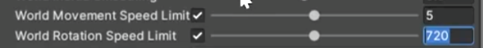

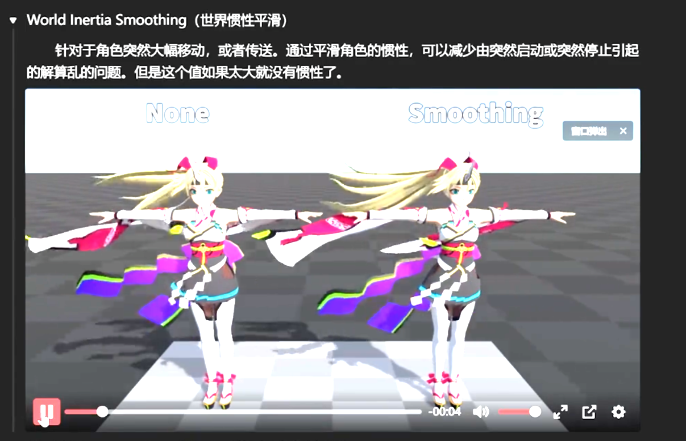

动画自身产生的惯性

惯性随着深度发送变化，深度是指骨骼离根部的距离

离心力，旋转时布料能否甩起

限制每根骨骼的最大速度

###### 传送判断

一帧之内的判断条件，下面时传送后重置布料解算

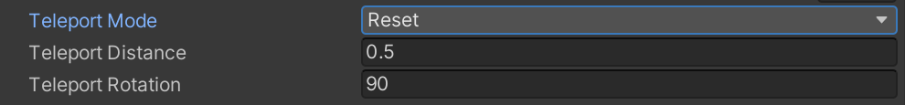

##### 布料穿插

Collider Collision设置

点模式和边模式

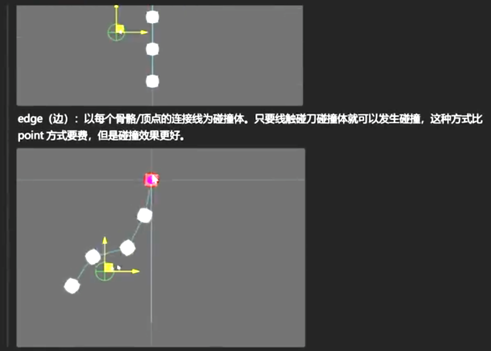

##### 形状保持

添加碰撞体之后还需要设置形状保持

按顺序的一圈

拖拽力，布料压缩程度，三角形变形程度

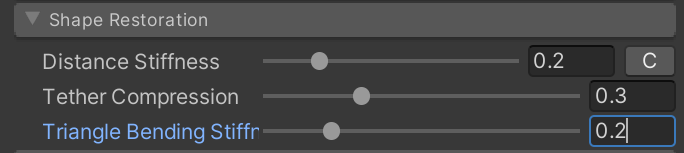

##### Movement Limit

##### 风力系统

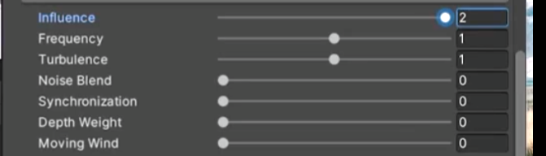

- 风力权重
- 风频
- 湍流权重
- 噪波混合正弦，0.7
- 一个magica cloth脚本骨骼之间的同步，越大越同步
- 深度权重，一般开一点

- 移动就有风 不需要风场 效果不再是直的

##### 弹簧（breast）

### 雨水效果

新建一个camera 使他看不到除了粒子系统之外的东西

### 雨水效果2

#### y轴偏移效果

#### 世界空间下的法线

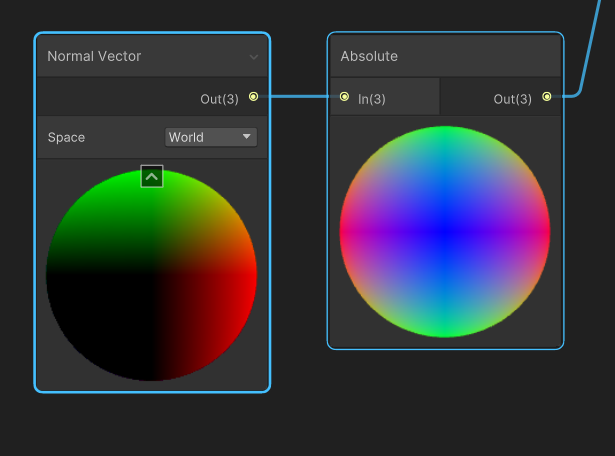

#### Saturate节点

限制取值在0-1

### 新的输入系统

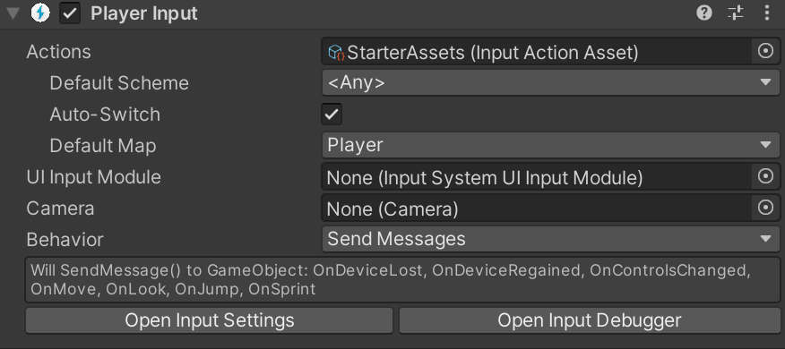

# 面试资料

https://www.yuque.com/chengxuyuanchangfeng/wg2e4q/ybq3h4cegwcwk8yz#D0VyE

**百人计划：**​[https://www.bilibili.com/video/BV1pJ411z7JD/?spm_id_from=333.337.search-card.all.click](https://link.zhihu.com/?target=https%3A//www.bilibili.com/video/BV1pJ411z7JD/%3Fspm_id_from%3D333.337.search-card.all.click)  
**庄懂的TA教程：**​[https://www.bilibili.com/video/BV1sE411g7N9/?spm_id_from=333.337.search-card.all.click](https://link.zhihu.com/?target=https%3A//www.bilibili.com/video/BV1sE411g7N9/%3Fspm_id_from%3D333.337.search-card.all.click)  
**Games101：**​[https://www.bilibili.com/video/BV1X7411F744/?spm_id_from=333.337.search-card.all.click](https://link.zhihu.com/?target=https%3A//www.bilibili.com/video/BV1X7411F744/%3Fspm_id_from%3D333.337.search-card.all.click)  
**Games104：**​[https://www.bilibili.com/video/BV1oU4y1R7Km/?spm_id_from=333.337.search-card.all.click](https://link.zhihu.com/?target=https%3A//www.bilibili.com/video/BV1oU4y1R7Km/%3Fspm_id_from%3D333.337.search-card.all.click)  
**Games202：**​[https://www.bilibili.com/video/BV1YK4y1T7yY/?spm_id_from=333.337.search-card.all.click](https://link.zhihu.com/?target=https%3A//www.bilibili.com/video/BV1YK4y1T7yY/%3Fspm_id_from%3D333.337.search-card.all.click)

‍
