# PlantVsZombie

# 创建序列帧动画

将所有sprite拖到场景中的GameObject

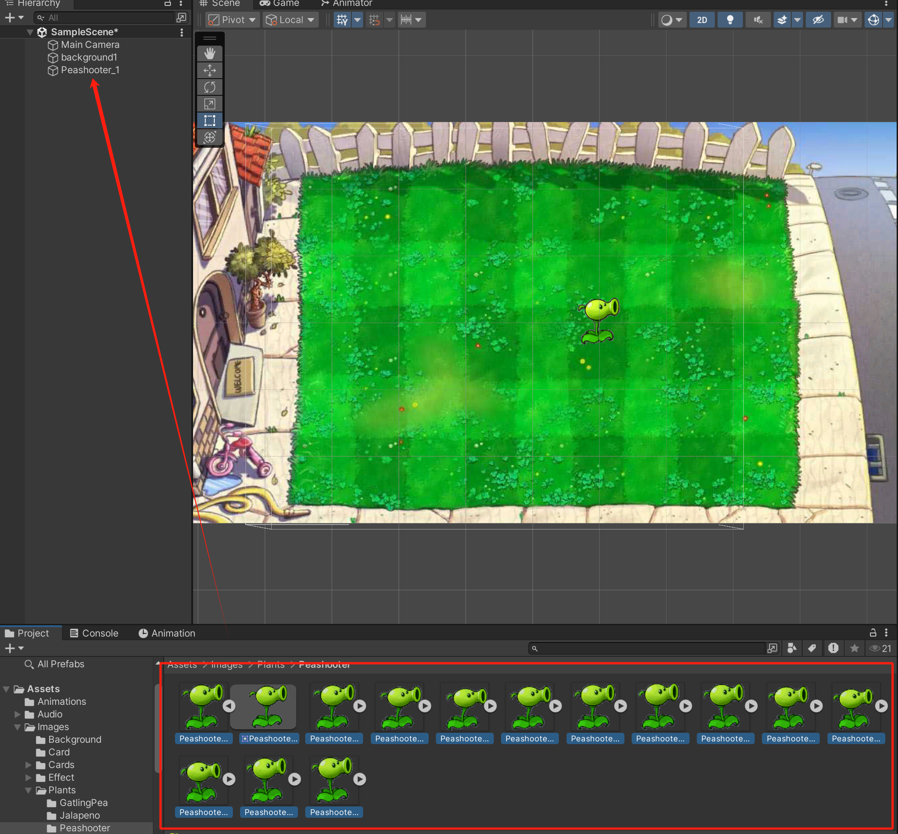

# 层级设置

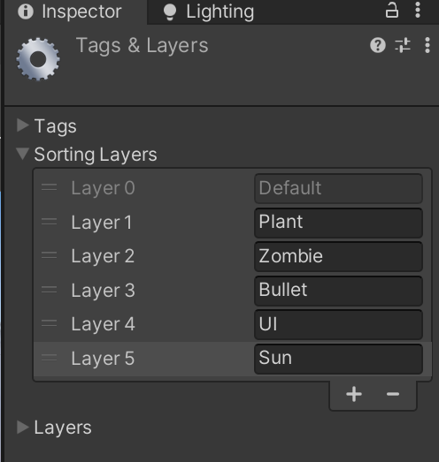

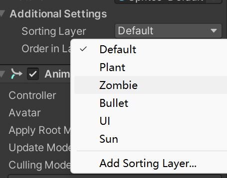

# 动画事件


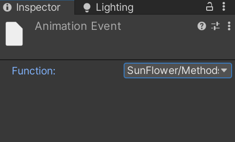

# 设置image比例

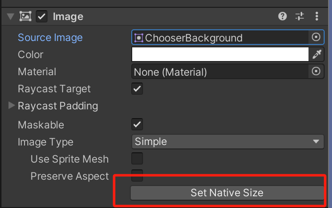

# 图片进度条

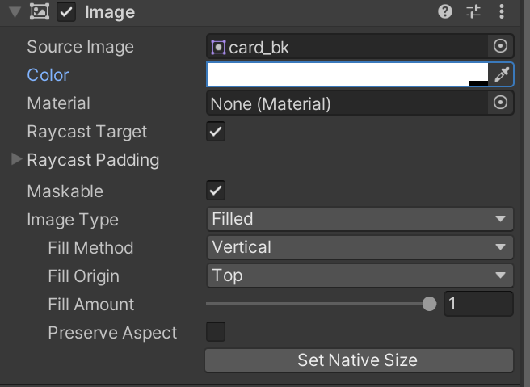

# Grid Layout

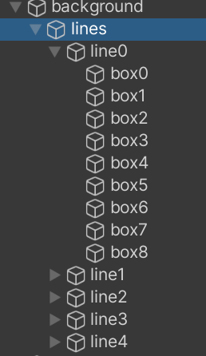

lines使用 horizontal

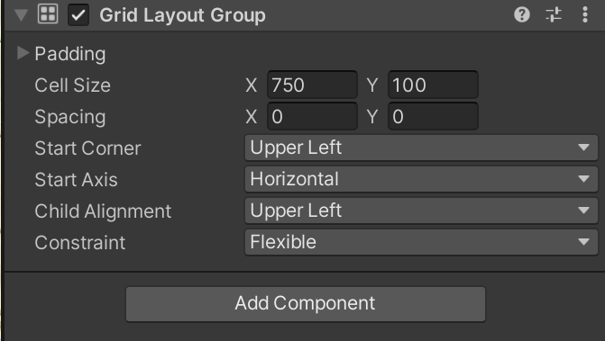

linex使用vertical，设置好cell size和box的碰撞体一致

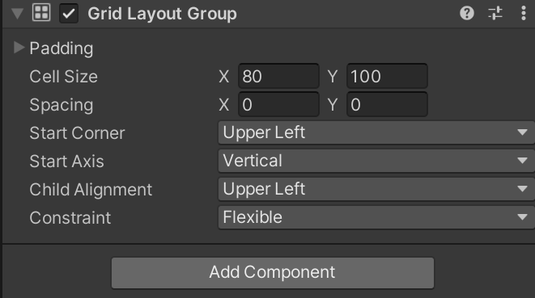

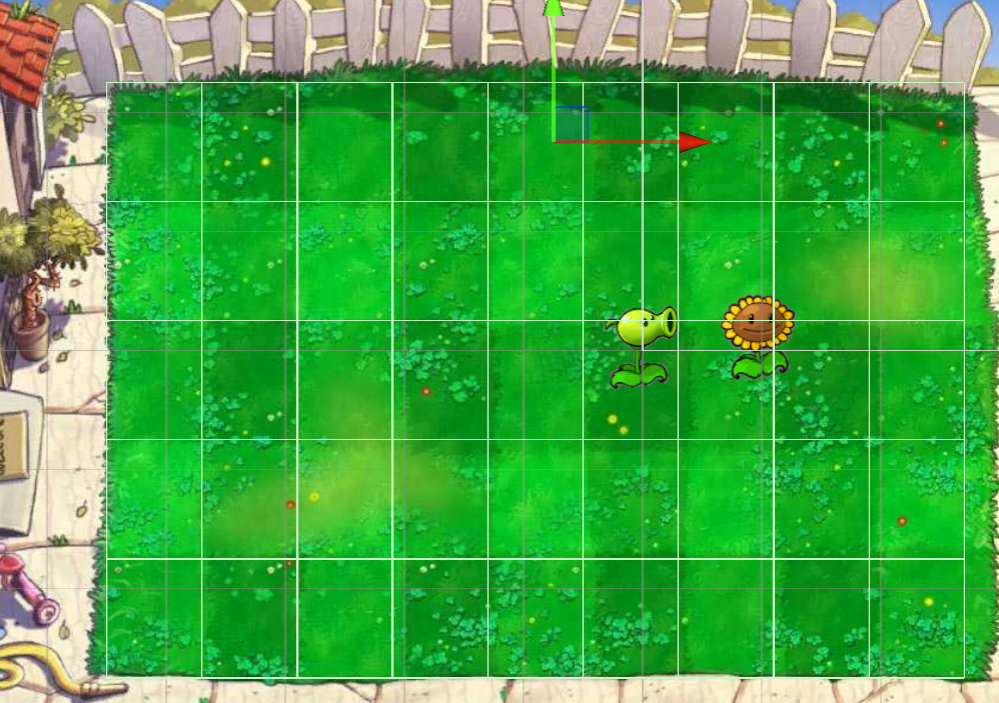

# 标签

给格子打上标签

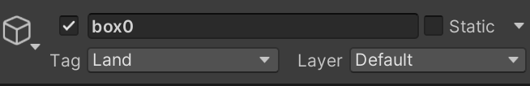

# Event System

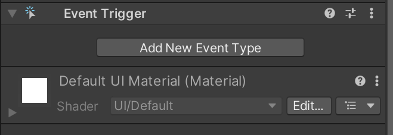

## 屏幕坐标、UI坐标、世界坐标转换

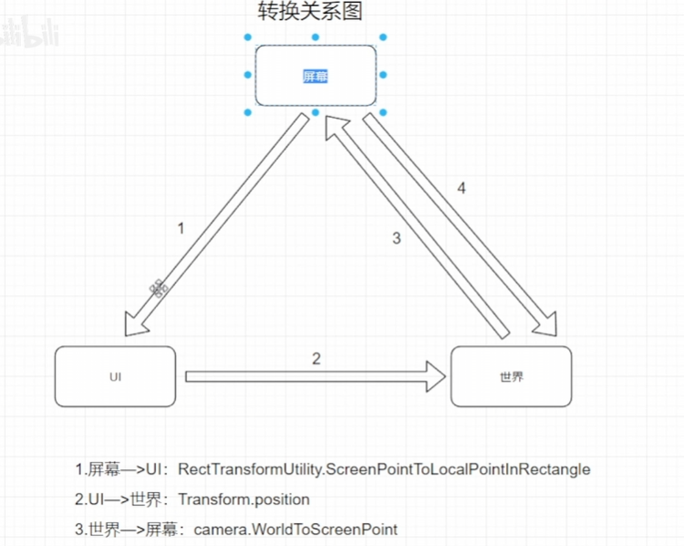

### 屏幕坐标

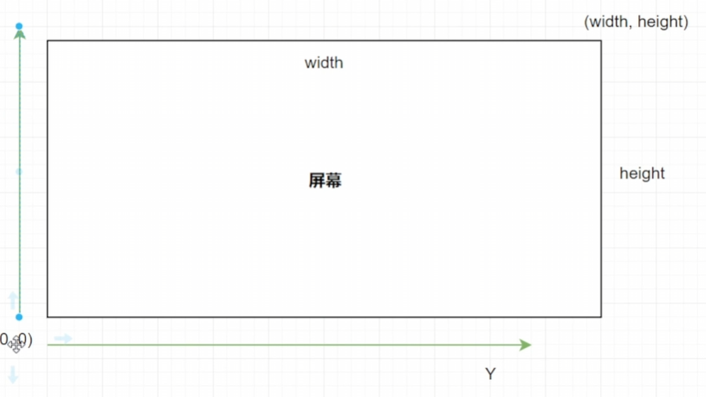

### UI坐标系

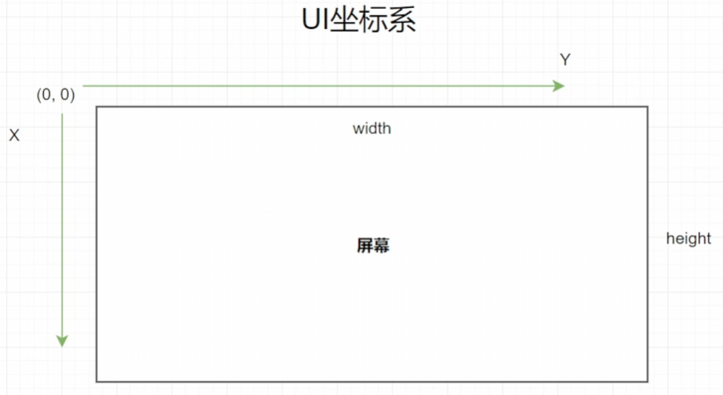

# 刚体和碰撞体

is trigger决定了物体碰撞后时穿过

kinematic 表示不需要物理行为

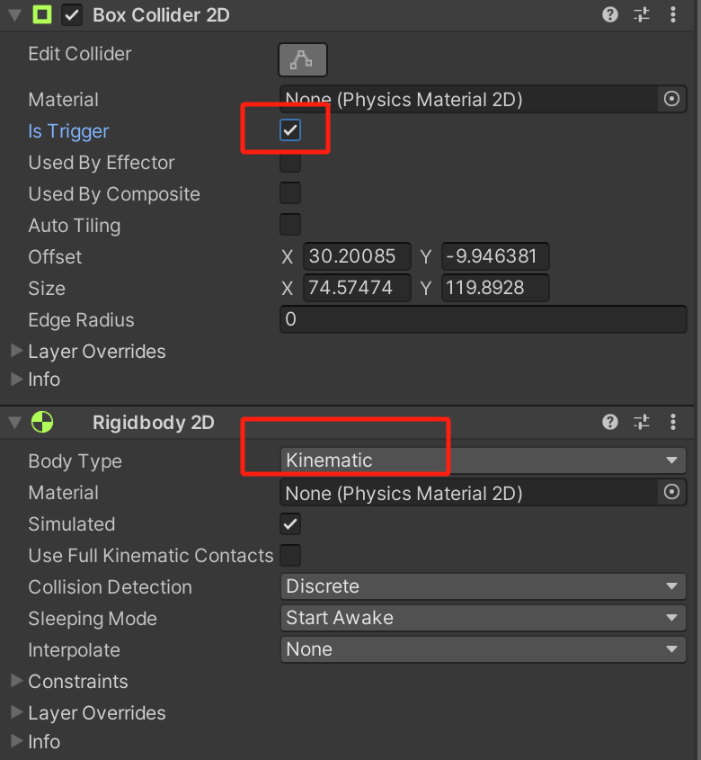

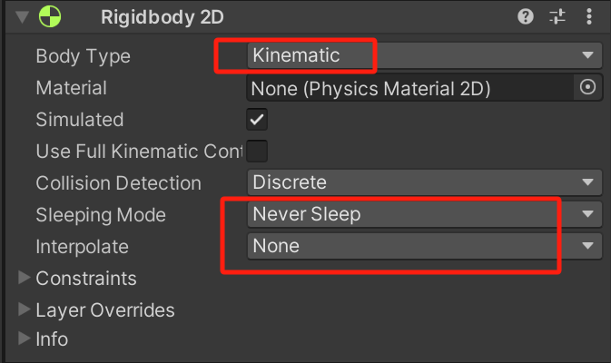

# 子弹销毁的方式

## 延迟销毁

```csharp
GameObject.Destroy(gameObject, 10);
```

## 碰撞销毁

# 鼠标事件

```csharp
public void OnDrag(BaseEventData data)
    {
        if (curGameObject == null)
        {
            return;
        }
        PointerEventData pointerEventData = data as PointerEventData;
        curGameObject.transform.position = TranslateScreenToWorld(pointerEventData.position);
    }
public static Vector3 TranslateScreenToWorld(Vector3 position)
    {
        Vector3 cameraTranslatePos = Camera.main.ScreenToWorldPoint(position);
        return new Vector3(cameraTranslatePos.x, cameraTranslatePos.y,0);
    }
```

# 判断某一个点击中的Collider

```csharp
Collider2D[] col = Physics2D.OverlapPointAll(TranslateScreenToWorld(pointerEventData.position));
        foreach (Collider2D c in col)
        {
            if (c.tag == TARGET && c.transform.childCount == 0)
            {
                curGameObject.transform.parent = c.transform;
                curGameObject.transform.localPosition = Vector3.zero;
                curGameObject = null;
            }
        }
```

# 判断是否active

```csharp
dark.activeSelf
```

# 很难点击到阳光的问题

## 原因分析

点击击中了格子，射线被格子挡住

## 解决方法

设置阳光的位置，使阳光更接近摄像机

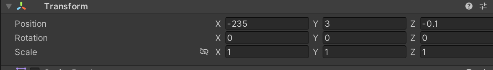

# 使用excel设计关卡

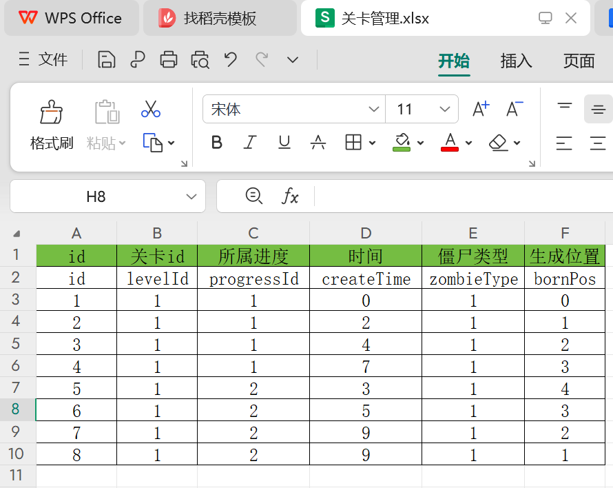

## 启动时运行Editor脚本代码

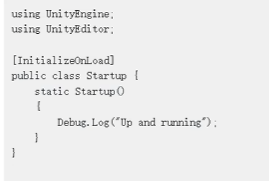

## 读取xlsl并保存为SO

```csharp
using UnityEngine;
using System.IO;
using OfficeOpenXml;
using UnityEditor;
using System.Reflection;
using System;

[InitializeOnLoad]
public class ReadTable
{
    public static bool needRead = false;
    private const string ZOMBIE_SHEET = "僵尸";
    static ReadTable()
    {
        if (! needRead)
        {
            return;
        }

        string path = Application.dataPath + "/Editor/关卡管理.xlsx";
        string assetName = "Level";

        FileInfo fileInfo = new FileInfo(path);

        // 创建序列化类
        LevelData levelData = (LevelData)ScriptableObject.CreateInstance(typeof(LevelData));

        using (ExcelPackage excelPackage = new ExcelPackage(fileInfo))
        {
            ExcelWorksheet workSheet = excelPackage.Workbook.Worksheets[ZOMBIE_SHEET];
            for (int i = workSheet.Dimension.Start.Row + 2; i < workSheet.Dimension.End.Row; i++)
            {
                LevelItem levelItem = new LevelItem();
                Type type = typeof(LevelItem);
                for (int j = workSheet.Dimension.Start.Column; j < workSheet.Dimension.End.Column; j++)
                {
                    FieldInfo variable = type.GetField(workSheet.GetValue(2, j).ToString());
                    string tableValue = workSheet.GetValue(i,j).ToString();
                    variable.SetValue(levelItem, Convert.ChangeType(tableValue, variable.FieldType));
                }
                levelData.levelDataList.Add(levelItem);
            }
        }
        

        AssetDatabase.CreateAsset(levelData,"Assets/Resources/" + assetName + ".asset");
        AssetDatabase.SaveAssets();
        AssetDatabase.Refresh();

    }
    
}
```

# Start在下一帧执行导致的target不正确的问题

在CreateSunDown中创建了太阳并且设置了target，但是由于sun的start在下一帧才会调用，会导致赋值不正确

```csharp
GameObject sun = Instantiate(sunPrefab,bornPos,Quaternion.identity);

float y = Random.Range(leftBottom.y - 80, leftBottom.y - 30);
sun.GetComponent<Sun>().SetTargetPosition(new Vector3(bornPos.x,y,0));
```

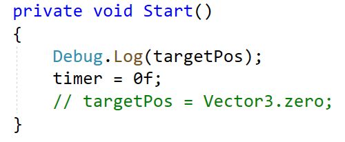

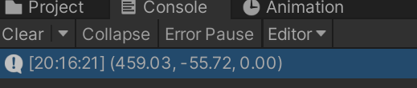

如果把注释打开，值就会被覆盖

# 音效

## PlayOneShot

用于叠加音效，不会覆盖

# 程序动画插件DOTween

Set设置状态，Do执行

## 案例

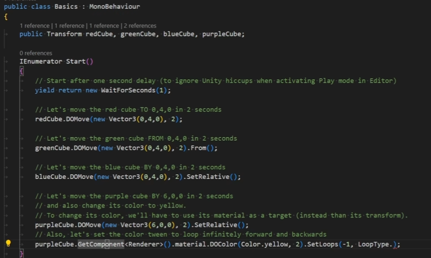

## 动画序列

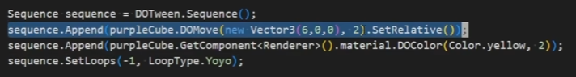

## 回调

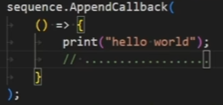

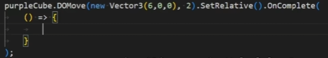

# 清除补间动画

DOTween.Clear();

## 疑问

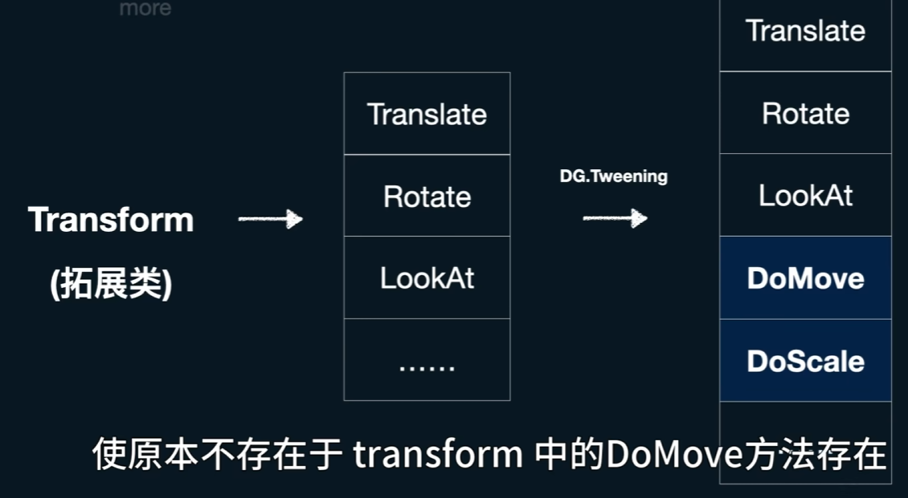

# 异步加载场景

```csharp
// 开始加载
AsyncOperation operation = SceneManager.LoadSceneAsync("Menu");
operation.allowSceneActivation = false; // 不立即切换场景

// Update
curProgress = Mathf.Clamp01(operation.progress / 0.9f);
OnSliderValueChange(curProgress);

// 点击后切换
operation.allowSceneActivation = true;
```

# [实现自动排布并且父物体适应子物体尺寸](TA渲染方向/unity基础/UI.md#20250321195159-njxha0m)

# [Json存储](PlantVsZombie/Json存储.md)

‍
