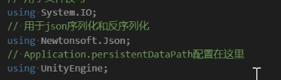

# Json存储

# 需要的库文件



# 存储在Application.persistentDataPath

windows下是：

C:\Users\王周凯\AppData\LocalLow\DefaultCompany\pvz\users

# 框架

- 缓存加速
- 简单异或加密
- 使用Newtonsoft存取

```csharp
using System.Collections.Generic;
using UnityEngine;
using Newtonsoft.Json;
using System.IO;

public class LocalConfig
{
    private const string PREFIX = "/users";
    public static Dictionary<string, UserData> usersData = new Dictionary<string, UserData>();
    public static char[] keyChars = { 'a', 'b', 'c', 'd', 'e' };


    // 异或加密
    public static string Encrypt(string data)
    {
        char[] dataChars = data.ToCharArray();
        for (int i = 0; i < dataChars.Length; i++)
        {
            char dataChar = dataChars[i];
            char keyChar = keyChars[i % keyChars.Length];
            char newChar = (char)(dataChar ^ keyChar);
            dataChars[i] = newChar;
        }
        return new string(dataChars);
    }

    // 解密
    public static string Decrypt(string data)
    {
        return Encrypt(data);
    }

    public static void SaveUserData(UserData userData)
    {
        // 保存用户数据为文本文件
        if (!File.Exists(Application.persistentDataPath + PREFIX))
        {
            System.IO.Directory.CreateDirectory(Application.persistentDataPath + PREFIX);
        }
        // 保存缓存
        usersData[userData.name] = userData;

        // 转换用户数据为JSON字符串
        string jsonData = JsonConvert.SerializeObject(userData);

        // 加密
        jsonData = Encrypt(jsonData);

        // 将JSON字符串写入文件中
        File.WriteAllText(Application.persistentDataPath + $"{PREFIX}/{userData.name}.json", jsonData);

    }

    public static UserData LoadUserData(string userName)
    {

        // 先从缓存读取
        if (usersData.ContainsKey(userName))
        {
            return usersData[userName];
        }

        // 返回用户数据到内存
        string path = Application.persistentDataPath + $"{PREFIX}/{userName}.json";
        UserData userData = null;
        if (File.Exists(path))
        {
            string jsonData = File.ReadAllText(path);

            // 解密
            jsonData = Decrypt(jsonData);

            userData = JsonConvert.DeserializeObject<UserData>(jsonData);
        }

        return userData;

    }

}
```

# 使用UnityEditor的MenuItem方便测试

```csharp
using UnityEngine;
using UnityEditor;

public class GMCmd
{
 
    [MenuItem("CMCmd/SaveLocalConfig")]
    public static void SaveLocalConfig()
    {
        for (int i = 0; i < 5; i++)
        {
            UserData userData = new UserData();
            userData.name = "test" + i.ToString();
            userData.level = i;
            LocalConfig.SaveUserData(userData);
        }
        Debug.Log("Save End!");
    }

    [MenuItem("CMCmd/LoadLocalConfig")]
    public static void LoadLocalConfig()
    {
        for (int i = 0; i < 5; i++)
        {
            string name = "test" + i.ToString();
            UserData userData = LocalConfig.LoadUserData(name);
            Debug.Log(userData.name);
            Debug.Log(userData.level);
        }
    }

}
```
