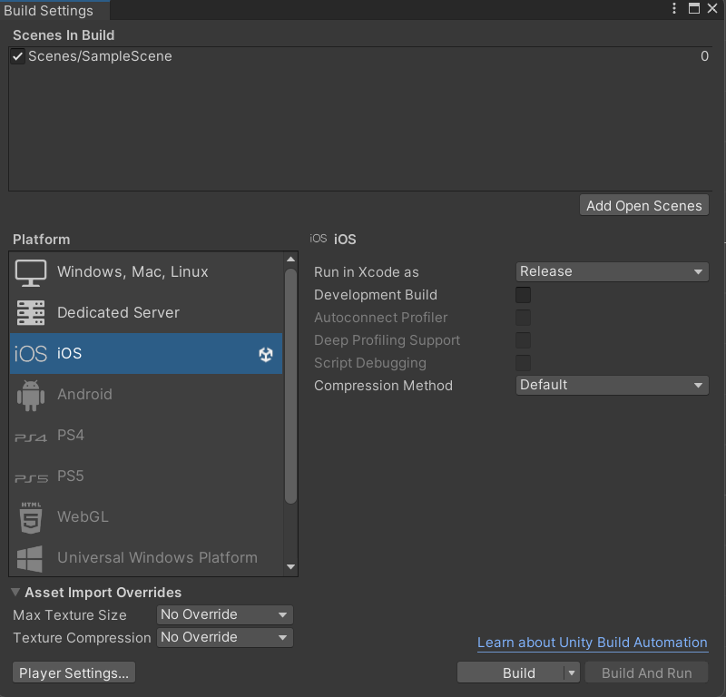
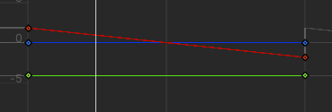
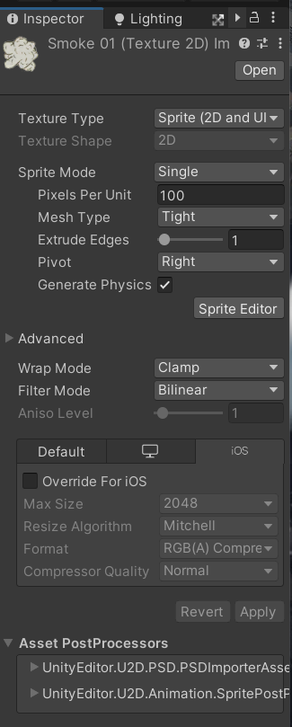

# 疯狂小鸟

# Build平台设置



# 动画曲线

设置两侧为Broken-Linear实现动画平滑



# 设置Sprite的Pivot



# 协程生成管道

```c#
    public void StartRun()
    {
        coroutine = StartCoroutine(GeneratePiplines());
    }

    public void StopRun()
    {
        StopCoroutine(coroutine);
    }

    IEnumerator GeneratePiplines()
    {
        while (true)
        {
            GeneratePipline();
            yield return new WaitForSeconds(2f);
        }
    }
  
    private void GeneratePipline()
    {
        Instantiate(template, transform);
    }
```

‍
