# KitchenChaos

- 动画切换与程序逻辑分离
- 玩家输入与游戏逻辑分离

# URP的管线设置

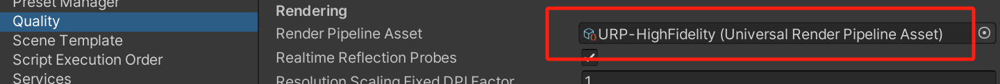

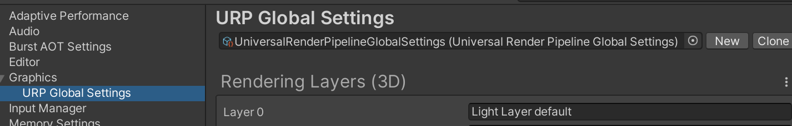

# 代码规范

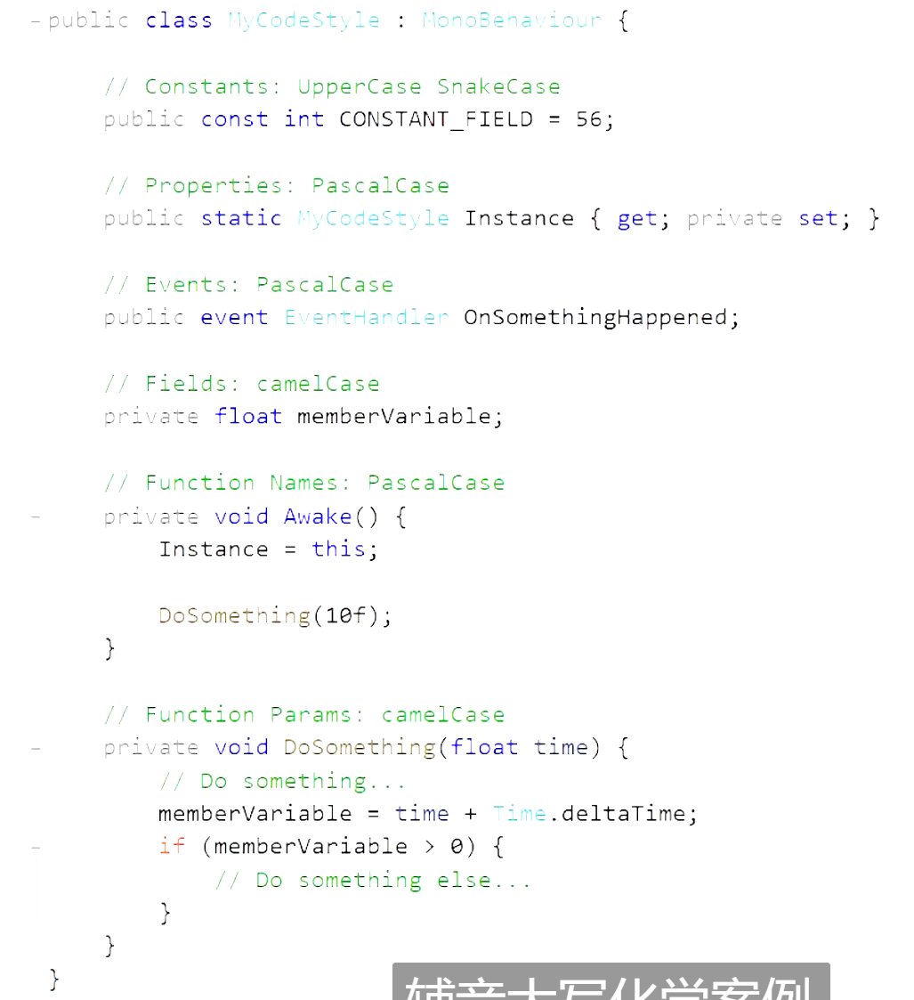

# Global Volume（后处理相关）

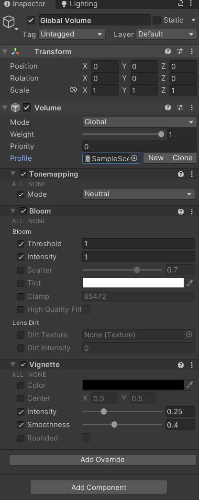

删除原有Profile

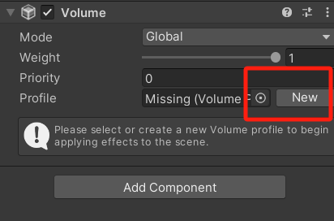

camera中启用后处理

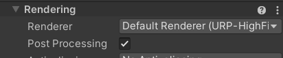

在render pipline确保开启了后处理

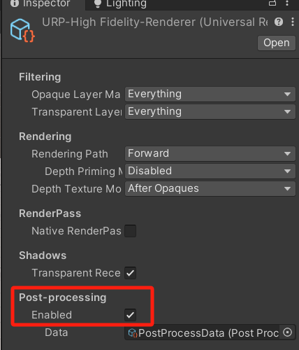

# 添加AO

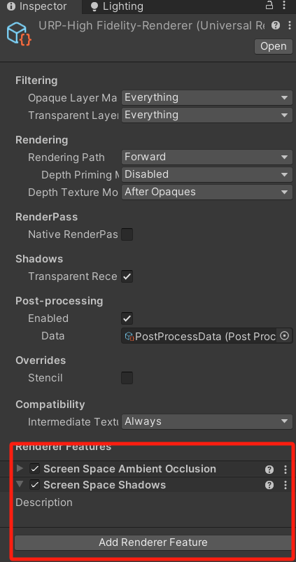

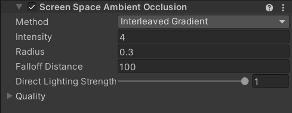

# 垂直同步开关

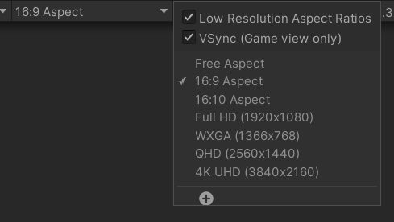

# [SerializeField]

可以使一个属性是私有的同时允许 inspector 修改

# Animator

关于animation的制作，move到idle的状态希望body不动，所以在idle的第一帧要设置body的位置

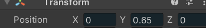

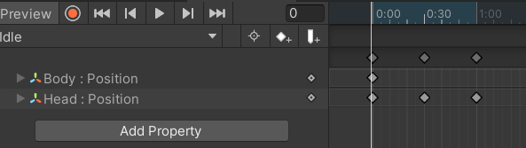

只有对象身上的animator有该animation的状态时才可以切换

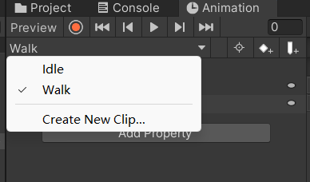

# Cinemachine

添加Virtual Camera

添加柏林噪声，模拟手持相机效果

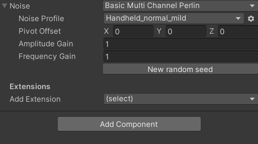

## 控制cinemachine的相机跟随

cinemachine允许存在多个虚拟相机，通过设置优先级决定谁是主导


# new Input System

启用

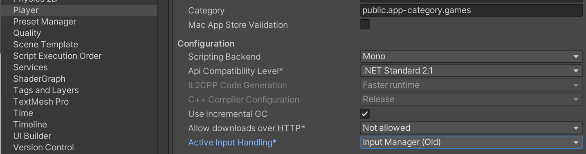

新建player action asset


内容

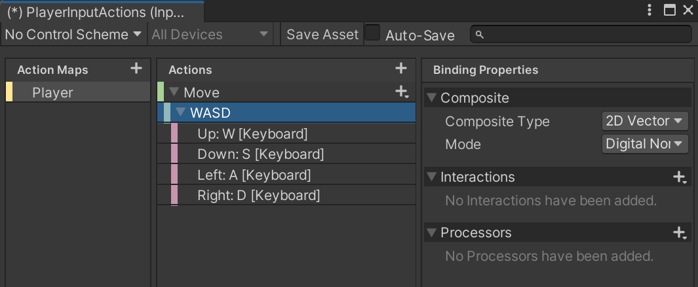

在player对象上添加player input

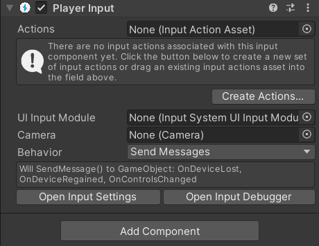

或者从asset生成脚本

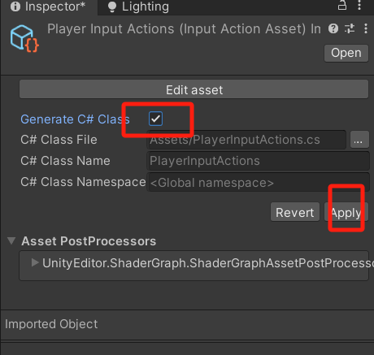


GameInput中激活

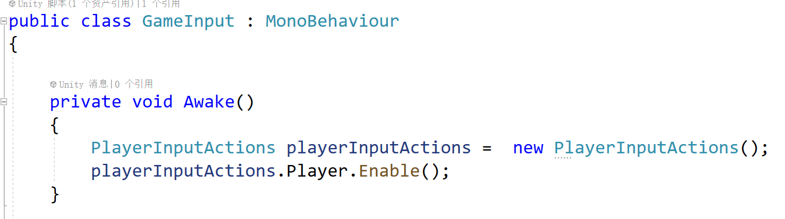

注意PlayerInputActions对象需要手动释放

虽然理论上对象销毁后事件监听器应该被清理，但由于 Unity 的 Input System 的特殊性（涉及非托管资源和全局状态），显式调用 `Dispose()` 是必要的。这是一种良好的编程习惯，可以避免资源泄漏和潜在的运行时错误。

如果不调用 `Dispose()`，可能会导致：

- 资源泄漏。
- 旧的事件监听器被触发。
- 输入系统状态不一致。

因此，**始终在** **​`OnDestroy`​**​ **中调用** **​`Dispose()`​**  是推荐的做法。

```csharp
private void OnDestroy()
{
        playerInputActions.Player.Interact.performed -= Interact_performed; // Add listener
        playerInputActions.Player.InteractAlternate.performed -= InteractAlternate_performed;
        playerInputActions.Player.Pause.performed -= Pause_performed;

        playerInputActions.Dispose();
}
```

即使添加新的操作模式后脚本内容也会自动更新

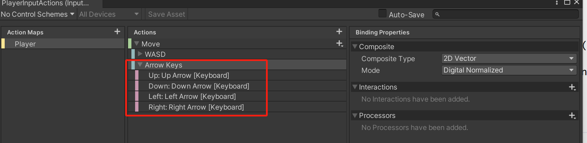

连接手柄时可以看到

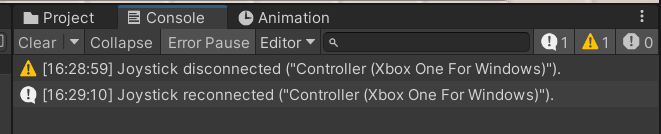

添加手柄

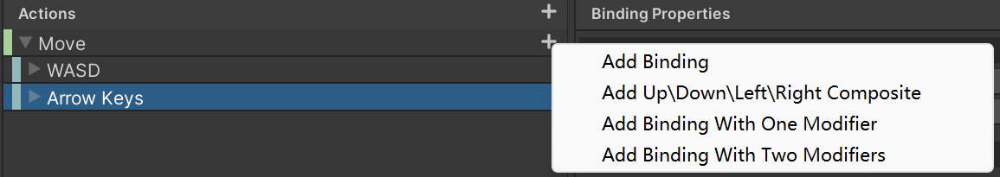

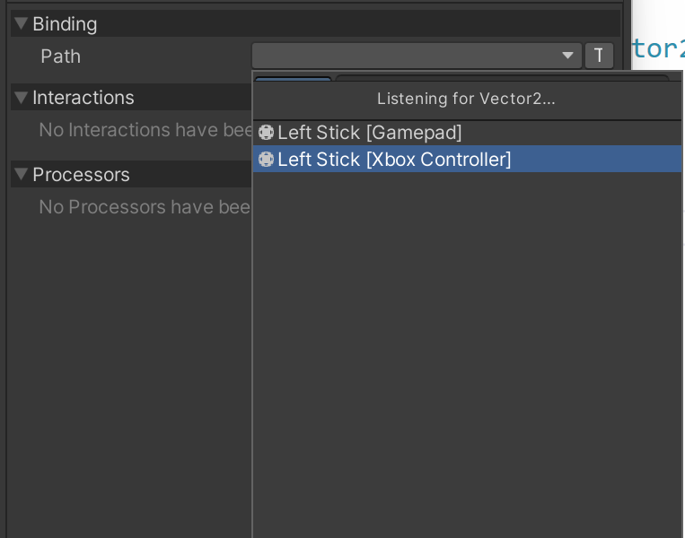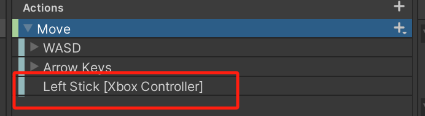

# 碰撞检测

[射线检测](常用脚本/射线检测实现碰撞检测.md)

# 添加LayerMask

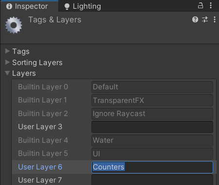

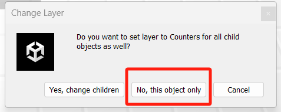

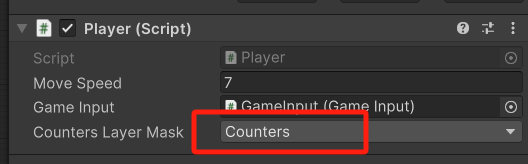

# [事件](c#.md#20250217210605-lyq2o0z)

## 自定义事件

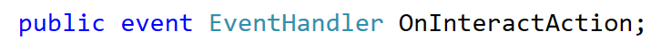

## 触发自定义事件的两种写法

判断事件的订阅者是否为空

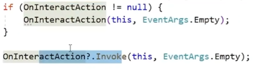

## 订阅输入系统的事件

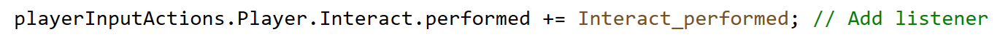

## 自定义的EventArgs

```csharp
public event EventHandler<OnSelectedCounterChangedEventArgs> OnSelectedCounterChanged;
public class OnSelectedCounterChangedEventArgs:EventArgs
    {
        public ClearCounter selectedCounter;
    }

// 触发
 OnSelectedCounterChanged?.Invoke(this, new OnSelectedCounterChangedEventArgs
        {
            selectedCounter = selectedCounter
        });
```

# ScriptableObject（享元模式的一种体现）

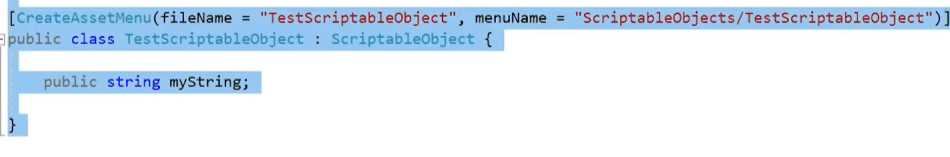

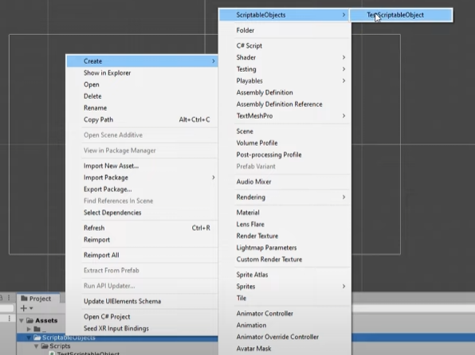

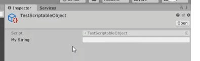

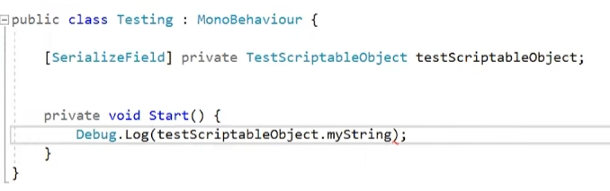

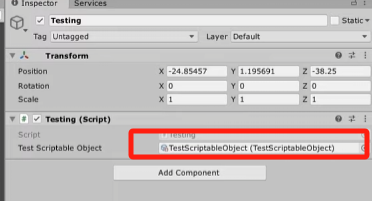

# 预制体变体

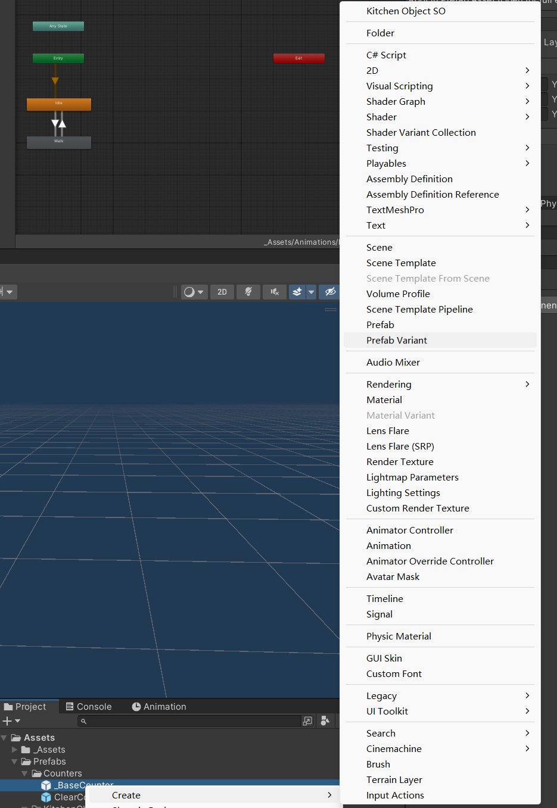

# 物体上的UI

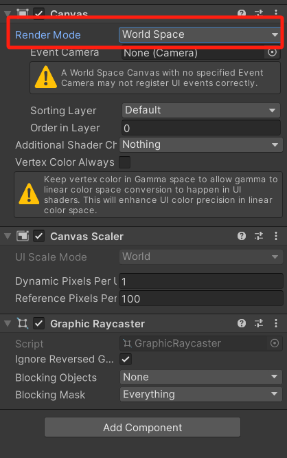

## 用image制作进度条

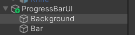

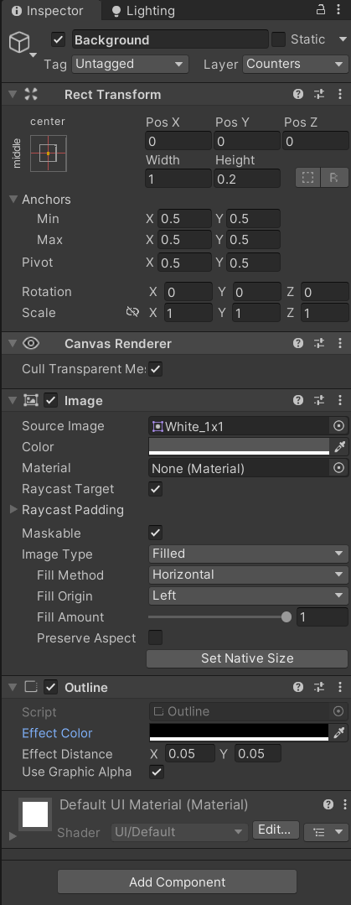

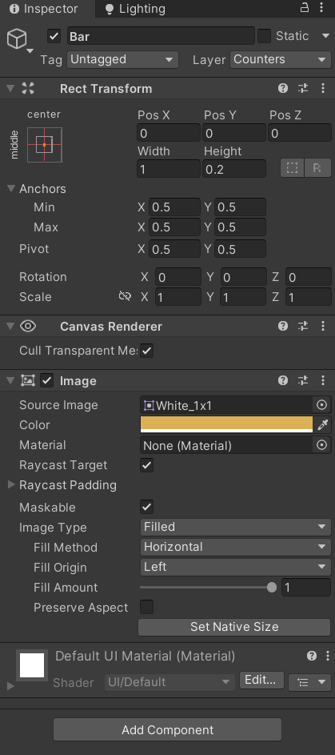

# [协程](KitchenChaos/协程.md)

```csharp
private void Start()
{
	StartCoroutine(HandleFryTimer());
}

private IEnumerator HandleFryTimer()
{
	yield return new WaitForSeconds(1f);
}
```

# Unity不会在inspector中暴露接口

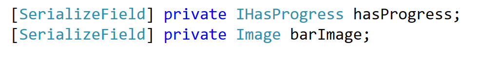

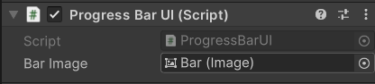

# 如何显示结构体

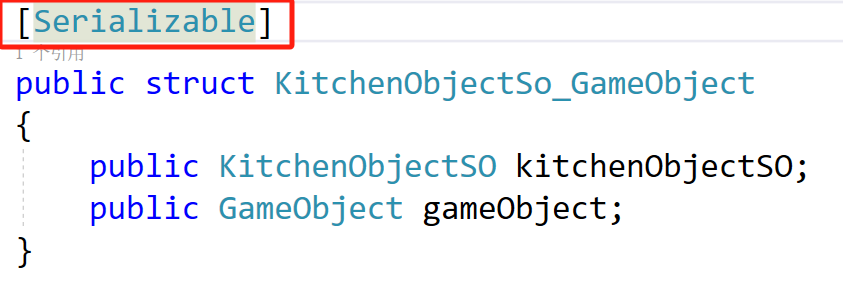

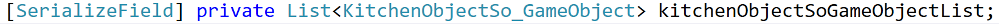


# UI格子布局

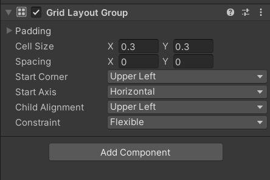

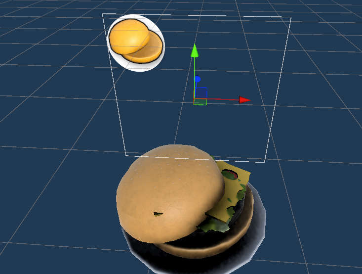

# 避免预制件过多的方法（Template）

用一个制作好的Template进行复制

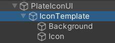

复制对象

```c#
[SerializeField] private Transform iconTemplate;
...
Transform iconTransform = Instantiate(iconTemplate,transform);
```

# 音乐的优先级

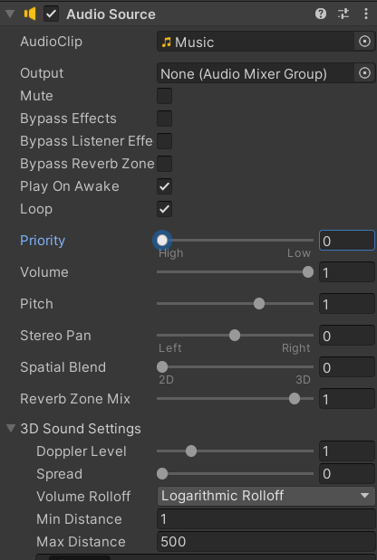

# <span id="20250227171307-hgumo6y" style="display: none;"></span>初识TextMeshProUGUI（所在库TMPro）

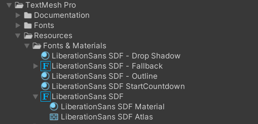

要带有LiberationSans SDF才能识别

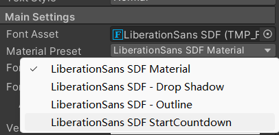

现在就可以随意修改而不影响其他的文字


# <span id="20250302164606-vqhhwov" style="display: none;"></span>场景切换 SceneManagement

using UnityEngine.SceneManagement


# Canvas设置


# <span id="20250302184643-1o4qims" style="display: none;"></span>场景间通信的方式

申明静态类

```public
public static class Loader{ ... }
```

在两个场景之间加入一个Loader场景，场景A调用Load进入Loader场景


Loader场景的第一帧加载目标场景，由MonoBehaviour.Start调用


# 存储变量

```csharp
PlayerPrefs.SetFloat(PLAYER_PREFS_MUSIC_VOLUME , volume);
PlayerPrefs.Save();
```

# 获取绑定的按键

## 定义一个枚举作为抽象层


## 从playerAction获取按键字符串

每个action是一个一维数组


# 重新分配按键

```csharp
using UnityEngine.InputSystem;

public void RebindBinding(Binding binding, Action onActionRebound)
    {
        playerInputActions.Player.Disable();

        InputAction inputAction;
        int bindingIndex;

        switch (binding)
        {
            default:
            case Binding.Move_Up:
                inputAction = playerInputActions.Player.Move;
                bindingIndex = 1;
                break;
            case Binding.Move_Down:
                inputAction = playerInputActions.Player.Move;
                bindingIndex = 2;
                break;
            case Binding.Move_Left:
                inputAction = playerInputActions.Player.Move;
                bindingIndex = 3;
                break;
            case Binding.Move_Right:
                inputAction = playerInputActions.Player.Move;
                bindingIndex = 4;
                break;
            case Binding.Interact:
                inputAction = playerInputActions.Player.Interact;
                bindingIndex = 0;
                break;
            case Binding.Interact_Alternate:
                inputAction = playerInputActions.Player.InteractAlternate;
                bindingIndex = 0;
                break;
            case Binding.Pause:
                inputAction = playerInputActions.Player.Pause;
                bindingIndex = 0;
                break;
        }

        inputAction.PerformInteractiveRebinding(bindingIndex)
            .OnComplete(callback => {
                callback.Dispose();
                playerInputActions.Player.Enable();
                onActionRebound();

				PlayerPrefs.SetString(PLAYER_PREFS_BINDINGS, playerInputActions.SaveBindingOverridesAsJson());
				PlayerPrefs.Save();
            })
            .Start();
    }
```

## 保存按键

```csharp
PlayerPrefs.SetString(PLAYER_PREFS_BINDINGS, playerInputActions.SaveBindingOverridesAsJson());
PlayerPrefs.Save();
```

## 读取按键

```csharp
playerInputActions =  new PlayerInputActions();
if (PlayerPrefs.HasKey(PLAYER_PREFS_BINDINGS))
{
    playerInputActions.LoadBindingOverridesFromJson(PlayerPrefs.GetString(PLAYER_PREFS_BINDINGS));
}
playerInputActions.Player.Enable();
```

‍

# 手柄死区问题

避免角色漂移


# UI的EventSystem设置，支持手柄输入


## selectColor设置

resumButton.Select();


# 如何在打开其他UI后能够回到本UI

```csharp
// 打开ui调用
Hide();
OptionsUI.Instance.Show(Show);
// 目标ui的申明
public void Show(Action onCloseButtonAction)
{
        this.onCloseButtonAction = onCloseButtonAction;

        gameObject.SetActive(true);

        soundEffectsButton.Select();
}
// 关闭时回调
closeButton.onClick.AddListener(() =>
{
            Hide();
            onCloseButtonAction();
});
```

‍
