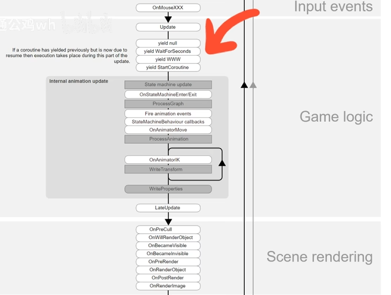
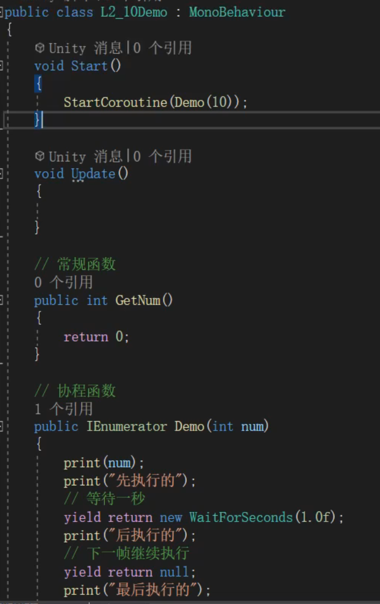
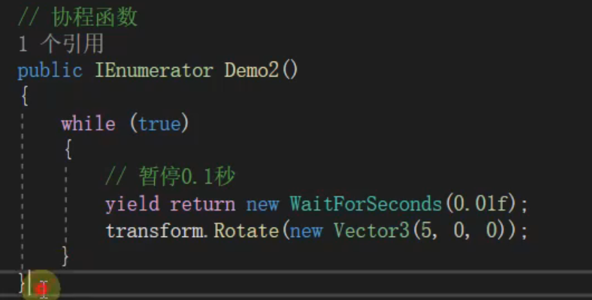
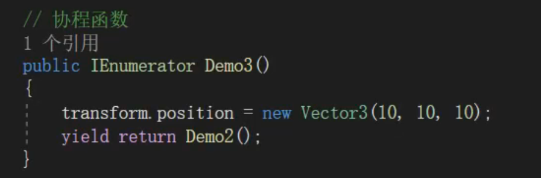
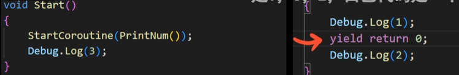
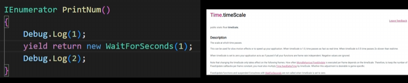
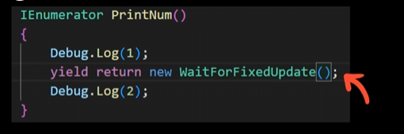
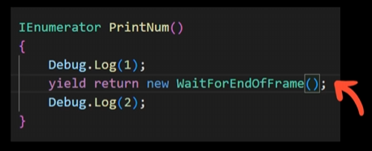
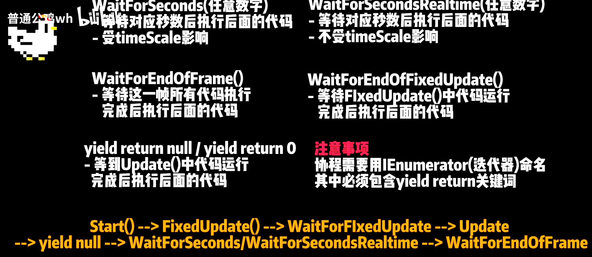
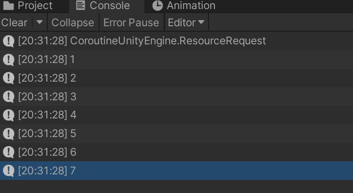

# 协程





# 协程也可以做动画



# 返回另外一个协程



# 例：

yield return null; 是同样的结果



返回132，原因是当执行到yield时程序被暂时挂起


waitForSeconds受timescale影响




在fixedUpdate后执行



最后执行





# 例子

```csharp
IEnumerator LoadTable()
    {
        ResourceRequest request = Resources.LoadAsync("Level");
        Debug.Log("Coroutine" + request);
        yield return request;

        levelData = request.asset as LevelData;
        for (int i = 0; i < levelData.levelDataList.Count; i++)
        {
            Debug.Log(levelData.levelDataList[i].id);
        }
    }
```

输出



当执行到return时，程序挂起等待request加载完成

# 取消协程

## 取消全部


## 明确的关闭某个协程（推荐）


## 取消某个协程函数的全部


‍
