# c#

# 单行赋值

```csharp
int c=30,d=20;
```

# 控制台输入输出

```c#
class Program
{
    static void Main(string[] args)
    {
        Console.Write("hello ");
        Console.WriteLine("world");

        // 等待输入（回车结束）
        Console.ReadLine();
        Console.WriteLine("输入完毕");

        // 读取任意键盘输入
        Console.ReadKey();
        Console.WriteLine("输入完毕");
    }
}
```

# 格式化输出

```csharp
Debug.LogFormat("{0}{1}",var1,var2);
```

# 折叠代码

```c#
#region Console
Console.Write("hello ");
Console.WriteLine("world");

// 等待输入（回车结束）
Console.ReadLine();
Console.WriteLine("输入完毕");

// 读取任意键盘输入
Console.ReadKey();
Console.WriteLine("输入完毕");
#endregion
```

# 变量类型

## 基本变量类型

- 有符号整型

  - sbyte -128~127  8位
  - int -21亿<sub>21亿 （-2,147,483,648</sub>2,147,483,647）32位
  - short -32768~32767 16位
  - long -9百万兆~9百万兆 （-9,223,372,036,854,775,808 ~ 9,223,372,036,854,775,807）64位
- 无符号整型

  - byte 0~255 8位
  - uint 0~42亿 32位
  - ushort 0~65535 16位
  - long 0~18万兆 64位
- 浮点数

  - 默认0.12这样的为double
  - float 7 or 8位有效数字，编译器决定，自动四舍五入 32位

    ```c#
    float f1 = 0.123456789f;
    float f2 = 1000;
    ```
  - double 15 ~ 17位有效数字，自动四舍五入 64位
  - decimal 27 ~ 28 位有效数字，自动四舍五入 128位

    ```c#
    decimal de = 0.123456789m;
    ```
- 特殊类型

  - bool 8位
  - char 16位
  - string 可变

## 多变量声明

```c#
int a1 = 1, a2 = 2;
```

## 枚举

枚举的权限不能低于字段的权限

```csharp
// 必须使public 不然访问不到
public enum emAction
{
        GetUp,
        Wash,
        Eat,
        Play
}
/*public enum emAction
{
        GetUp = 0,
        Wash, // 0+1
        Eat,// 0+2
        Play// 0+3
}*/

public emAction mAction;
```

### 枚举的输出

```csharp
Debug.Log(mAction); // None
Debug.Log(mAction.ToString()); // None
```

### 字符串转枚举

```csharp
// Wash必须在枚举中存在
mAction = (emAction)Enum.Parse(typeof(emAction), "Wash");
Debug.Log(mAction.ToString()); // Wash
```

### 枚举转int

```csharp
Debug.Log((int)mAction); // 0
// 或
Convert.ToInt32(mAction);
```

### int转枚举

```csharp
mAction = (emAction)3;
// 或
mAction = (emAction)Enum.ToObject(typeof(emAction),3);
```

## 常量 const

- 必须初始化
- 不能被修改

# 转义字符

\字符

- 制表符\t
- 光标退格\b

  ```c#
  string str = "123\b123";
  // 12123
  ```
- 空字符\0
- 警报音\a

## 取消转义字符

```c#
string str = @"哈哈\哈哈";
```

# 类型转换

## 隐式转换

- 相同大类型之间大范围装小范围
- 不同的大类型之间同样大范围装小范围，需要数据范围完全涵盖
- decimal不能装float和double，但可以装所有整型
- 特殊类型之间不存在隐式转换
- 浮点数能装任何整数 ，浮点型比任何整型范围都大
- 整型可以存char，只要范围够
- 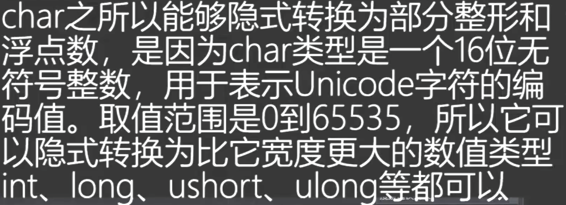

## 显示转换

### 1、()

数值转换，可能出现范围问题

- 整型获得一个异常值
- 浮点型精度丢失
- 浮点转整型截断小数，没有四舍五入
- bool和string不能用（）强转

### 2、Parse

把字符串转换成对应类型

类型不符合会直接报错，范围不符合也会报错

```c#
int i = int.Parse("123");
bool b = bool.Parse("true");
char c = char.Parse("A");
```

### 3、Convert

精度更准确比较全面

类型不符合会直接报错，范围不符合也会报错

- 存在四舍五入
- 可以把bool类型转换成数值类型

```c#
int a = Convert.ToInt32("12");  
sbyte sb = Convert.ToSByte("1");
short s = Convert.ToInt16("1");
float f = Convert.ToSingle("13.2");
double d = Convert.ToDouble("13.2");
decimal de = Convert.ToDecimal("13.2");
```

### 4、其他类型转string

进行字符串拼接时，会自动调用ToString

```c#
13.f.ToString();
// 自动调用ToString
Console.WriteLine("123123"  + 1 + true);
```

## as和()转型

- ​`as`​ 关键字：如果转换失败，结果将是 `null`​，而不会抛出异常。

  转换时先检查类型，类型不正确无法通过编译

  ```csharp
  string a = "abc";
  int[] c = a as int[]; // 报错，类型不匹配

  SonTemp sonTemp = new SonTemp();
  if (sonTemp as SonTemp != null)
  {
      Debug.Log("Son as SonTemp");
  }

  if (sonTemp as BaseTemp != null)
  {
      Debug.Log("Son as BaseTemp");
  }
  ```
- ​`()`​ 转型：如果对象无法转换为指定类型，则会抛出 `InvalidCastException`​ 异常。

## is

```csharp
string a = "abc";
Debug.Log(a is string); // True
```

# 异常捕获

```c#
try
{

}
catch (Exception e)
{

    throw;
}
```

# 运算符

## 数值运算符

乘=除>取余>加=减

后计算复合运算

- 除法

```c#
float f = 1/2f;
```

## 条件运算符

- 优先级小于数值运算符
- 只要是数值就能够进行比较
- 特殊类型bool，char，string能和相同的类型进行==、!=运算符比较，其中char还能和数值类型进行数值比较，和char进行大小比较

## 逻辑运算符

- 短路规则

  ```c#
  int i = 1;
  i > 0 || ++i >= 0 // i = 1
  ```

## 位运算

### 取反

```csharp
int a = 60;
// ~a = -61
```

这是由于计算机内部是补码表示，取反将60的补码逐位取反，还原成原码之后就是-61

# 字符串拼接

- +会自动调用其他类型的ToString

  ```c#
  string str = "123" + 1; // 1231
  str+=1+2+3+4; // 123110
  ```
- string.Format()

  ```c#
  string str = string.Format("{0}{1}{2}",1,true,false);
  ```
- 控制台打印拼接

  ```c#
  Console.WriteLine("A{0},B{1}",1,2);
  ```

# 继承

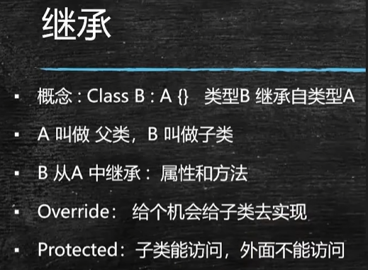

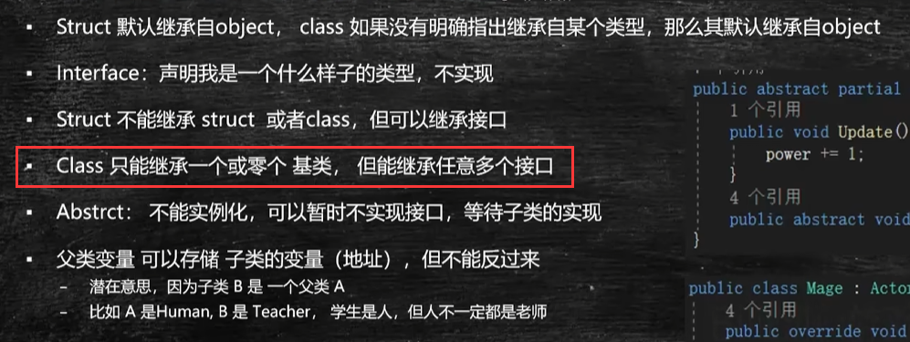

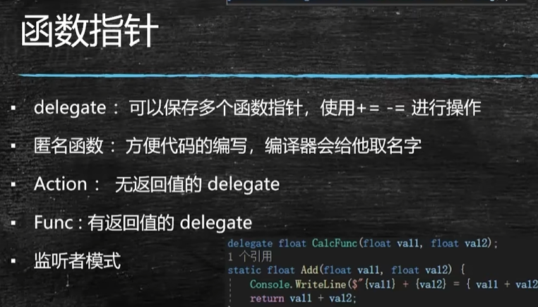

# 理解 C# 中的委托

委托是引用类型，默认值是null 

在你的示例中，`GetLerpValue` 被用作平滑插值的源。因为这个方法是通过委托（或函数指针）传递的，实际上它可以被外部调用，而不需要创建该类的实例。这在某种程度上允许外部代码获取到类内部的私有字段，这个特性使得 C# 的委托在行为上与 C++ 中的友元类似。

# 抽象方法和虚方法

- 虚方法可以有方法体，可以不继承
- 抽象方法不能有方法体，一定要继承实现

# 事件与委托

委托是一 个函数的“容器”，可以装下任何函数，类似于函数指针，指向地址

委托例子：

```c#
delegate void MyDelegate1(int x);
delegate void MyDelegate2<T>(T x);

MyDelegate1 delegate1 = new MyDelegate1(Show1);
MyDelegate2<int> delegate2 = Show1;
// MyDelegate1 delegate1 = Show1;

public void Show1(int x)
{
	...
}

delegate1(2);
delegate1.Invoke(2);
```

委托有可能为空，调用前应该判断，C#的简化的语法糖：

```c#
OnInteractAction?.Invoke(this, EventArgs.Empty);
```

## 多播委托

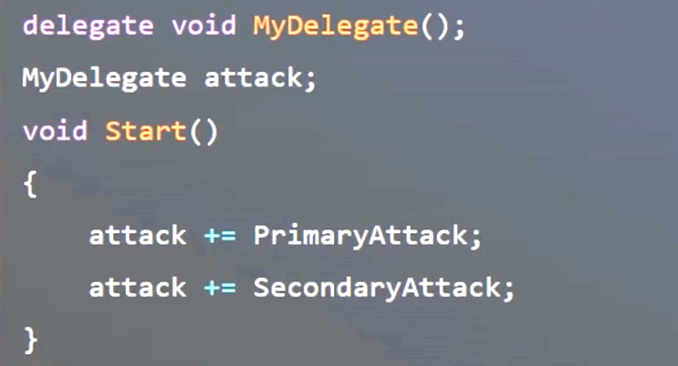

## 委托与设计模式

以下方法不符合开闭原则

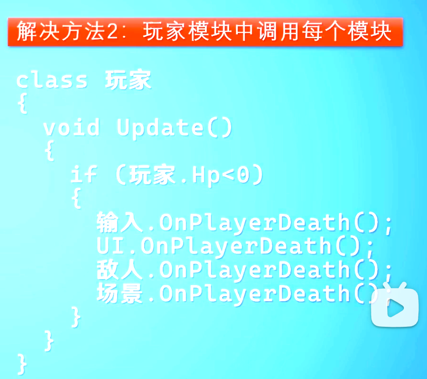

### 观察模式

在C# 中可以将委托作为事件发布者，利用了多播委托的性质

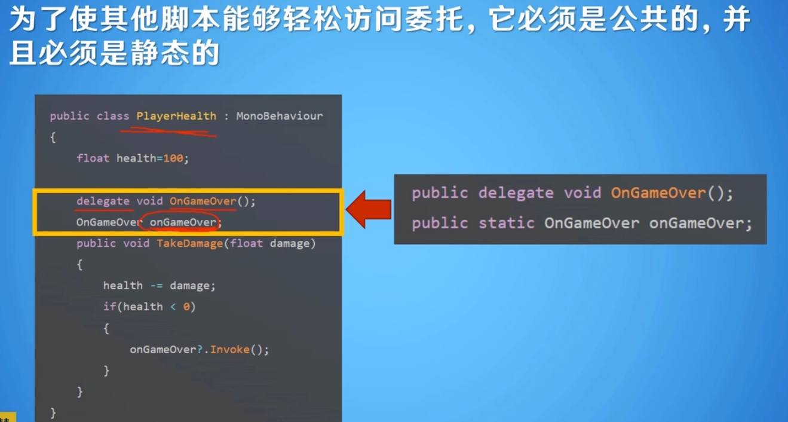

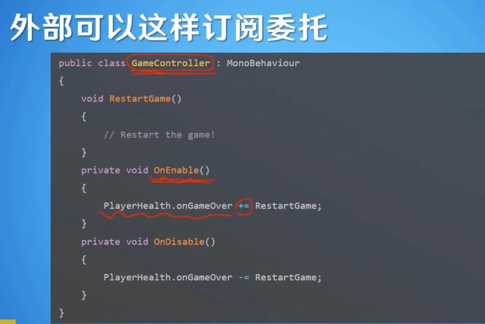

## 内置泛型委托

### Action和Func

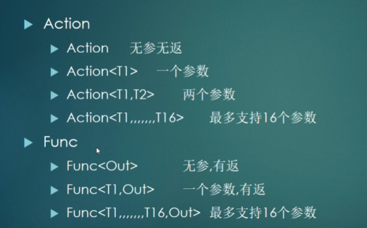

### Func的定义

最后一个参数作为返回值

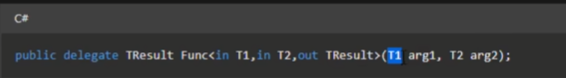

使用

```c#
Func<int, int> func = MyFunc;
func?.Invoke(1);

// 函数定义
public int MyFunc(int a)
{
	return a;
}
```

## 匿名函数

```c#
delegate（）{
}
```

## <span id="20250217210605-lyq2o0z" style="display: none;"></span>事件

事件用Event修饰，只能是成员

### C# 的内置事件

EventHandler

- 事件是一种多播委托
- 事件只能在事件所在的类被触发
- 事件可以阻止委托中订阅者对于其他订阅者的修改和调用，从而避免不可预知的错误
- 订阅者可以订阅和取消自己的函数，但不能触发事件，也不能更改其他类中其他函数的订阅，只能+=和-=

事件的定义：

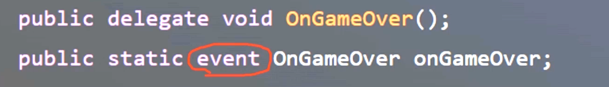

## C#的两种预定义的事件泛型


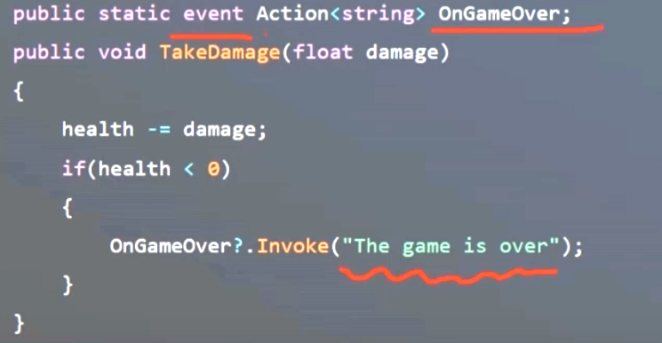

## Unity中预定义的Event

和C# 最本质的区别是Unity定义的event可以序列化，因此可以显示在inspector上

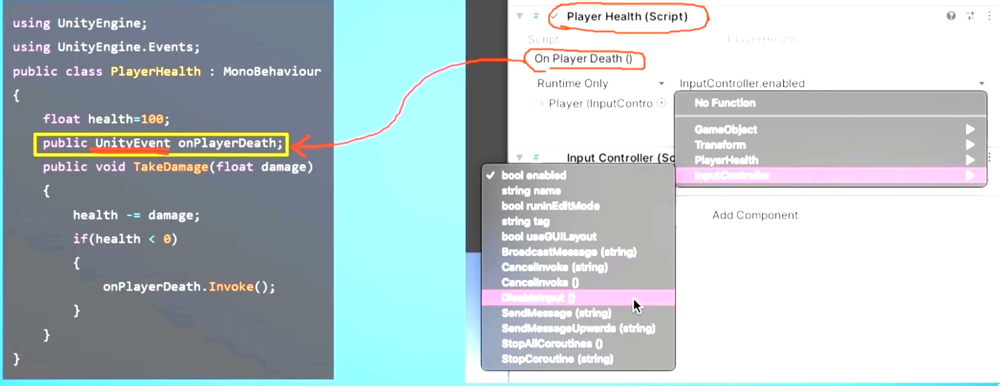

### 定义自己的UnityEvent

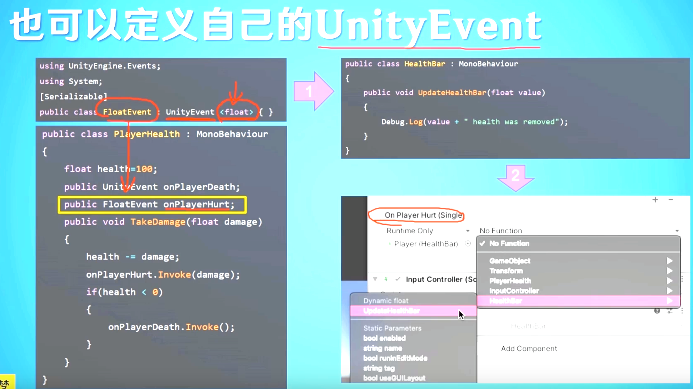

# [Collection](c#/Collection.md)

# 交错数组（指针数组）

5种申明方式

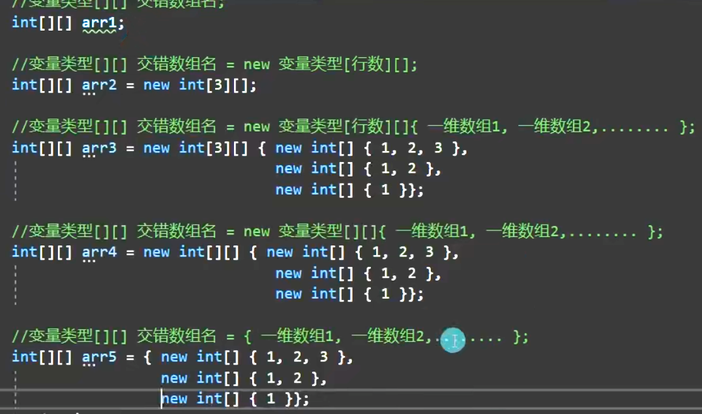

获取长度

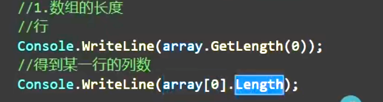

# 数组

‍

```csharp
int[] array1; // 数组申明不分配内存
int[] array2 = new int[5]; // 数组的申明和内存分配
int[] array3 = new int[5] { 1, 2, 3, 4, 5 }; // 容量显示申明
int[] array5 = new int[] { 1, 2, 3, 4, 5 };// 容量隐式申明
int[] array6 = { 1, 2, 3, 4, 5 }; // 数组初始化
```

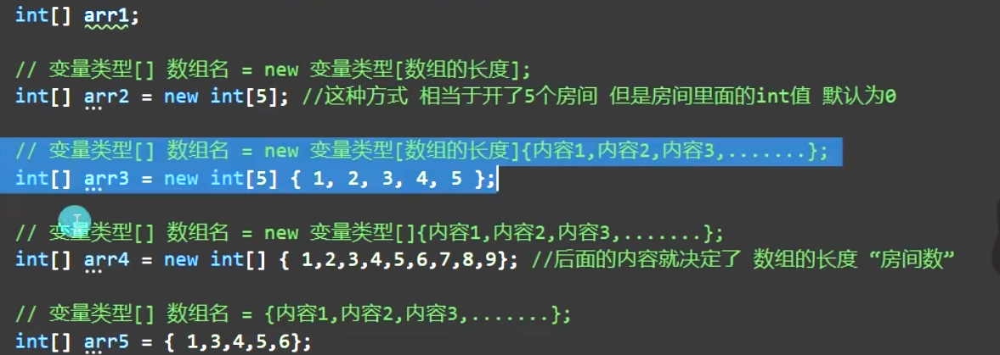

## 数组长度

```csharp
array.Length // 总长度
array.GetLength(0) // 获得某一维的长度
```

## 二维数组

```csharp
        int[,] array7 = new int[,]
        {
            { 1, 2, 3, 4, 5 },
            { 1, 2, 3, 4, 5 }
        };
        int[,] array8 = new int[2,5]
        {
            { 1, 2, 3, 4, 5 },
            { 1, 2, 3, 4, 5 }
        };
```

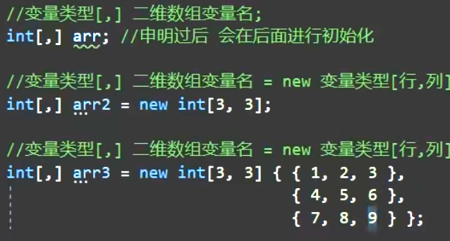

# 面向对象

## virtual关键字

父类的方法没有被声明为`virtual`​，即使子类中有同名的方法，该方法也不会被重写，而是会被隐藏，此时通过父类的引用调用该方法时，会调用父类的方法

## 隐式转换

```csharp
public static implicit operator Playable(ScriptPlayable<T> playable);
```

## 类型检查

判断playable.GetPlayableType()是否是AnimAdapter的子类或者同一个类

```csharp
typeof(AnimAdapter).IsAssignableFrom(playable.GetPlayableType())
```

# [泛型](c#/泛型.md)

# [面向对象](c#/面向对象.md)

# 断点调试

- 添加断点 f9
- 点击附加到Unity
- 运行Unity
- 回到vs，f10是下一步，f11是进入函数
- f5 退出当前的断点

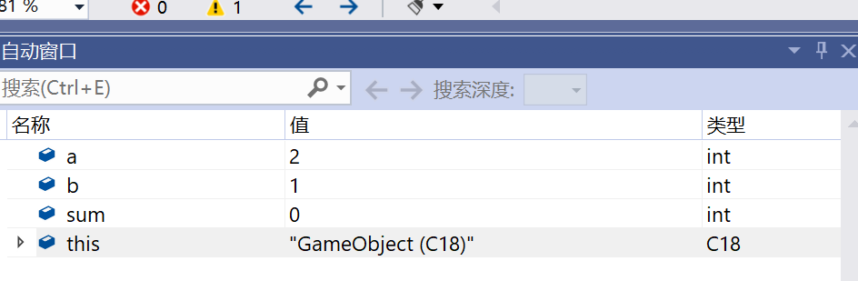

# 装箱拆箱

## 装箱

```csharp
int a = 20;
object b = (object)a; // 发生GC内存分配
```

## 拆箱

```csharp
int a = 20;
object b = (object)a;

int c = (int)b; // 拆箱
```

# 值类型和引用类型

## 引用类型

- 引用存储在栈中，引用的对象存储在堆中 CLR管理
- 也可能引用也存在堆中，引用的对象存储在堆中（当引用作为字段或者数组的元素）

类、接口、数组、委托

## 值类型

- 当值类型在局部中申明时，是栈内存
- 当值类型作为类的字段时，是堆内存

# string

## 字符串比较

### string.Compare

```c#
string.Compare(str1,str2);  // 0 1 -1
string.Compare(str1,str2,true); // 忽略大小写
```

### == 区分大小写

### string.Equals 区分大小写

### str.Equals 区分大小写

## 字符串连接

### string.Concat

```c#
string.Concat(str1,str2);
```

### +

## 格式化str.Format

```c#
string.Format("{0} {1}",14,"张三");
```

## 判断字符串中是否包含字符串/字符串

### str.Contains 只能判断是否存在某个字符串

```c#
str.Contains("L");
```

### str.IndexOf/ LastIndexOf 可以判断字符是否存在

```c#
str.IndexOf("L"); // 返回索引 i -1
str.IndexOf('L'); // 返回索引 i -1
```

## 判断字符串是否以某字符串开头/结尾

### str.StartWith

### str.EndWith

## 插入

插入操作将返回新的字符串，不

### str.Insert(index,str1)

## 判空

### string.IsNullOrEmpty

## 移除

### s.Remove(index,count);

## 替换

```c#
string s = "asda";
s.Replace("a","K");
```

## 切割

s.Split(params char[])

```c#
string s = "asdsa";
string[] newstrs = s.Split(new char[] { 's'});
foreach (string item in newstrs)
{
	Debug.Log(item);
}
// a d a
```

```c#
string s = "asdsa";
string[] newstrs = s.Split('s','a');
foreach (string item in newstrs)
{
	Debug.Log(item);
}

// 对每个字符串再次分割
// 空格 空格 d 空格 空格 
```

## 大小写转换

## s.ToUpper() / s.ToLower()

## 去掉空格

### s.Trim()

# StringBuilder

由于string的内容是不可变的，每次对string的修改实际上都创建了一个新的类

在频繁的字符串修改下会造成额外的GC开销，因此使用stringBuilder更加合适

但是要注意：

stringBuilder有容量大小，每次达到容量大小时会将容量翻倍，设置合适的capacity很重要

```c#
StringBuilder stringBuilder = new StringBuilder("Hello World",20);
```

## 常用API

### str.Append(string)

### str.AppendFormat("{0}","string")

### Insert

```c#
StringBuilder stringBuilder = new StringBuilder("Hello World",20);
stringBuilder.Insert(3,"abc");
Debug.Log(stringBuilder);
```

### Remove(index,count)

### Replace(str1,str2)

```c#
StringBuilder stringBuilder = new StringBuilder("Hello World",20);
stringBuilder.Insert(3,"abc");
stringBuilder.Replace("abc","cde");
Debug.Log(stringBuilder);
```

# StringBuilder与String的区别

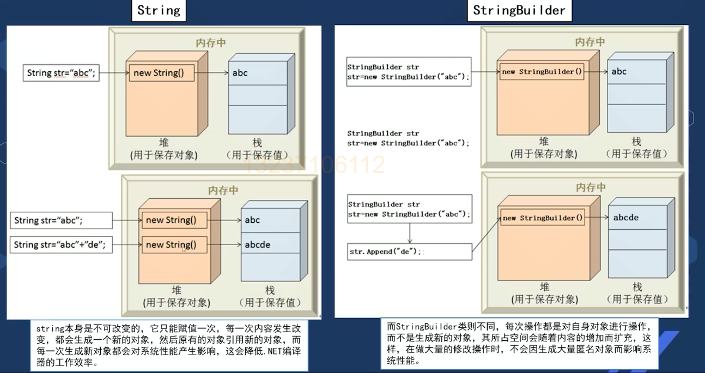

# FileStream

```c#
	void CreateFile()
    {
        string path = @"E:\\code\\student.txt";
        // 如果不存在目标文件就创建FileMode.OpenOrCreate
        FileStream fileStream = new FileStream(path, FileMode.OpenOrCreate, FileAccess.ReadWrite, FileShare.ReadWrite);

        string msg = "1710026";
        byte[] bytes = Encoding.UTF8.GetBytes(msg);

        fileStream.Write(bytes, 0, bytes.Length);
        fileStream.Flush();
        fileStream.Close();

    }


    void ReadFile()
    {
        string path = @"E:\\code\\student.txt";
        if (File.Exists(path))
        {
            FileStream fileStream = new FileStream(path,FileMode.Open,FileAccess.Read);
            byte[] bytes = new byte[fileStream.Length];
            fileStream.Read(bytes,0,bytes.Length);
            string s = Encoding.UTF8.GetString(bytes);

            Debug.Log("学生的学号为：" + s);
            fileStream.Close();
        }
        else
        {
            Debug.Log("文件不存在");
        }
    }
```

# StreamWriter & streamReader 

```c#
    void CreateFile()
    {
        string path = @"E:\\code\\student2.txt";
        StreamWriter streamWriter = new StreamWriter(path);
        streamWriter.WriteLine("小张");
        streamWriter.WriteLine("13112345678");
        streamWriter.Flush();
        streamWriter.Close();
    }


    void ReadFile()
    {
        string path = @"E:\\code\\student2.txt";
        StreamReader streamReader = new StreamReader(path);
        while (streamReader.Peek() != -1)
        {
            string str = streamReader.ReadLine();
            Debug.Log(str);
        }
        streamReader.Close();
    }
```
