# Collection

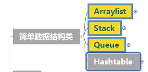

# 主要库

```c#
using System.Collection.Generic;
using System.Linq;
```

# Array.Sort

从小到大排序

​`Array.Sort(array, (a, b) => a.CompareTo(b));`

​`Array.Sort(arr, (a,b) => a-b);`

# 转换

## List转Array

```csharp
List<int[]> res = new List<int[]>();
res.ToArray();
```

## 二维List转二维Array

```csharp
List<List<int>> res = new List<List<int>>();
res.Select(x => x.ToArray()).ToArray();
```

# 遍历

## foreach

只有实现迭代器才可以使用

```csharp
Queue<int> queueList = new Queue<int>();
queueList.Enqueue(1);
queueList.Enqueue(2);
queueList.Enqueue(3);

foreach (int item in queueList)
	Console.WriteLine($"item: {item}");
}
```

## Enumerator

```csharp
Queue<int> queueList = new Queue<int>();
queueList.Enqueue(1);
queueList.Enqueue(2);
queueList.Enqueue(3);
IEnumerator<int> enumerator = queueList.GetEnumerator();
while (enumerator.MoveNext())
{
	Console.WriteLine($"item: {enumerator.Current}");
}
```

## Select

select 返回一个新的IEnumerable

```csharp
List<int> list = new List<int>(new int[] { 1,2,3});
List<int> newList = list.Select((x) =>
{
	return x + 1;
}).ToList();

foreach (var item in list)
{
	Console.WriteLine($"list:[{item}]");
}

foreach (var item in newList)
{
	Console.WriteLine($"newlist:[{item}]");
}

// 输出
list:[1]
list:[2]
list:[3]
newlist:[2]
newlist:[3]
newlist:[4]
```

# Hashtable 

```csharp
Hashtable hashtable = new Hashtable();

```

## Hashtable 比较大小（拆箱）

```csharp
Math.Max( (int)hashtable[key],right );
```

## 增

不能存在相同键 

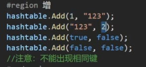

## 删

- 只能通过键删除
- 删除不存在的键没反应

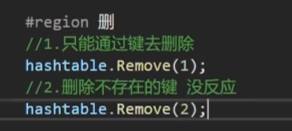

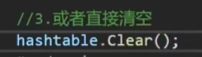

## 查

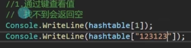

Contains通过键查找， 和ContainsKsy同

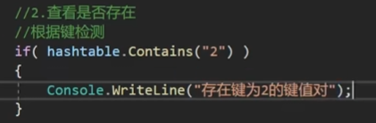

### 根据值查找

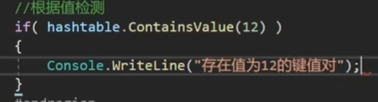

## 改

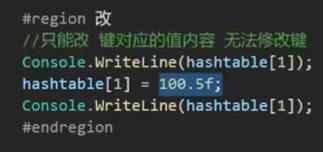

## 遍历（四种）

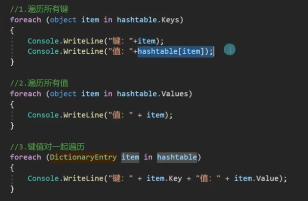

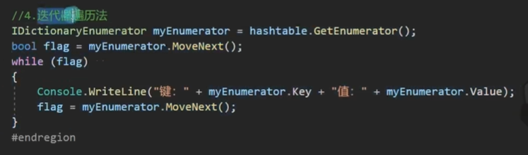

# ArrayList

object 类型的数组，因此可以存放任意类型

## 索引器

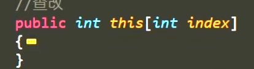

## 增

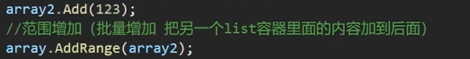

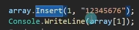

```c#
array.AddRange(new int[]{4,5,6});
```

## 删

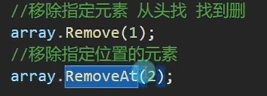

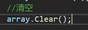

```c#
array.Remove(12); // 删除第一个遇到得的12 
```

## 查   

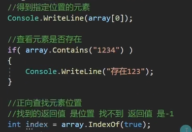

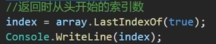

## 改

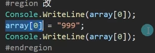

## 属性

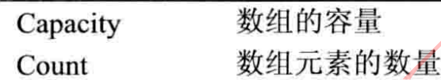

## 装箱拆箱

装箱：值=>引用

拆箱：引用=>值

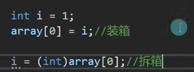

## 倒序

```c#
arrayList.Reverse();
```

### 排序

```c#
arrayList.Sort();
```

# Dictionary

```c#
Dictionary<int,int> = new Dictionary<int,int>();
```

## 遍历

```c#
Dictionary<string, string> dic =
            new Dictionary<string, string>();

        dic.Add("1","1");
        dic.Add("2","1");
        dic.Add("3","1");
        dic.Add("4","1");

        foreach (KeyValuePair<string,string> kv in dic)
        {
            Debug.LogFormat("key: {0},value: {1}",kv.Key,kv.Value);
        }
```

# Stack<>

## 弹出

### Pop()

## 压栈

### Push()

## 查

### Peek()、Contains()

## 改

### Clear()

## 遍历

### 1、foreach

注意foreach的结果是从栈顶到栈底

### 2、转Array

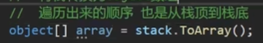

## 属性

### Count

可以用于判空

# Queue <>

## 增

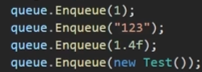

## 取

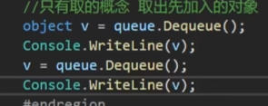

## 查

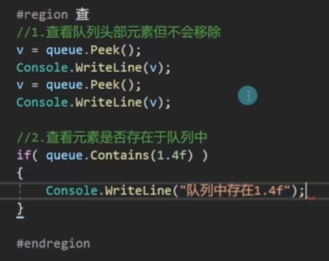

## 改

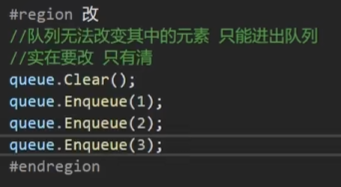

## 遍历

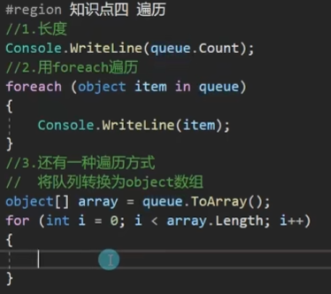

# 常用泛型数据结构类

- 很大程度上避免装箱拆箱
- 类型安全

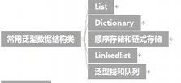

# List<T>

## 初始化n个0

```csharp
List<int> dp = Enumerable.Repeat(0, n).ToList();
```

# HashSet<>

- 去重的
- 集合运算

```c#
HashSet<int> set = new HashSet<int>();
        set.Add(1);
        set.Add(2);
        set.Add(3);
        set.Add(1);
        set.Add(1);

        foreach (int item in set)
        {
            Debug.Log(item);
        }
```

交集

IntersectWith

```c#
        HashSet<int> set1 = new HashSet<int>();
        HashSet<int> set2 = new HashSet<int>();
        set1.Add(1);
        set1.Add(2);
        set1.Add(3);

        set2.Add(1);
        set2.Add(1);
        set2.Add(2);

        set1.IntersectWith(set2); //1,2
        foreach (int item in set1)
        {
            Debug.Log(item);
        }
```

## 并集

```c#
set1.UnionWith(set2); //1,2,3
```

## 差集

set1减去两者的交集

```c#
set1.ExceptWith(set2); // 3
```

## 对称差集

- set1并set2 减去 set1交set2
- 符合交换律
- 无法排序

```c#
HashSet<int> set1 = new HashSet<int>();
        HashSet<int> set2 = new HashSet<int>();
        set1.Add(1);
        set1.Add(2);
        set1.Add(3);

        set2.Add(1);
        set2.Add(1);
        set2.Add(2);
        set2.Add(4);

        set1.SymmetricExceptWith(set2); // 3,4
```

# 链表LinkedList

- 事实上是双向链表

```c#
        LinkedList<int> linkedList = new LinkedList<int>();
        LinkedListNode<int> node;

        node = linkedList.AddFirst(1);
        linkedList.AddAfter(node, 2);
        node = linkedList.AddBefore(node, 0);

        Debug.Log(linkedList.Count); // 3
        Debug.Log(linkedList.First.Value); // 0
        Debug.Log(linkedList.Last.Value); // 2

        if (node.Previous != null) // null
        {
            Debug.Log(node.Previous.Value); 
        }

        if (node.Next != null)
        {
            Debug.Log(node.Next.Value); // 1
        }
```

# 实现栈（链表法）

```c#
public class MyStack
{
    public class StackData{
        public StackData next;
        public object data;
        public StackData(StackData next, object data)
        {
            this.next = next;
            this.data = data;
        }    
    }

    StackData top;

    public void Push(object data)
    {
        top = new StackData(top, data);
    }

    public object Pop()
    {
        object rsl = top.data;
        top = top.next;
        return rsl;
    }
}
```

# 实现队列（链表法）

```c#
public class MyQueue
{
    public class QueueData
    {
        public object data;
        public QueueData next;

        public QueueData(QueueData next,object data)
        {
            this.next = next;
            this.data = data;
        }

    }

    public QueueData front;
    public QueueData tail;

    public bool Empty()
    {
        return front == null;
    }

    public void EnQueue(object data)
    {
        if (Empty())
        {
            front = new QueueData(null,data);
            tail = front;
            return;
        }
        QueueData queNode = new QueueData(null, data);
        tail.next = queNode;
        tail = queNode;

    }

    public object DeQueue()
    {
        if (Empty())
        {
            return null;
        }

        QueueData rsl = front;
        front = front.next;
        return rsl.data;
    }

}
```
