# 泛型

# 一、泛型类、接口、函数

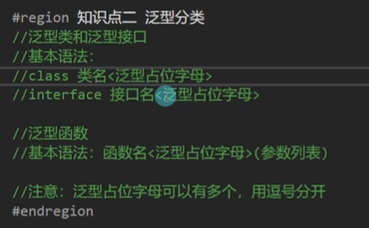

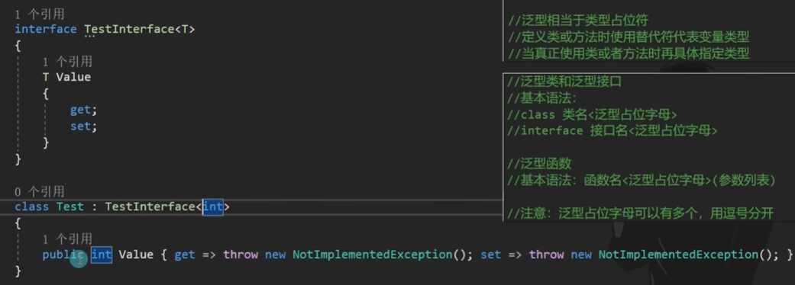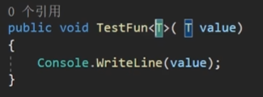

## 泛型的默认值：default(T)

```csharp
public class A<T,X>
{
    public void Func<K>(K val)
    {

    }
}
```

## 泛型类中的泛型方法

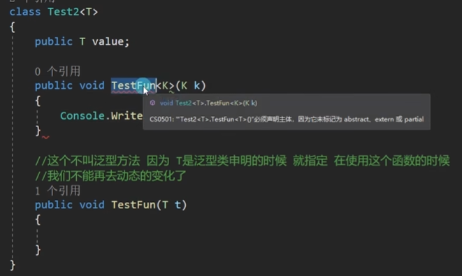

## 泛型方法的T可以省略不写

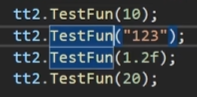

## 继承泛型类可以选择指定类型，也可不指定

```csharp
public class A<T,X>
{
    
}
public class B<T, X,Y>:A <T,X>
{

}
public class C : A<int, string>
{

}
```

## 举例

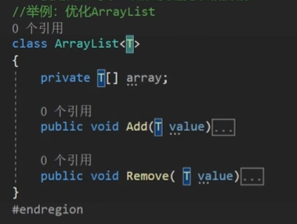

## 总结

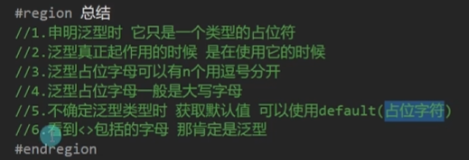

# 二、泛型约束（6种）

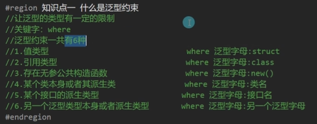

## new

- 所有的值类型都有无参构造函数
- 不能使用抽象类

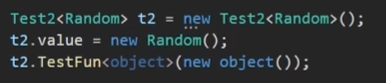

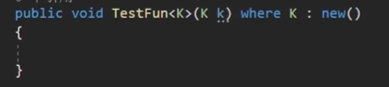

## 类名

类本身和他的派生

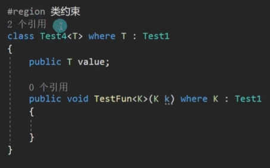

## 接口

接口的的派生，接口本身也不报错，但是无法new

## 另一个泛型约束

要么T是U的派生，要么一样

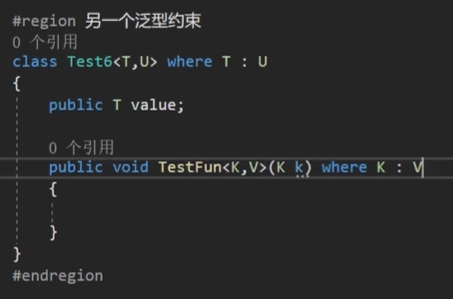

## 约束的组合使用

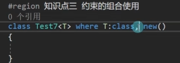

## 多个泛型有约束

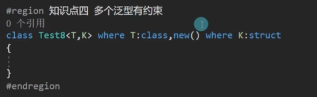

‍
