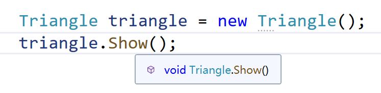
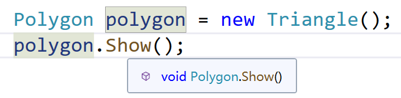

# 面向对象

# 构造和析构

析构函数不能有任何的修饰符

# 接口

接口不能有成员变量，但可以有property方法

# static

static修饰的函数和变量可以通过类名访问

# 访问修饰符

## public

## private

## protected

## internal

同一个程序集的对象可以访问

## protected internal

或的关系，即是子类或者同一个程序集内即可访问

# 命名空间

默认是global命名空间

# 三大特性

## 封装

## 继承

隐藏实现的细节，只关心结果

## 多态

### 静态多态（编译时）

在编译时，函数和对象的连接机制

- 函数重载
- 运算符重载

override的函数，通过f12能够直接定位时

```csharp
public class Polygon
{
    public  virtual void Show()
    {
        Debug.Log("Polygon");
    }
}
public class Triangle:Polygon
{
    public override void Show()
    {
        Debug.Log("Triangle");
    }
}
public class Rectangle : Polygon
{
    public override void Show()
    {
        Debug.Log("Rectangle");
    }
}
```



### 动态多态（运行时）

在运行时，根据实例对象，执行同一个函数的不同行为

编译时无法定位调用的函数属于哪一个重写



# 重载和重写

## 重载

同一个类中具有相同名称但**参数列表不同**

参数数量、类型顺序、类型不同

## 重写

virtual

# base和this

base在父类中找，this包含继承的成员

# 静态类

一般用在工具类

- 不能实例化
- 不能继承
- 只能包含静态成员或常量
- 可以包含静态构造函数
- 不允许有实例构造函数
- 但是由于静态类不能够初始化，所以静态构造函数不会被调用
- 无法从静态类派生

# const

- 外部访问时，必须通过类名访问
- 只能在申明时初始化
- 不可修改

# readonly

- 外部访问时，通过实例对象访问
- 可以在构造函数初始化
- 不能修改

# 静态构造函数

- 不能有访问修饰符
- 系统自动调用
- 静态构造函数，无论有多少实例，只被系统调用一次

# 构造函数调用顺序

1. 静态构造函数
2. 父类
3. 本类

# 抽象类

- 包含属性、函数接口
- 不允许实例化，支持一般构造函数
- 可继承抽象类
- 可以包含普通方法
- 可以包含虚方法
- 抽象方法必须有函数体，并且子类必须实现，也是override
- 抽象方法不能是private

# 密封类

- 类不能被继承，方法不能被重写
- 不能申明为抽象类
- 成员函数不能为sealed，必须要重写的函数才能密封

```csharp
public sealed class Triangle:Polygon
{
    public sealed override void Show()
    {
        Debug.Log("Triangle");
    }

    public sealed void Show1()
    {

    }
}
```

# 接口

约束行为规范 

- 方法默认时public且只能是public
- 只能有抽象方法，abstract可以省略
- 不可实例化
- 不允许构造函数

# 结构体

- 只能实现接口
- 可定义构造函数，但不能定义无参构造，也没有析构函数
- 不能被继承，因此与继承有关的就没有意义，如protected 、 virtual、abstract
- 支持静态构造函数
- 普通变量不能在声明时赋值
- readonly只能在构造函数赋值
- 初始化了才可以用他的值

  ```csharp
  St st;
  st.a = "abc";
  string b = st.a;
  ```

- 没有new的结构体无法访问成员函数
