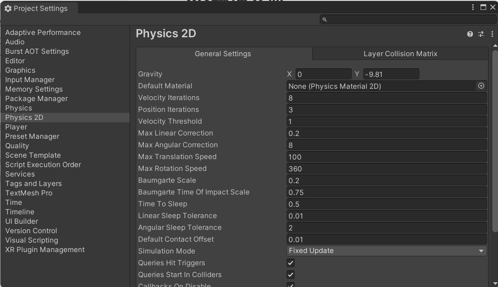
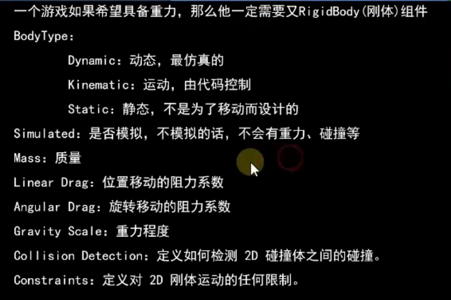
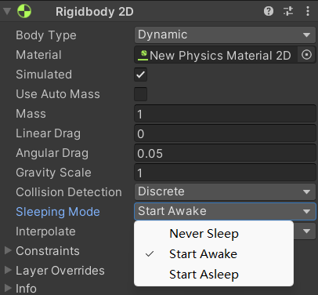
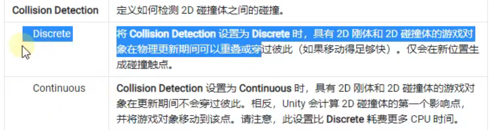
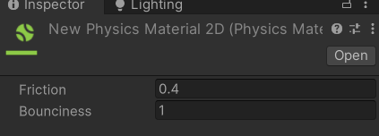
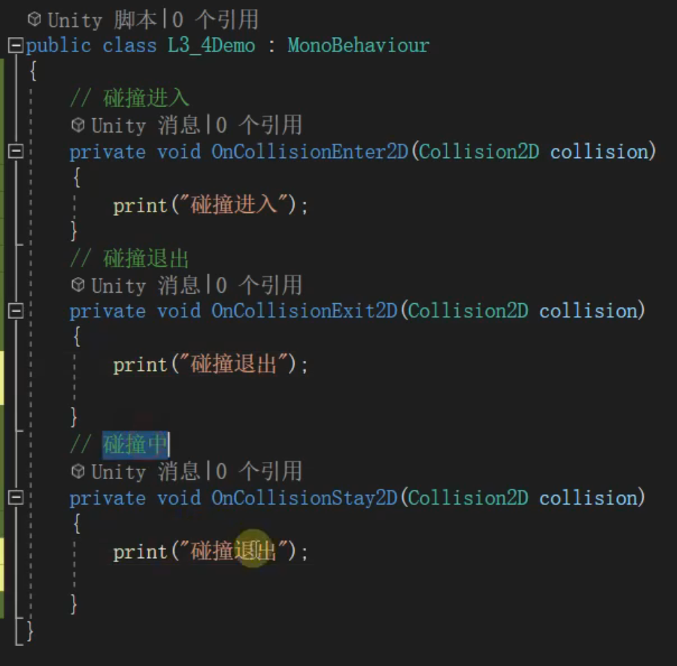
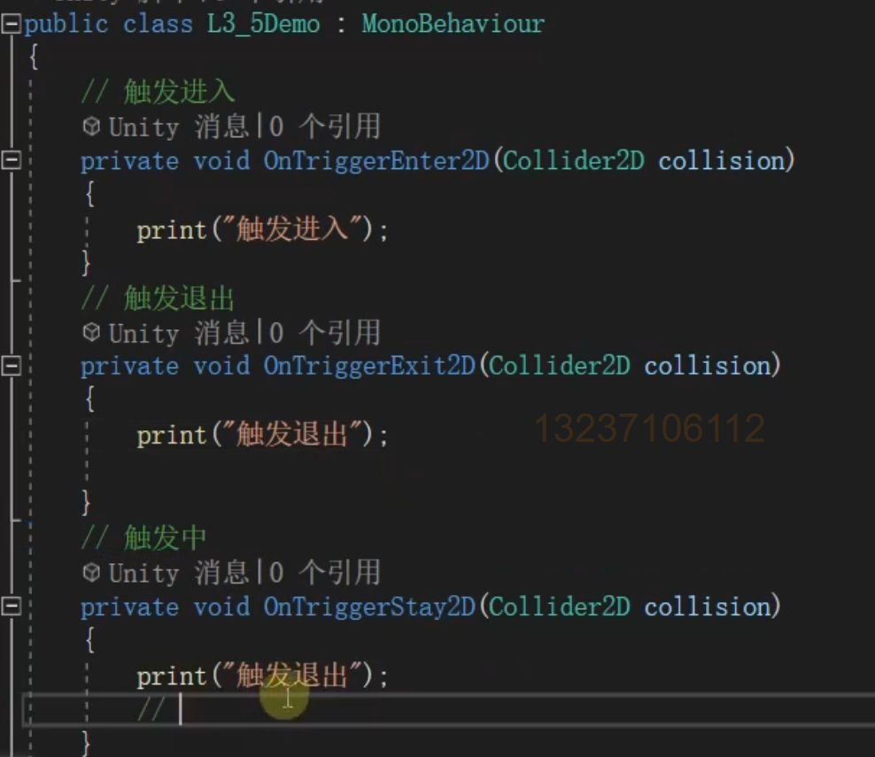

# 2D物理系统

‍

## 全局设置



# 刚体参数



## 动态

- 只有动态的被碰撞时会移动
- 动态的在碰撞时会被挤出

## Simulated

控制刚体的开关

## 休眠



## 碰撞检测



## 物理材质



## 刚体移动

```c#
rig.MovePosition(new Vector2(0,1));
```

## 施加力

```c#
rig.AddForce(Vector2.right * 100);
```

# 碰撞回调



# 触发IsTrigger



‍
