# DOTS（Data-Oriented Technology Stack）

- ECS架构使得内存更加紧凑，提高CPU缓存的命中率
- ECS使用struct，不涉及GC，非托管

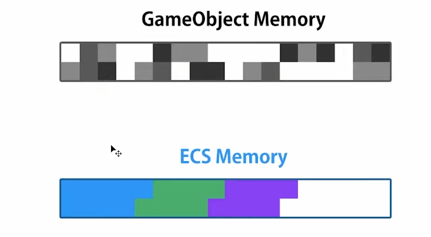

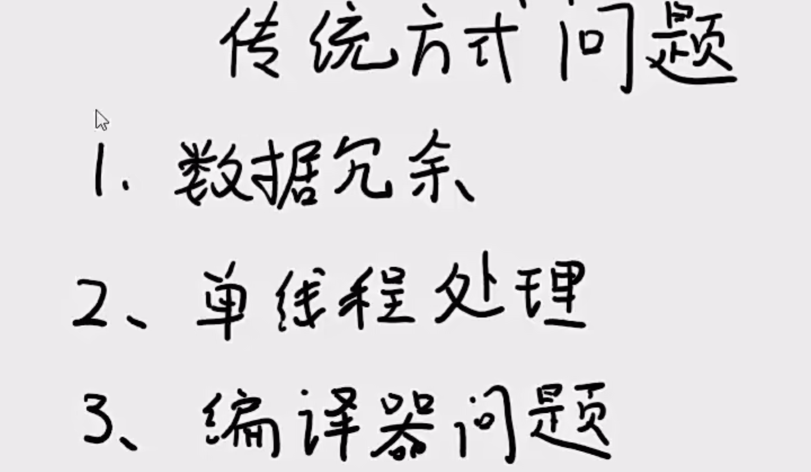

‍

# 技术组成

- Entities
- Entities Graphics
- Unity Physics


## 1、ECS


## 2、Job System

多线程，充分发挥多核CPU的特性 

## 3、Burst Complie

# 好处

- 改变组件可以轻松改变实体的行为

# DOTS和GameObjects可以一起使用

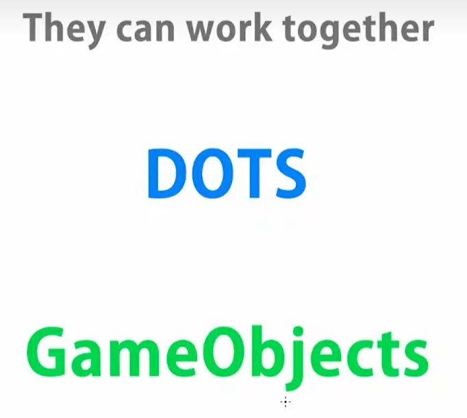

# 编辑器设置

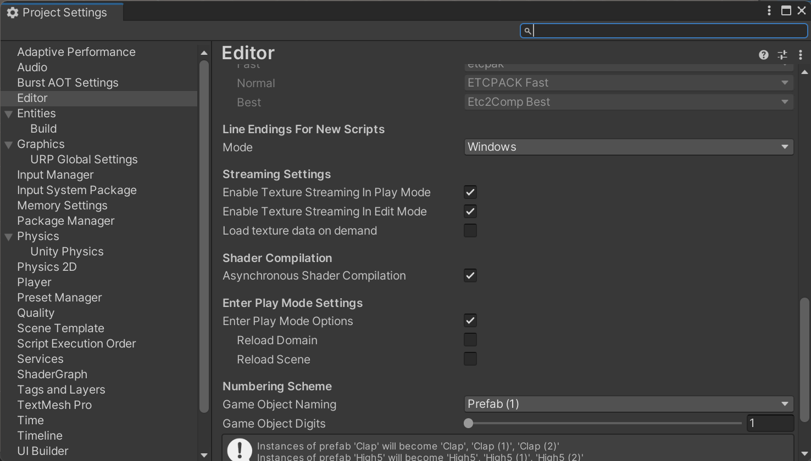

# 设置环境光照

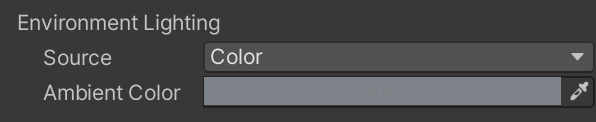

# URP渲染器设置

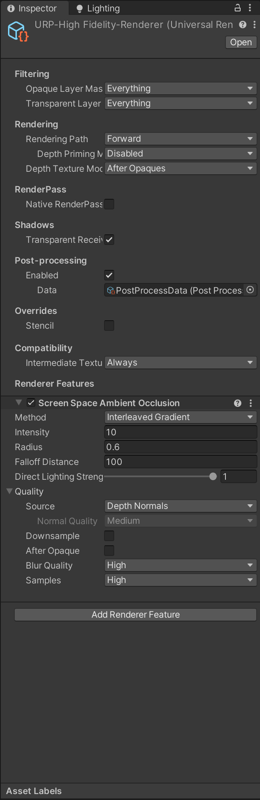

# 渲染管线设置

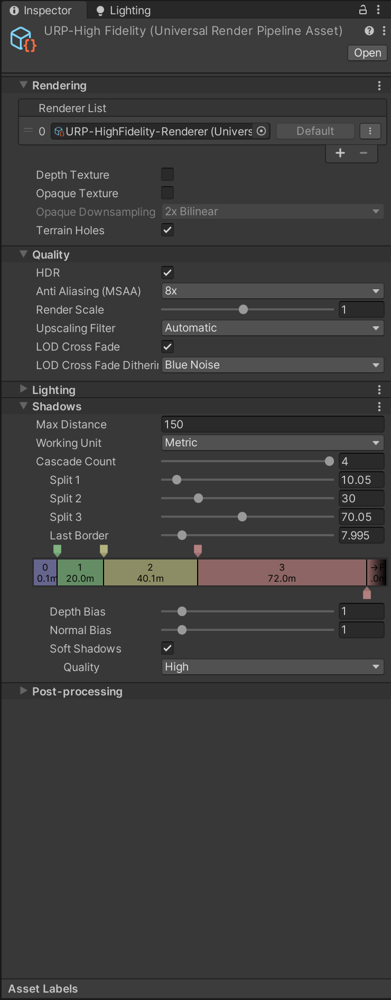

# 子场景

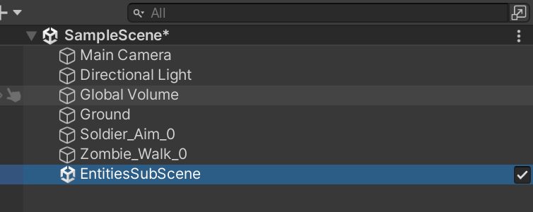

# 烘焙DOTS组件

- DOTS不会烘焙空对象
- 自动将GameObject和常规组件烘焙成DOTS实体和组件

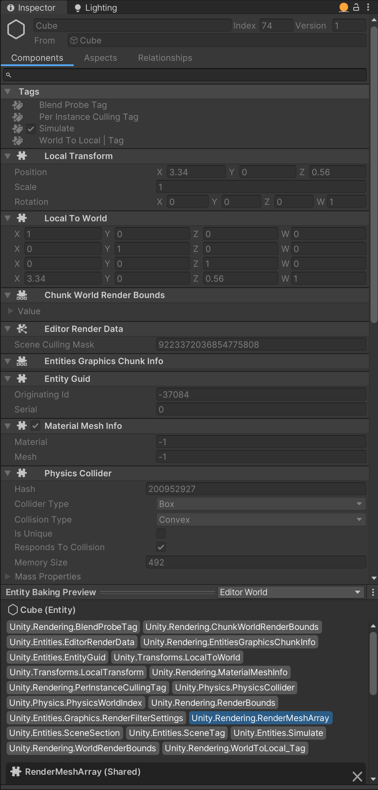

# 实体窗口

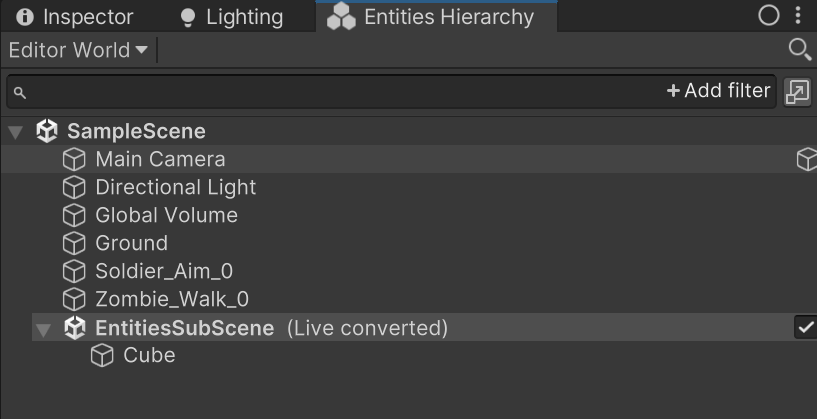

# 运行时设置

设置成运行时数据可以在Scene界面看到运行效果

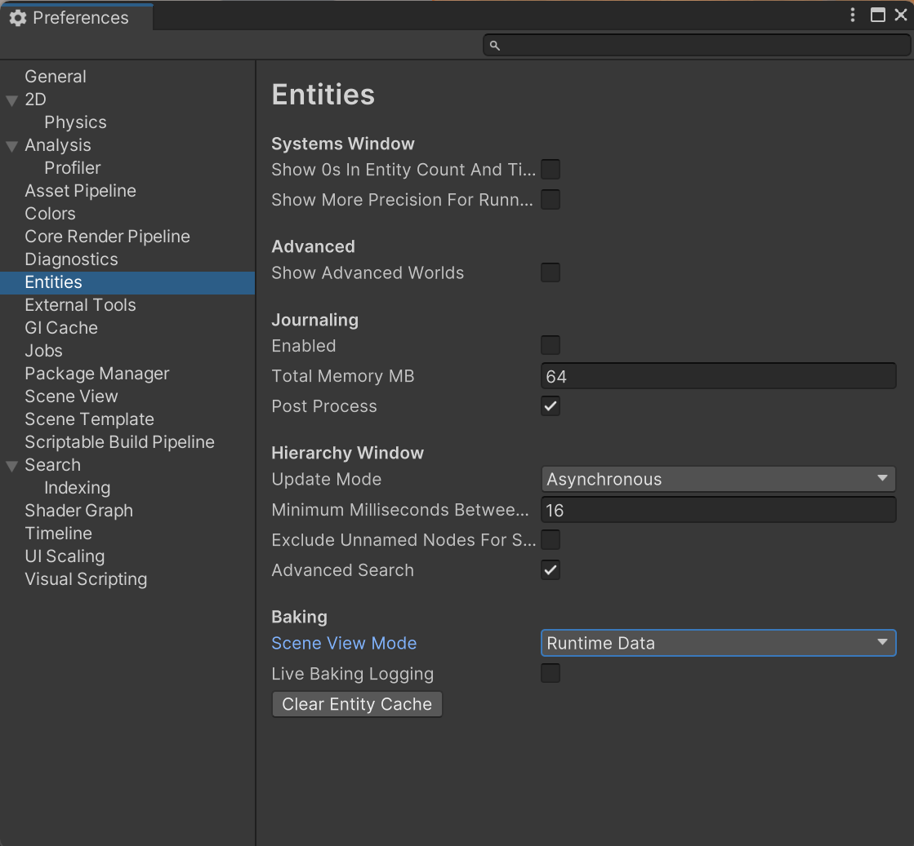

# 自定义DOTS组件（E+C）

## 1、继承IComponentData实现DOTS组件

```csharp
using Unity.Entities;

public struct MoveSpeed : IComponentData
{
    public float value;
}
```

## 2、自定义Authoring组件

```csharp
using Unity.Entities;
using UnityEngine;

public class MoveSpeedAuthoring : MonoBehaviour
{

    public float value;
   

}
```

## 3、实现新的Baker

unity会在触发baking的时候调用所有Baker的Bake

```csharp
 public class Baker : Baker<MoveSpeedAuthoring>
    {
        public override void Bake(MoveSpeedAuthoring authoring)
        {
			// Dynamic的实体自带 移动/旋转/缩放 组件
            Entity entity = GetEntity(TransformUsageFlags.Dynamic);
			// 添加自定义组件，并使用Authoring组件赋值
            AddComponent(entity, new MoveSpeed { 
                value = authoring.value
            });
        }
    }
```

## 4、简化

```csharp
using Unity.Entities;
using UnityEngine;

public class MoveSpeedAuthoring : MonoBehaviour
{

    public float value;
    public class Baker : Baker<MoveSpeedAuthoring>
    {
        public override void Bake(MoveSpeedAuthoring authoring)
        {
            Entity entity = GetEntity(TransformUsageFlags.Dynamic);
            AddComponent(entity, new MoveSpeed { 
                value = authoring.value
            });
        }
    }

}

public struct MoveSpeed : IComponentData
{

    public float value;

}
```

# **Unity 自动调用 Baker 的机制**

1. **触发条件**：

    - 当 GameObject 被放入 **SubScene** 中时，Unity 会自动触发 Baking。
    - 修改 Authoring 组件或场景后保存时，Baking 会重新执行。
2. **匹配规则**：

    - Unity 遍历场景中所有 GameObject 上的 Authoring 组件。
    - 对每个 Authoring 组件，查找对应的 `Baker<T>`​（`T` 必须精确匹配 Authoring 类型）。
3. **执行顺序**：

    - 如果一个 GameObject 有多个 Authoring 组件，每个组件对应的 Baker 会按**不确定的顺序**执行。
    - 若存在依赖关系，需通过 `DependsOn(authoring)` 显式声明。

# 系统类型（S）

ISystem速度比较快 ，比较常用

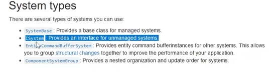

## 控制实体移动

```csharp
using Unity.Burst;
using Unity.Entities;
using Unity.Transforms;
using Unity.Mathematics;

partial struct UnitMoveSystem : ISystem
{


    [BurstCompile]
    public void OnUpdate(ref SystemState state)
    {
        foreach (RefRW<LocalTransform> localTransform in SystemAPI.Query<RefRW<LocalTransform>>())
        {
            localTransform.ValueRW.Position = localTransform.ValueRO.Position + new float3(1,0,0) * SystemAPI.Time.DeltaTime;
        }
    }


}

```

## 查询

### 查询的“与”操作

```csharp
using Unity.Burst;
using Unity.Entities;
using Unity.Transforms;
using Unity.Mathematics;

partial struct UnitMoveSystem : ISystem
{

    [BurstCompile]
    public void OnUpdate(ref SystemState state)
    {
        foreach ((
            RefRW<LocalTransform> localTransform, 
            RefRO<MoveSpeed> moveSpeed)
            in SystemAPI.Query<
                RefRW<LocalTransform>,
                RefRO<MoveSpeed>>())
        {
            localTransform.ValueRW.Position = localTransform.ValueRO.Position + new float3(moveSpeed.ValueRO.value,0,0) * SystemAPI.Time.DeltaTime;
        }
    }

}
```

# 查看正在运行的系统

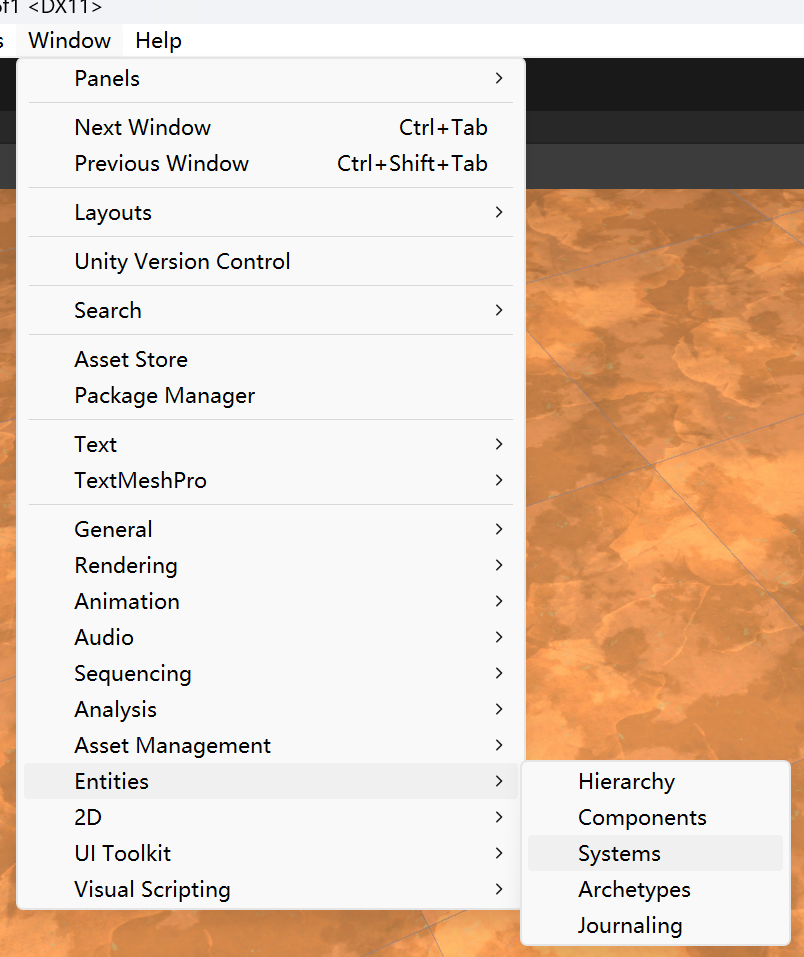

## 自定义的UnitMoveSystem正在运行

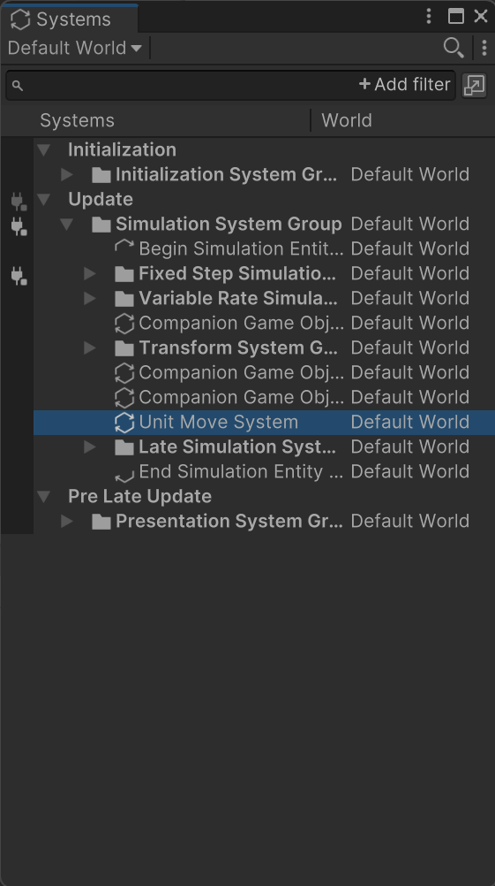

# 刚体设置

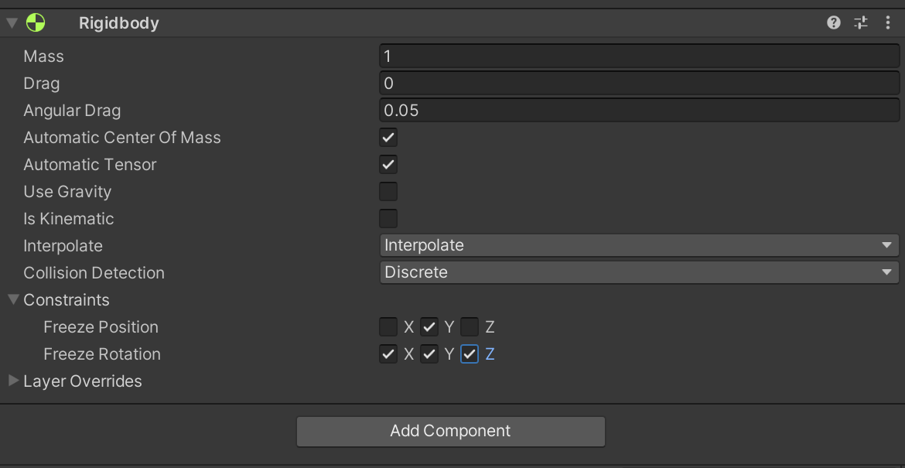

## 使用刚体控制移动

- 使用PhysicsVelocity组件设置线性速度但不设置角速度
- 仍然用LocalTransform设置旋转
- 使用PhysicsVelocity组件设置角速度为0，避免碰撞产生的角速度影响

```csharp
using Unity.Burst;
using Unity.Entities;
using Unity.Transforms;
using Unity.Mathematics;
using Unity.Physics;

partial struct UnitMoveSystem : ISystem
{


    [BurstCompile]
    public void OnUpdate(ref SystemState state)
    {
        foreach ((
            RefRW<LocalTransform> localTransform, 
            RefRO<MoveSpeed> moveSpeed,
            RefRW<PhysicsVelocity> physicsVelocity)
            in SystemAPI.Query<
                RefRW<LocalTransform>,
                RefRO<MoveSpeed>,
                RefRW<PhysicsVelocity>
                >())
        {

            float3 targetPosition = localTransform.ValueRO.Position + new float3(10,0,0);
            float3 moveDirection = targetPosition - localTransform.ValueRO.Position;
            moveDirection = math.normalize(moveDirection);

            localTransform.ValueRW.Rotation = quaternion.LookRotation(moveDirection,math.up());
            // localTransform.ValueRW.Position += moveDirection * moveSpeed.ValueRO.value * SystemAPI.Time.DeltaTime;
            physicsVelocity.ValueRW.Linear = moveDirection * moveSpeed.ValueRO.value;
            // 避免碰撞影响角速度
			physicsVelocity.ValueRW.Angular = float3.zero;

        }
    }


}

```

# 使用ScreenPointToRay获取鼠标点击位置

## 不使用物理系统的方法

简单、高性能、适用于平坦的地面

- Camera.main.ScreenPointToRay(Input.mousePosition) 获取射线
- 构造平面
- Plane.Raycast方法求得距离 distance
- Ray.GetPoint(distance) 获得点

```csharp
public Vector3 GetPosition()
    {
        Ray mouseCameraRay = Camera.main.ScreenPointToRay(Input.mousePosition);

        Plane plane = new Plane(Vector3.up,Vector3.zero);

        if (plane.Raycast(mouseCameraRay,out float distance))
        {
            return mouseCameraRay.GetPoint(distance);
        }else
        {
            return Vector3.zero;
        }
    }
```

## 使用物理系统

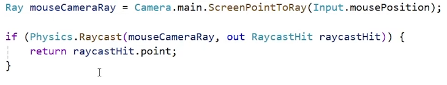

# 对角度做球面插值是旋转平滑

```csharp
localTransform.ValueRW.Rotation = 
                math.slerp(localTransform.ValueRO.Rotation, quaternion.LookRotation(moveDirection, math.up()), SystemAPI.Time.DeltaTime * rotationSpeed);
```

# 注意math.normalize(moveDirection)有可能返回NAN

# Burst有时会报错，可以暂时忽略

# 使用DOTS遵守的原则

## 1、只有在性能需求高的时候使用System

## 2、System应当专注于一件事情

# 游戏对象与DOTS交互

## monoBehaviour向System的通信

要注意获得的组件是值类型

- 获取实体管理器
- 获取查询
- 遍历实体设置副本数据并写回

```csharp
public class UnitSelectManager : MonoBehaviour
{

    private void Update()
    {
        if (Input.GetMouseButtonDown(1))
        {
            Vector3 mouseWorldPosition = MouseWorldPosition.Instance.GetPosition();

            // 获取默认世界的实体管理器
            EntityManager entityManager =  World.DefaultGameObjectInjectionWorld.EntityManager;
            // 获取一个含有UnitMover的实体的查询，Allocator.Temp会在该帧的末尾回收
            EntityQuery entityQuery = new EntityQueryBuilder(Allocator.Temp).WithAll<UnitMover>().Build(entityManager);

            // 获取组件和对象实体数组
            NativeArray<Entity> entityArray = entityQuery.ToEntityArray(Allocator.Temp);
            NativeArray<UnitMover> unitMoverArray = entityQuery.ToComponentDataArray<UnitMover>(Allocator.Temp);
            for (int i = 0; i < unitMoverArray.Length; i++)
            {
                UnitMover unitMover = unitMoverArray[i];
                unitMover.targetPosition = mouseWorldPosition;
                // 将副本数据写入内存
                entityManager.SetComponentData<UnitMover>(entityArray[i], unitMover);
            }
        }
    }

}
```

### 优化

```csharp
for (int i = 0; i < unitMoverArray.Length; i++)
            {
                UnitMover unitMover = unitMoverArray[i];
                unitMover.targetPosition = mouseWorldPosition;
                // 将副本数据写入内存
                // entityManager.SetComponentData<UnitMover>(entityArray[i], unitMover);
                unitMoverArray[i] = unitMover;
            }
            // 统一写入速度更快
            entityQuery.CopyFromComponentDataArray(unitMoverArray);
```

# Job System

1. 实现基础的逻辑，这里先用查询测试了逻辑
2. 重构为作业系统 IJobEntity
3. 添加[BurstCompile]

确保burst是启用的

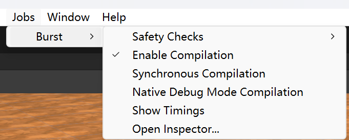

```csharp
using Unity.Burst;
using Unity.Entities;
using Unity.Transforms;
using Unity.Mathematics;
using Unity.Physics;
using UnityEngine;

partial struct UnitMoveSystem : ISystem
{


    [BurstCompile]
    public void OnUpdate(ref SystemState state)
    {
        UnitMoverJob unitMoverJob = new UnitMoverJob
        {
            deltaTime = SystemAPI.Time.DeltaTime
        };
        // 安排所有匹配查询的实体上并行运行
        unitMoverJob.ScheduleParallel();
        /* 
        foreach ((
            RefRW<LocalTransform> localTransform, 
            RefRO<UnitMover> unitMover,
            RefRW<PhysicsVelocity> physicsVelocity)
            in SystemAPI.Query<
                RefRW<LocalTransform>,
                RefRO<UnitMover>,
                RefRW<PhysicsVelocity>
                >())
        {

            // float3 targetPosition = MouseWorldPosition.Instance.GetPosition();
            
            float3 moveDirection = unitMover.ValueRO.targetPosition - localTransform.ValueRO.Position;
            moveDirection = math.normalize(moveDirection);

            
            localTransform.ValueRW.Rotation = 
                math.slerp(localTransform.ValueRO.Rotation,
                quaternion.LookRotation(moveDirection, math.up()),
                SystemAPI.Time.DeltaTime * unitMover.ValueRO.rotationSpeed);

            // localTransform.ValueRW.Position += moveDirection * moveSpeed.ValueRO.value * SystemAPI.Time.DeltaTime;
            physicsVelocity.ValueRW.Linear = moveDirection * unitMover.ValueRO.moveSpeed;
            physicsVelocity.ValueRW.Angular = float3.zero;


        }*/
    }


}

[BurstCompile]
public partial struct UnitMoverJob : IJobEntity
{

    public float deltaTime;
    public void Execute(ref LocalTransform localTransform,in UnitMover unitMover,ref PhysicsVelocity physicsVelocity)
    {
        float3 moveDirection = unitMover.targetPosition - localTransform.Position;
        moveDirection = math.normalize(moveDirection);


        localTransform.Rotation =
            math.slerp(localTransform.Rotation,
            quaternion.LookRotation(moveDirection, math.up()),
            deltaTime * unitMover.rotationSpeed);

        // localTransform.ValueRW.Position += moveDirection * moveSpeed.ValueRO.value * SystemAPI.Time.DeltaTime;
        physicsVelocity.Linear = moveDirection * unitMover.moveSpeed;
        physicsVelocity.Angular = float3.zero;
    }
}
```

# 实现框选逻辑

## 标签

- 标签是一种空组件
- 添加或移除组件是结构变化（实体原型变化），会降低性能

```csharp
public class SelectedAuthoring : MonoBehaviour
{
    
    public class Baker : Baker<SelectedAuthoring>
    {
        public override void Bake(SelectedAuthoring authoring)
        {
            Entity entity = GetEntity(TransformUsageFlags.Dynamic);
            AddComponent(entity,new Selected());
        }
    }

}

public struct Selected : IComponentData
{

}
```

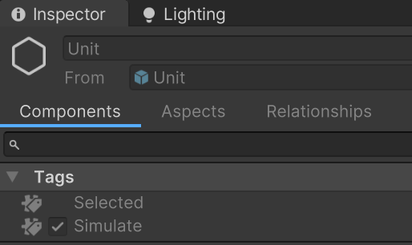

## 可启用组件（推荐）

不会发生原型变化

```csharp
public struct Selected : IComponentData,IEnableableComponent
{

}
```

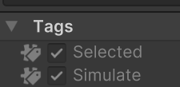

## 只需要在选中命令逻辑中对实体筛选启用Selected的部分

```csharp
EntityQuery entityQuery = new EntityQueryBuilder(Allocator.Temp).WithAll<UnitMover,Selected>().Build(entityManager);
```

## 选中特效

### 使用精灵渲染实际上会产生GameObject的链接，不够高效


### 使用网格

这将再次使用DOTS

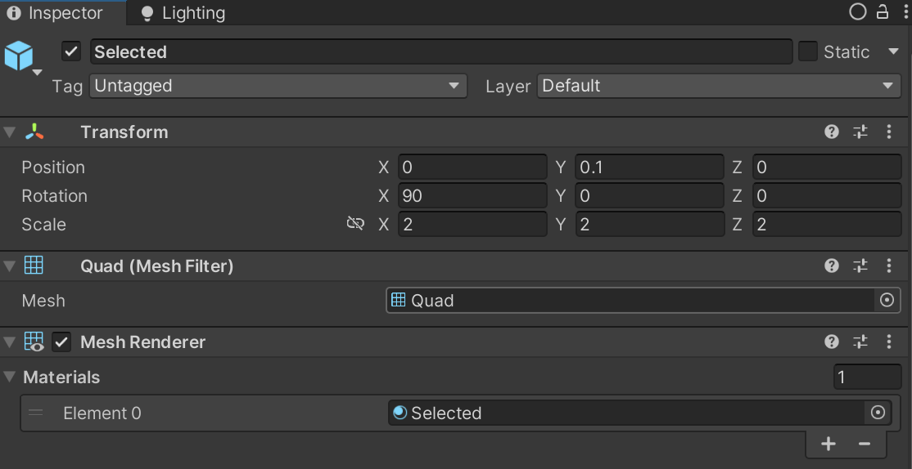

### 获得visualEntity

```csharp
using UnityEngine;
using Unity.Entities;

public class SelectedAuthoring : MonoBehaviour
{
    
    public GameObject visualEntity;

    public class Baker : Baker<SelectedAuthoring>
    {
        public override void Bake(SelectedAuthoring authoring)
        {
            Entity entity = GetEntity(TransformUsageFlags.Dynamic);
            AddComponent(entity,new Selected { 
                visualEntity = GetEntity(authoring.visualEntity,TransformUsageFlags.Dynamic)
            });
            SetComponentEnabled<Selected>(entity,false);
        }
    }

}

public struct Selected : IComponentData,IEnableableComponent
{
    public Entity visualEntity;
}
```

## 选择UI

### 获取选择区域逻辑

```csharp
private void Update()
{

        if (Input.GetMouseButtonDown(0))
        {
            selectionStartMousePosition = Input.mousePosition;
            Debug.Log("Down: " + selectionStartMousePosition);
        }
        if (Input.GetMouseButtonUp(0))
        {
            Vector2 selectionEndMousePosition = Input.mousePosition;
            Debug.Log("Up: " + selectionEndMousePosition);
        }

}
```

### 画布设置

- UI随高度变化缩放

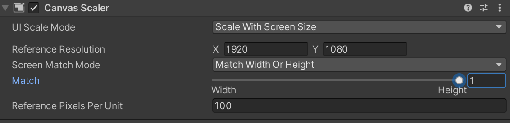

### UI的设计原则

- 与程序逻辑解耦，即通过事件通信

### 获取矩形区域

1. 获取开始和结束的鼠标位置，结束可以是当前帧的鼠标位置，而开始是MouseDown获取的
2. 计算左下角和右上角的Vector2
3. 返回 Rect( x,y,width,height )

```csharp
public Rect GetSelectionArea()
    {

        Vector2 selectionEndMousePosition = Input.mousePosition;

        Vector2 lowerLeftCorner = new Vector2(
            Mathf.Min(selectionStartMousePosition.x, selectionEndMousePosition.x),
             Mathf.Min(selectionStartMousePosition.y, selectionEndMousePosition.y)
            );

        Vector2 upperRightCorner = new Vector2(
            Mathf.Max(selectionStartMousePosition.x, selectionEndMousePosition.x),
             Mathf.Max(selectionStartMousePosition.y, selectionEndMousePosition.y)
            );

        return new Rect(
                lowerLeftCorner.x,
                lowerLeftCorner.y,
                upperRightCorner.x - lowerLeftCorner.x,
                upperRightCorner.y - lowerLeftCorner.y
            );
    }
```

### UI订阅Manager的事件，绘制矩形

- 绘制的UI会受到Canvas缩放的影响，可以认为默认乘上了localScale，因此要除以这个canvasScale来抵消影响

```csharp
private void UpdateVisual()
    {
        Rect selectionArea = UnitSelectManager.Instance.GetSelectionAreaRect();

        float canvasScale = canvas.transform.localScale.x;
        selectionAreaRectTransform.anchoredPosition = new Vector2(selectionArea.x, selectionArea.y) / canvasScale;
        selectionAreaRectTransform.sizeDelta = new Vector2(selectionArea.width , selectionArea.height) / canvasScale;

    }
```

# 实现单选逻辑

1. 查询 PhysicsWorldSingleton，获取 CollisionWorld
2. 将普通的射线检测转换为DOTS的射线检测
3. 使用CollisionWorld投射射线

### 位掩码

例：击中第0层和第5层

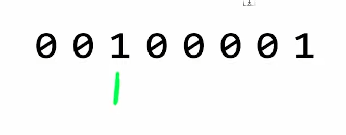

- BelongsTo设置为全1意味着射线不属于任何层
- CollidesWith的第六位设置位1，只与unitLayer = 6的层级发射碰撞
- GroupIndex 可以忽略层级与相同group发生碰撞

```csharp
// 执行单选逻辑
// 等价于 new EntityQueryBuilder(Allocator.Temp).WithAll<PhysicsWorldSingleton>().Build(entityManager);
entityQuery = entityManager.CreateEntityQuery(typeof(PhysicsWorldSingleton));
PhysicsWorldSingleton physicsWorldSingleton = entityQuery.GetSingleton<PhysicsWorldSingleton>();
CollisionWorld collisionWorld = physicsWorldSingleton.CollisionWorld;

UnityEngine.Ray cameraRay = Camera.main.ScreenPointToRay(Input.mousePosition);
int unitLayer = 6;
RaycastInput raycastInput = new RaycastInput { 
	Start = cameraRay.GetPoint(0f),
	End = cameraRay.GetPoint(9999f),
	Filter = new CollisionFilter
	{
		BelongsTo = ~0u,
		CollidesWith = 1u << unitLayer,
		GroupIndex = 0
	}
};
collisionWorld.CastRay(raycastInput);
```

# 避免士兵挤到一起，使用环形阵

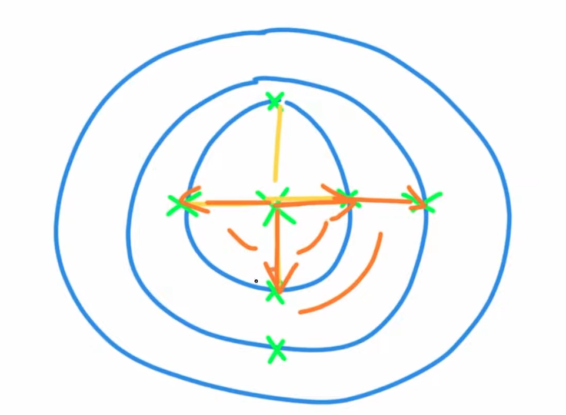

- 输入圆心位置，即鼠标点击的位置，位置的数量，即士兵的数量
- 线性的增加每个环上的数量，令r = 1，均分每个环
- 获得一个向右的向量，根据上一步获得的弧度计算旋转

```csharp
private NativeArray<float3> GenerateMovePositionArray(float3 targetPosition,int positionCount)
{
        NativeArray<float3> positionArray = new NativeArray<float3>(positionCount, Allocator.Temp);
        if (positionCount == 0)
        {
            return positionArray;
        }
        positionArray[0] = targetPosition;
        if (positionCount == 1)
        {
            return positionArray;
        }

        float ringSize = 2.2f;
        int ring = 0;
        int positionIndex = 1;


        while (positionIndex < positionCount)
        {
            // 每个环上线性增加位置的数量
            int ringPositionCount = 3 + ring * 2;

            for (int i = 0; i < ringPositionCount; i++)
            {
                // 2*PI*r,r=1 均分一个环，获得弧度
                float angle = i * (math.PI2 / ringPositionCount);

                // 获得一个向右的向量，对这个向量应用旋转即可
                float3 ringVector = math.rotate(quaternion.RotateY(angle), new float3(ringSize * (ring + 1), 0, 0));
                float3 ringPosition = targetPosition + ringVector;

                positionArray[positionIndex] = ringPosition;
                positionIndex++;
                // 如果生成位置的数量大于等于士兵的数量则跳出
                if (positionIndex >= positionCount)
                {
                    break;
                }
            }

            ring++;
        }

        return positionArray;

}
```

# DOTS世界的事件

只是对值的监听

## 用bool值表示事件的触发

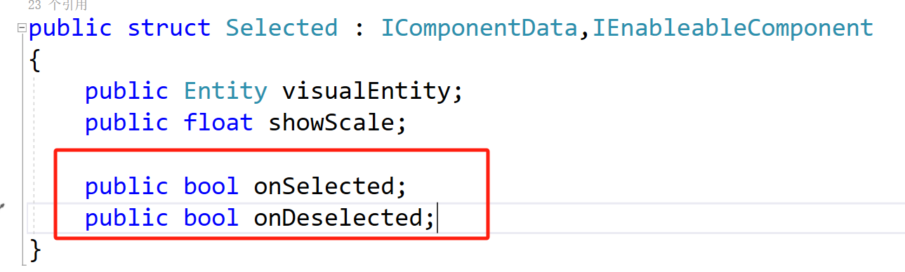

```csharp
Selected selected = entityManager.GetComponentData<Selected>(raycastHit.Entity);
selected.onSelected = true;
entityManager.SetComponentData(raycastHit.Entity, selected);
```

## 重置事件

```csharp
partial struct ResetEventSystem : ISystem
{
   
    [BurstCompile]
    public void OnUpdate(ref SystemState state)
    {
        foreach (RefRW<Selected> selected in SystemAPI.Query<RefRW<Selected>>().WithPresent<Selected>())
        {
            selected.ValueRW.onSelected = false;
            selected.ValueRW.onDeselected = false;
        }
    }
}
```

### 将重置系统安排到帧的末尾

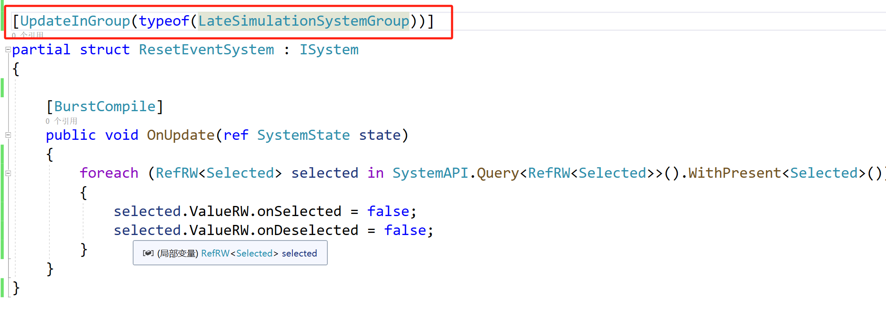

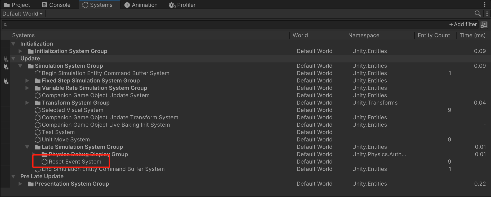

## 实际使用

在事件值发生变化是做出相应的视觉变化

```csharp
partial struct SelectedVisualSystem : ISystem
{

    [BurstCompile]
    public void OnUpdate(ref SystemState state)
    {
      
        foreach (RefRO<Selected> selected in SystemAPI.Query<RefRO<Selected>>().WithPresent<Selected>())
        {
            if (selected.ValueRO.onDeselected)
            {
                RefRW<LocalTransform> visualLocalTransform = SystemAPI.GetComponentRW<LocalTransform>(selected.ValueRO.visualEntity);
                visualLocalTransform.ValueRW.Scale = 0;
            }
            if (selected.ValueRO.onSelected)
            {
                RefRW<LocalTransform> visualLocalTransform = SystemAPI.GetComponentRW<LocalTransform>(selected.ValueRO.visualEntity);
                visualLocalTransform.ValueRW.Scale = selected.ValueRO.showScale;
            }
        }
     
    }

}
```

# 设置系统的更新顺序

```csharp
[UpdateInGroup(typeof(LateSimulationSystemGroup))]
[UpdateBefore(typeof(ResetEventSystem))]
partial struct SelectedVisualSystem : ISystem
```

# 定义阵营

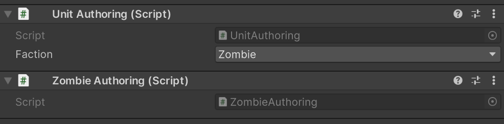

# 索敌

- 遍历列表
- 每个单位发出球形射线检测
- 判读检测到的单位是否有效，是否是敌方阵营
- 将有效的单位作为索敌目标
- 定时索敌，节约性能

# 造成伤害

1. 为所有单位添加Health组件
2. 上一步已经索敌，在所有拥有ShootAttack的实体上，修改索敌实体的Health

## EntityCommandBuffer

注意销毁实体要用实体命令缓冲区

```csharp
EntityCommandBuffer enityCommandBuffer = new EntityCommandBuffer(Allocator.Temp);
enityCommandBuffer.DestroyEntity(entity);
enityCommandBuffer.Playback(state.EntityManager);
```

使用DOTS预设的命令缓冲区

```csharp
EntityCommandBuffer enityCommandBuffer =
        SystemAPI.GetSingleton<EndSimulationEntityCommandBufferSystem.Singleton>().CreateCommandBuffer(state.WorldUnmanaged);

// 提交任务
enityCommandBuffer.DestroyEntity(entity);
```

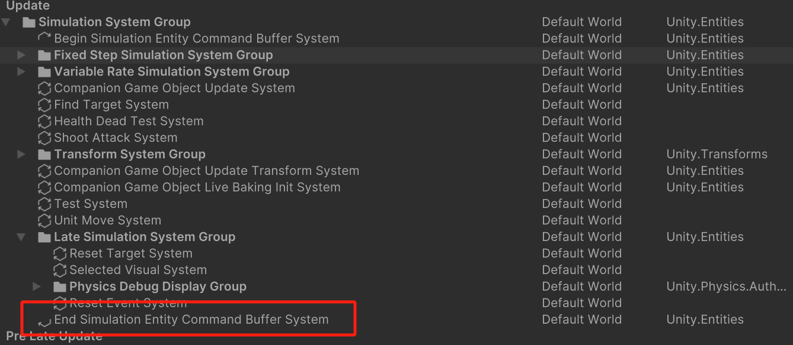

## 目标死亡后要用系统重置目标

```csharp
[UpdateInGroup(typeof(LateSimulationSystemGroup))]
partial struct ResetTargetSystem : ISystem
{
  
    [BurstCompile]
    public void OnUpdate(ref SystemState state)
    {
        foreach (RefRW<Target> target in SystemAPI.Query <RefRW<Target>> ())
        {
            if (!SystemAPI.Exists(target.ValueRO.targetEntity))
            {
                target.ValueRW.targetEntity = Entity.Null;
            }
        }
    }


}
```

## 解决实体销毁了但是网格还在

在预制件上设置

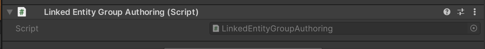

# Burst编译不好调试，可以暂时禁用修复bug

‍

# 子弹移动系统

与ShootAtack相似的逻辑

1. 查询所有同时拥有transform和bullet的实体，该实体就是子弹
2. 获取bullet组件的target，并向他移动
3. 距离足够小时子弹销毁自身，需要使用WithEntityAccess获取实体以及获取系统EntityCommandBuffer单例销毁子弹实体

```csharp
partial struct BulletMoveSystem : ISystem
{
  

    [BurstCompile]
    public void OnUpdate(ref SystemState state)
    {
        EntityCommandBuffer entityCommandBuffer =
            SystemAPI.GetSingleton<EndSimulationEntityCommandBufferSystem.Singleton>().CreateCommandBuffer(state.WorldUnmanaged);

        foreach ((
            RefRW<LocalTransform> localTransform,
            RefRO<Bullet> bullet,
            RefRO<Target> target,
            Entity entity)
            in SystemAPI.Query<
                RefRW<LocalTransform>,
                RefRO<Bullet>,
                RefRO<Target>>().WithEntityAccess())
        {
            LocalTransform targetLocalTransform = SystemAPI.GetComponent<LocalTransform>(target.ValueRO.targetEntity);
            float3 moveDirection = targetLocalTransform.Position - localTransform.ValueRO.Position;
            moveDirection = math.normalize(moveDirection);

            localTransform.ValueRW.Position += moveDirection * bullet.ValueRO.speed * SystemAPI.Time.DeltaTime;
            
            float destoryDistanceSq = 0.2f;
            if (math.distancesq(localTransform.ValueRO.Position, targetLocalTransform.Position) < destoryDistanceSq)
            {
                // 造成伤害
                RefRW<Health> targetHealth = SystemAPI.GetComponentRW<Health>(target.ValueRO.targetEntity);
                // int damageAmount = 1;
                targetHealth.ValueRW.healthAmount -= bullet.ValueRO.damageAmount;
                entityCommandBuffer.DestroyEntity(entity);
            }
        }
    }

   
}
```

## 一个隐蔽的问题（子弹反复横跳）

当子弹的速度足够大，并且destoryDistanceSq设置的足够小时：

- 子弹在某一帧的移动距离过大
- 子弹未满足销毁条件

于是子弹会出现在目标附近反复横跳的问题

### 解决方法

比较移动前后的距离，如果移动后的距离大于移动前，可以认为子弹超过了物体，这时要重置子弹的位置到目标位置

```csharp
// 移动前的距离
float distanceBeforeSq = math.distancesq(localTransform.ValueRO.Position, targetLocalTransform.Position);

float3 moveDirection = targetLocalTransform.Position - localTransform.ValueRO.Position;
moveDirection = math.normalize(moveDirection);
localTransform.ValueRW.Position += moveDirection * bullet.ValueRO.speed * SystemAPI.Time.DeltaTime;

// 移动后的距离
float distanceAfterSq = math.distancesq(localTransform.ValueRO.Position, targetLocalTransform.Position);

// 子弹超过了目标
if (distanceAfterSq > distanceBeforeSq)
{
	localTransform.ValueRW.Position = targetLocalTransform.Position;
}
```

# 生成子弹（动态生成实体）

在场景中挂载组件

使用EntitiesReferences组件将预制件烘焙成实体

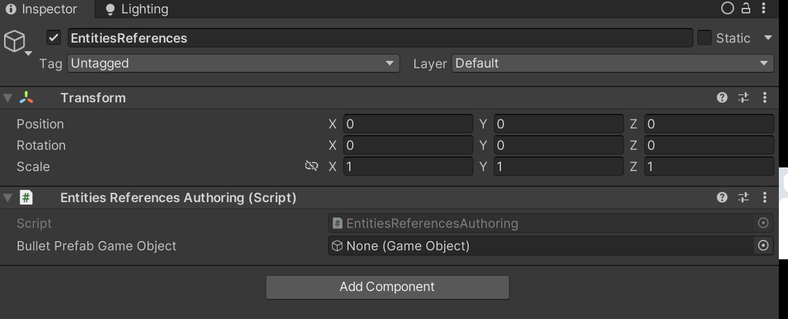

通过SystemAPI.GetSingleton访问场景中唯一的EntitiesReferences

```csharp
EntitiesReferences entitiesReferences = SystemAPI.GetSingleton<EntitiesReferences>();
```

在系统内部，可以访问state.EntityManager生成实体

```csharp
Entity bulletEntity = state.EntityManager.Instantiate(entitiesReferences.bulletPrefabEntity);
```

```csharp
// 获取子弹生成子弹实体并初始化实体的组件
          
            
            SystemAPI.SetComponent(bulletEntity, LocalTransform.FromPosition(localTransform.ValueRO.Position)); // 设置Transform
            
            RefRW<Bullet> bulletBullet = SystemAPI.GetComponentRW<Bullet>(bulletEntity);
            bulletBullet.ValueRW.damageAmount = shootAtack.ValueRO.damageAmount; // 设置伤害
            RefRW<Target> bulletTarget = SystemAPI.GetComponentRW<Target>(bulletEntity);
            bulletTarget.ValueRW.targetEntity = target.ValueRO.targetEntity; // 设置目标
```

## Bug修复

两个（多个）士兵同时锁定僵尸时，可能发生：

- 上一帧僵尸被其中一个士兵打死，已销毁
- 下一帧另一个士兵的子弹还在飞行，但执行move系统时发现target已经被上一帧reset系统清除，这一帧没有获取target，target这是是null


于是：

```csharp
if (target.ValueRO.targetEntity == Entity.Null)
            {
                entityCommandBuffer.DestroyEntity(entity);
                continue;
            }
```

## 由于重置目标执行在HealthDeadTest之前

有可能发生：

这一帧目标没有重置，但是目标在帧末尾销毁，所以在下一帧MoveSystem的目标依然存在但是已经失效

### 将重置系统设置在帧的开始运行

```csharp
[UpdateInGroup(typeof(SimulationSystemGroup), OrderFirst = true)]
```

### 仍然存在问题，物体并不会在一帧内立即销毁，但可以通过判断有无LocalTransform来检查实例是否存在

```csharp
[UpdateInGroup(typeof(SimulationSystemGroup), OrderFirst = true)]
partial struct ResetTargetSystem : ISystem
{
  
    [BurstCompile]
    public void OnUpdate(ref SystemState state)
    {
        foreach (RefRW<Target> target in SystemAPI.Query <RefRW<Target>> ())
        {
            if (target.ValueRW.targetEntity != Entity.Null)
            {
                if (!SystemAPI.Exists(target.ValueRO.targetEntity) || !SystemAPI.HasComponent<LocalTransform>(target.ValueRO.targetEntity))
                {
                    target.ValueRW.targetEntity = Entity.Null;
                }
            }
            
        }
    }
}
```

### 判断实体是否存在

```csharp
state.EntityManager.Exists(target.ValueRO.targetEntity)
```

# 士兵攻击逻辑

## 寻找目标（Target Authoring）

- 查询所有目标
- 是否再索敌范围内
- 获得敌对阵营目标

## 射击目标（ShootingAttack）

- 是否有攻击目标
- 是否在射击范围 => 移动到攻击范围 or 停止移动并攻击
- 调整士兵朝向敌人
- 射击cd => 射击

## 局部坐标转世界坐标

```csharp
float3 bulletSpawnWorldPosition = localTransform.ValueRO.TransformPoint(shootAtack.ValueRO.bulletSpawnLocalPosition);
```

# 用Transform存储定位点更加易于编辑

```csharp
public class ShootAttackAuthoring : MonoBehaviour
{
    ...
    public Transform bulletSpawnPositionTransform;

    public class Baker : Baker<ShootAttackAuthoring>
    {
        public override void Bake(ShootAttackAuthoring authoring)
        {
            Entity entity = GetEntity(TransformUsageFlags.Dynamic);
            AddComponent(entity,new ShootAttack { 
                ...
                bulletSpawnLocalPosition = authoring.bulletSpawnPositionTransform.localPosition
            });
        }
    }
}

public struct ShootAttack : IComponentData
{
    ...
    public float3 bulletSpawnLocalPosition;

}
```

# FindTargetSystem修复

似乎物体被销毁了在某一段时间内还是会被射线检测

```csharp
if (collisionWorld.OverlapSphere(localTransfom.ValueRO.Position, findTarget.ValueRO.range, ref distanceHitList, collisionFilter))
            {
                foreach (DistanceHit distanceHit in distanceHitList)
                {
                    // 目标已经无效
                    if (!SystemAPI.HasComponent<LocalTransform>(distanceHit.Entity))
                    {
                        
                        Debug.Log("目标没有Transform但是被碰撞体检测！");
                        continue;
                    }

                    Unit targetUnit = SystemAPI.GetComponent<Unit>(distanceHit.Entity);

                    if (targetUnit.faction == findTarget.ValueRO.targetFaction)
                    {
                        // 有效目标
                        // Debug.Log(distanceHit.Entity);
                        target.ValueRW.targetEntity = distanceHit.Entity;
                        break;
                    }
                    
                }
            }
```

# 随机数

## Unity.Mathematics.Random

在烘焙时传入随机种子

相同的随机种子返回相同的随机数序列，因此需要在每个单位设置不同的随机种子

```csharp
AddComponent(entity,new RandomWalking
{
	targetPosition = authoring.targetPosition,
	originPosition = authoring.originPosition,
	distanceMin = authoring.distanceMin,
	distanceMax = authoring.distanceMax,
	random = new Unity.Mathematics.Random(authoring.randomSeed)
});
```

# 非均匀缩放血条

## TransformUsageFlags.NonUniformScale

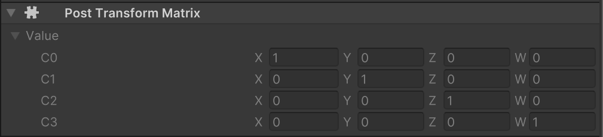

```csharp
RefRW<PostTransformMatrix> barVisualPostTranformMatrix = 
SystemAPI.GetComponentRW<PostTransformMatrix>(healthBar.ValueRO.healthEntity);
barVisualPostTranformMatrix.ValueRW.Value = float4x4.Scale(healthNormalized,1,1);
```

# GetEntity

这获取的是 authoring.barVisualGameObject对应的实体

```csharp
barVisualEntity = GetEntity(authoring.barVisualGameObject, TransformUsageFlags.NonUniformScale)
```

# billboard效果

- 获取父物体的LocalTransform
- 获得相机forward的rotation
- 将rotation通过InverseTransformRotation转为相对于父物体的旋转赋给localTransform

```csharp
parentLocalTransform.InverseTransformRotation(quaternion)
```

# 创建射击灯光

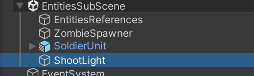

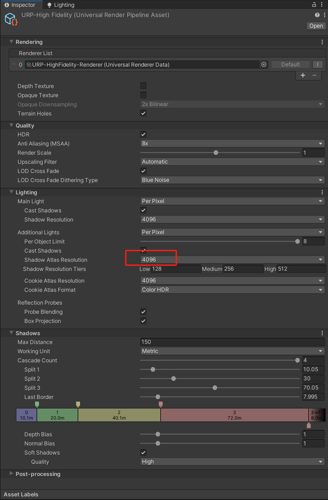

```csharp
// 生成灯光 
Entity shootLightEnity = state.EntityManager.Instantiate(entitiesReferences.shootLightPrefabEntity);
SystemAPI.SetComponent(shootLightEnity, LocalTransform.FromPosition(bulletSpawnWorldPosition)); // 设置Transform
```

# 胶囊体问题

似乎胶囊体的半径大于等于高度的1/2就会失效，无法被检测

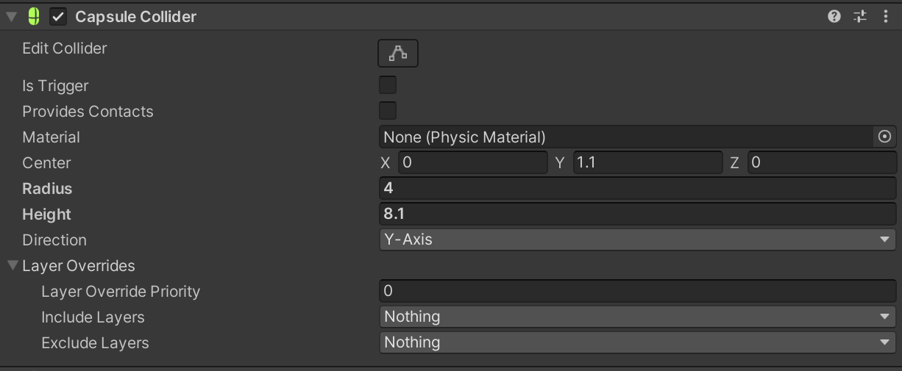

# 通过额外的射线检测解决近战无法解决的问题

```csharp
NativeList<RaycastHit> raycastHits = new NativeList<RaycastHit>(Allocator.Temp);
bool isCloseEnoughToAttack = math.distancesq(localTransform.ValueRO.Position, targetLocalTransform.Position) < meleeAttackDistanceSq;
            
            bool isTouchingTarget = false;
            if (!isCloseEnoughToAttack)
            {
                float3 dirToTarget = targetLocalTransform.Position - localTransform.ValueRO.Position;
                dirToTarget = math.normalize(dirToTarget);

                float distanceExtraToTestRaycast = 0.4f;
                RaycastInput raycastInput = new RaycastInput { 
                    Start = localTransform.ValueRO.Position,
                    End = localTransform.ValueRO.Position + dirToTarget * (meleeAttack.ValueRO.colliserSize + distanceExtraToTestRaycast),
                    Filter = CollisionFilter.Default
                };
                
                raycastHits.Clear();
                if (collisionWorld.CastRay(raycastInput, ref raycastHits))
                {
                    
                    foreach (RaycastHit raycastHit in raycastHits)
                    {
                        // 击中了目标
                        if(raycastHit.Entity == target.ValueRO.targetEntity)
                        {
                            isTouchingTarget = true;
                            break;
                        }
                    }
                }

            }
```

# 移动覆盖

## 对想要操作的实体只操作一次（标签）

```csharp
public void OnUpdate(ref SystemState state)
    {

        EntityCommandBuffer entityCommandBuffer = 
            SystemAPI.GetSingleton<EndSimulationEntityCommandBufferSystem.Singleton>().CreateCommandBuffer(state.WorldUnmanaged);

        foreach ((
            RefRO<LocalTransform> localTransfrom,
            RefRW<UnitMover> unitMover,
            RefRO<SetupUnitMoverDefaultPosition> setUnitMoverDefaultPosition,
            Entity entity)
            in SystemAPI.Query<
                RefRO<LocalTransform>, 
                RefRW<UnitMover>, 
                RefRO<SetupUnitMoverDefaultPosition>>().WithEntityAccess())
        {
            unitMover.ValueRW.targetPosition = localTransfrom.ValueRO.Position;
            entityCommandBuffer.RemoveComponent<SetupUnitMoverDefaultPosition>(entity);

            UnityEngine.Debug.Log("Setup");
        }
    }
```

## ShootAttack、MeleeAttack中排除MoveOverride

只有MoveOverride 未启用时才正常进行攻击逻辑

```csharp
WithDisabled<MoveOverride>()
```

## 移动覆盖系统只负责靠近target，足够接近时禁用自身

```csharp
public void OnUpdate(ref SystemState state)
    {
        foreach ((
            RefRO<LocalTransform> localTransform, 
            RefRO<MoveOverride> moveOverride,
            EnabledRefRW<MoveOverride> moveOverrideEnabled,
            RefRW<UnitMover> unitMover) in SystemAPI.Query<
                RefRO<LocalTransform>, 
                RefRO<MoveOverride>, 
                EnabledRefRW<MoveOverride>,
                RefRW<UnitMover>>())
        {
            if (math.distancesq(localTransform.ValueRO.Position, moveOverride.ValueRO.targetPosition) > UnitMoveSystem.REACHED_TARGET_POSITION_DISTANCE_SQ)
            {
                // 距离移动覆盖的位置太远了
                unitMover.ValueRW.targetPosition = moveOverride.ValueRO.targetPosition;
            }else
            {
                // 到达移动覆盖位置
                moveOverrideEnabled.ValueRW = false;
            }
        }
    }
```

## 在UnitSelectManager 右键点击时写入Override的target

```csharp
// 右键
        if (Input.GetMouseButtonDown(1))
        {
            Vector3 mouseWorldPosition = MouseWorldPosition.Instance.GetPosition();

            // 获取默认世界的实体管理器
            EntityManager entityManager =  World.DefaultGameObjectInjectionWorld.EntityManager;
            // 获取一个含有UnitMover的实体的查询，Allocator.Temp会在该帧的末尾回收
            EntityQuery entityQuery = new EntityQueryBuilder(Allocator.Temp).WithAll<Selected>().WithPresent<MoveOverride>().Build(entityManager);

            // 获取组件和对象实体数组
            NativeArray<Entity> entityArray = entityQuery.ToEntityArray(Allocator.Temp);
            NativeArray<MoveOverride> moveOverrideArray = entityQuery.ToComponentDataArray<MoveOverride>(Allocator.Temp);
            NativeArray<float3> movePositionArray = GenerateMovePositionArray(mouseWorldPosition, entityArray.Length);

            for (int i = 0; i < moveOverrideArray.Length; i++)
            {
                MoveOverride moveOverride = moveOverrideArray[i];
                moveOverride.targetPosition = movePositionArray[i];
                // 将副本数据写入内存
                // entityManager.SetComponentData<UnitMover>(entityArray[i], unitMover);
                moveOverrideArray[i] = moveOverride;
                entityManager.SetComponentEnabled<MoveOverride>(entityArray[i], true);
            }
            // 统一写入速度更快
            entityQuery.CopyFromComponentDataArray(moveOverrideArray);
        }
```

## 总结

- 需要一个Enable组件
- 在Enable开启时攻击系统失效（搜索中排除，攻击系统不在设置UnitMover的target）
- 使用MoveOverrideSystem设置UnitMover的target （UnitMover负责移动）

# RequireForUpdate

在系统中，在具有该组件的实体产生之前不会执行Update

```csharp
public void OnCreate(ref SystemState state)
    {
        state.RequireForUpdate<EntitiesReferences>();
    }
```

‍
