# Navigation

# 2022版本需要现在WIndos=》Package导入

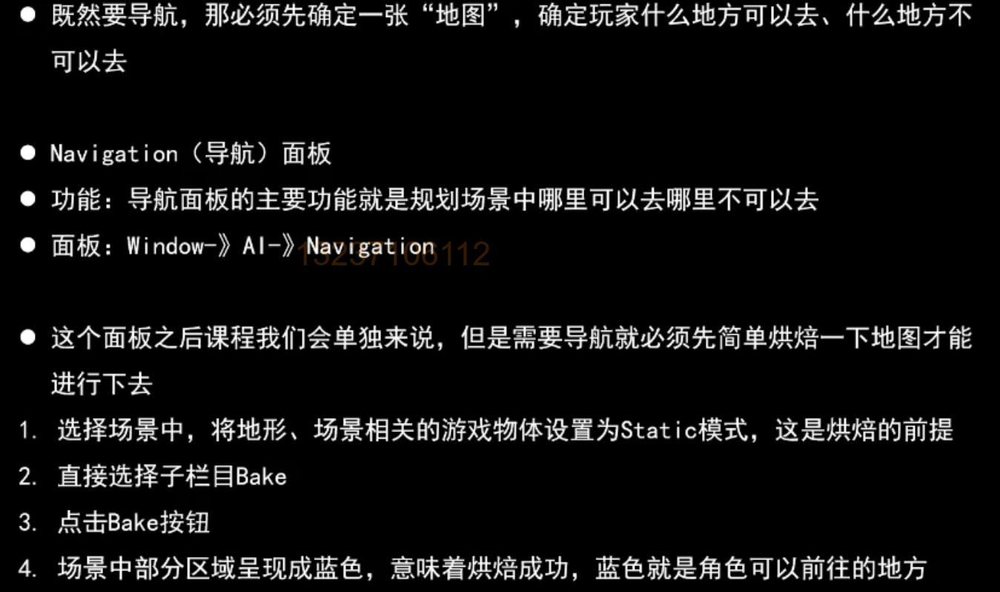

# Bake完成

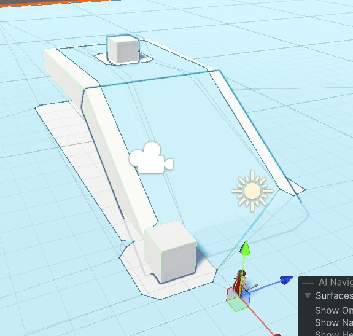

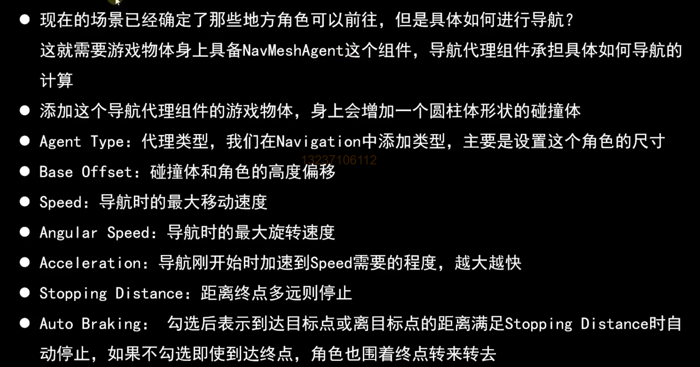

# 代码控制

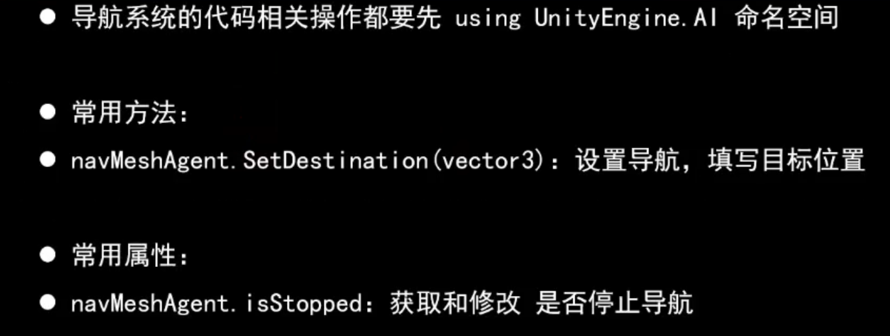

```c#
    void Update()
    {
        agent.SetDestination(target.position);
        if (Input.GetKeyDown(KeyCode.Space))
        {
            agent.isStopped = !agent.isStopped;
        }
    }
```

# 面板属性

## Agent面板

这里代表一种类型，无论如何修改，对最终结果都不影响

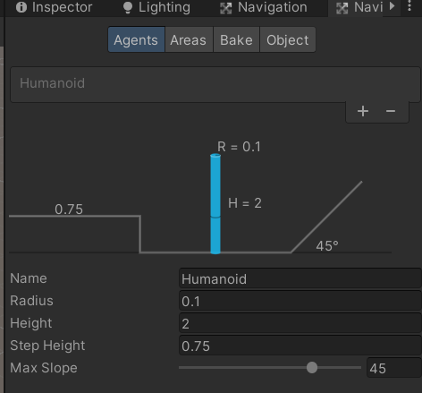

## 区域和代价

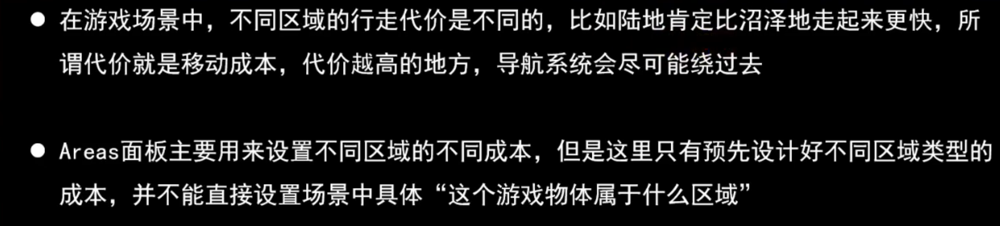

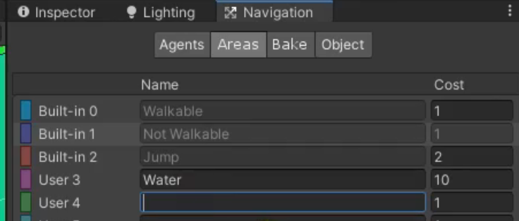

## Object 设置

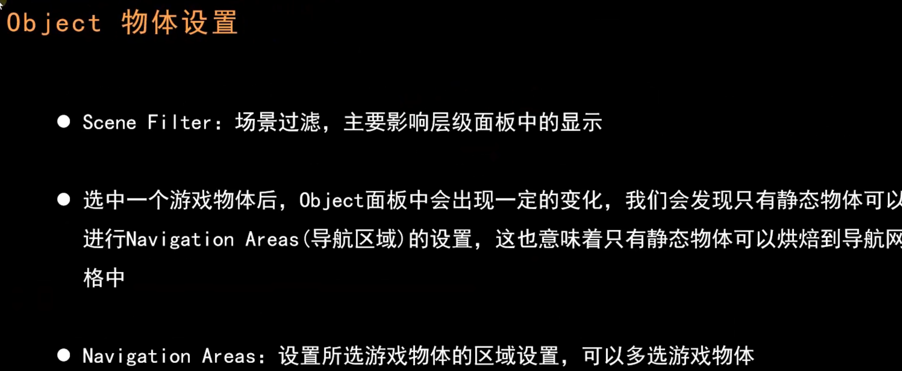

### 把两个桥分别设置为Walkable和Water

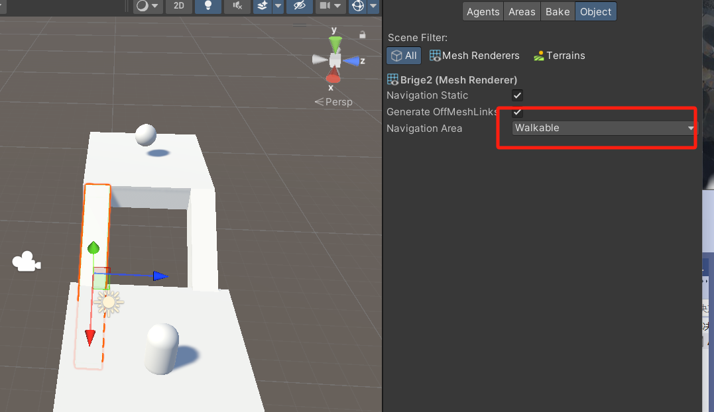

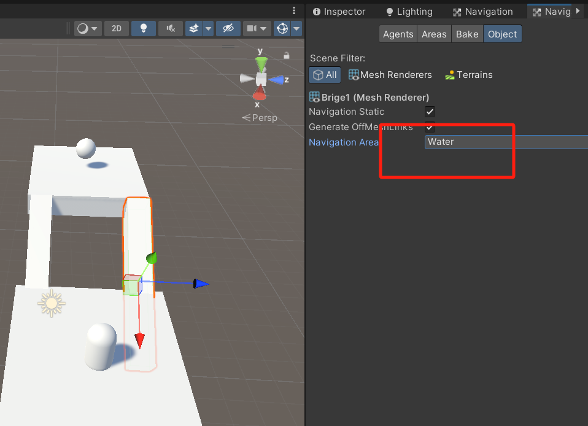

根据角色的宽度设置合适的Radius，否则容易出现角色越出边缘

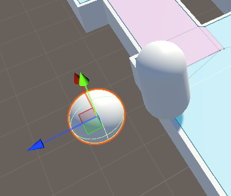

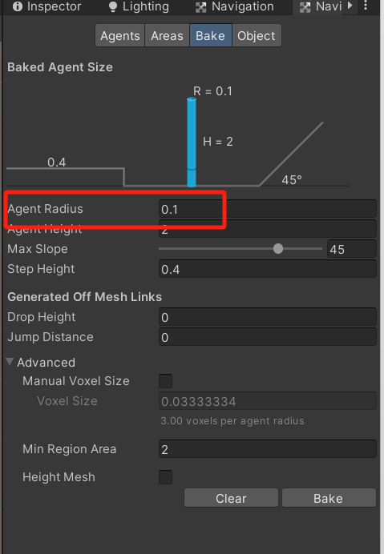

Bake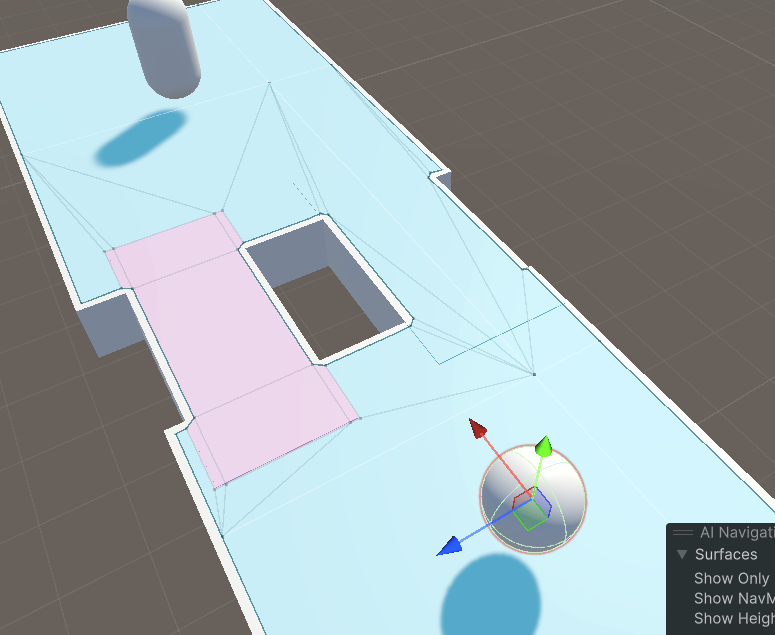

Agent显示是0.5

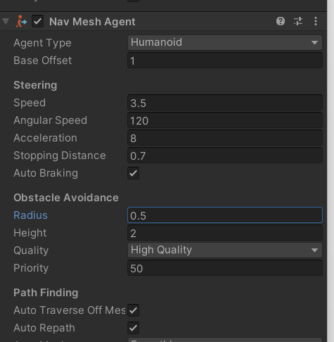

按照0.5烘焙

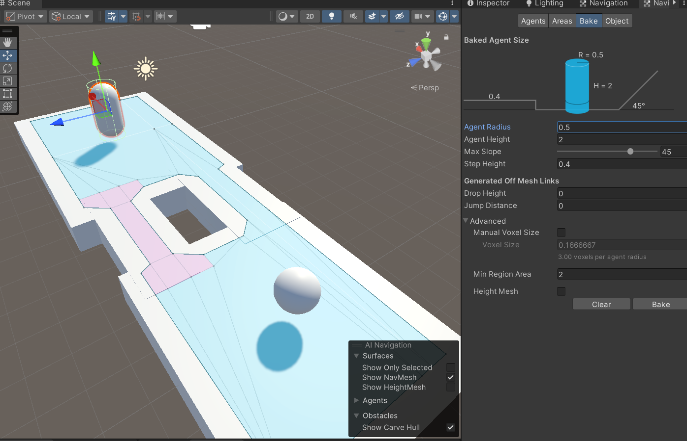

物体贴边

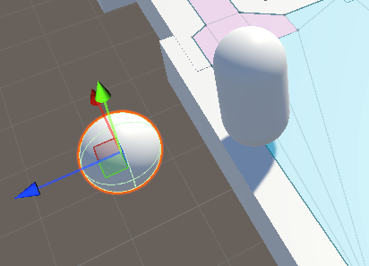

## Bake


这脸图上显示的坡度、半径以及高度，是真实影响烘焙的参数

# NavMeshObstacle

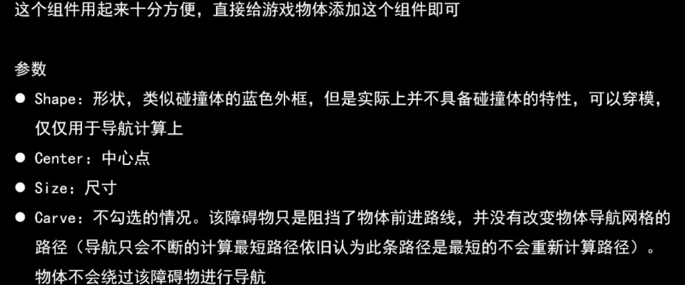

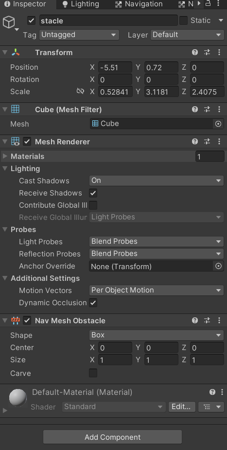

## Carve的勾选

勾上，当然如果足够高的话也可以通过，这跟Bake中设置的Agent Height有关

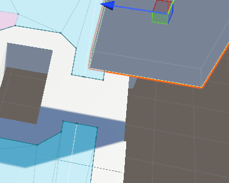

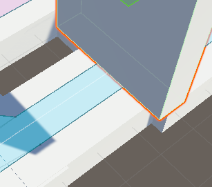

不勾

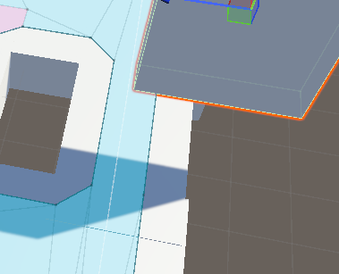

# 角色移动案例

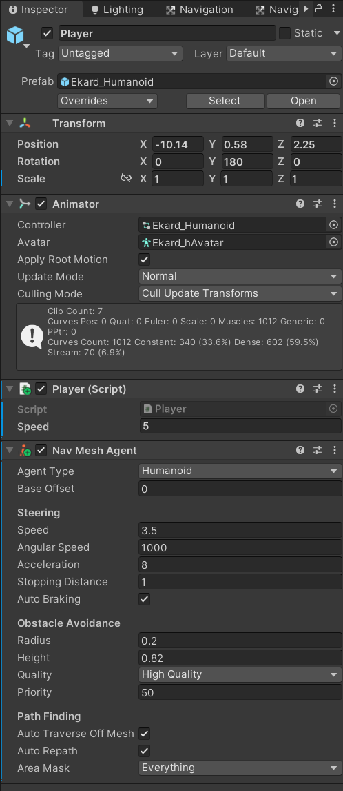

```c#
private void Update()
    {
        if (Input.GetMouseButtonDown(1))
        {
            Ray ray = Camera.main.ScreenPointToRay(Input.mousePosition);

            if (Physics.Raycast(ray,out RaycastHit hitInfo, 1000))
            {

                Debug.DrawLine(ray.origin, hitInfo.point , Color.red);
                agent.SetDestination(hitInfo.point);
                animator.SetBool("Run", true);
                agent.isStopped = false;

            }
        }

        if (Vector3.Distance(transform.position , agent.destination) <= agent.stoppingDistance)
        {
            animator.SetBool("Run", false);
            agent.isStopped = true;
        }
    }
```
