# Sprite和SpriteRenderer

# Pixels Per Unit

每米有多少个像素

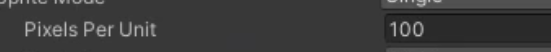

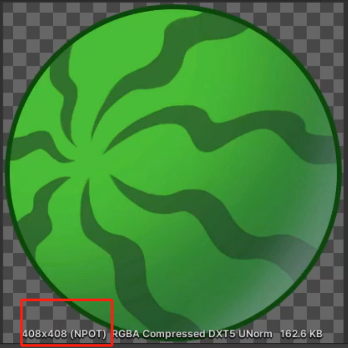

这里每米100个像素，这个sprite就是4.08米

# 拆分精灵图

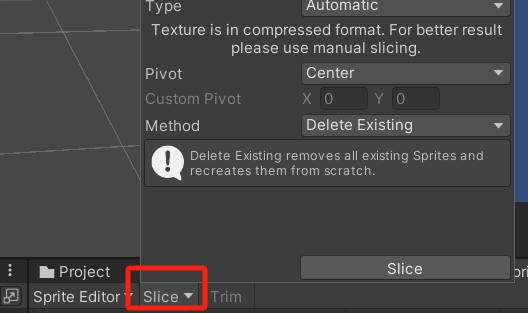

## 未拆分前可以看到没有精灵

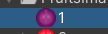

## 手动切

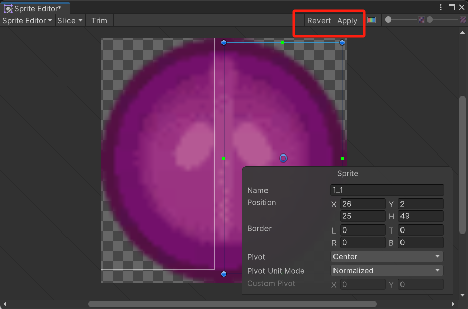

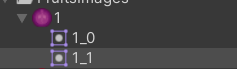

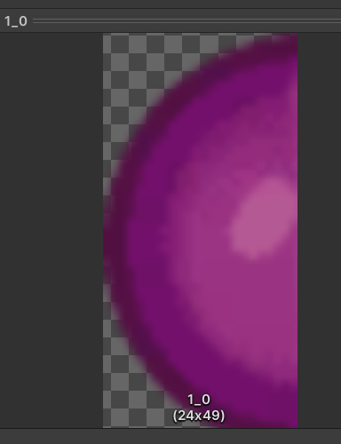

可以做一些破碎的效果

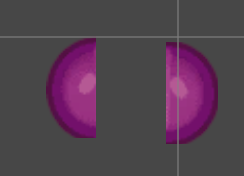

## 自动切

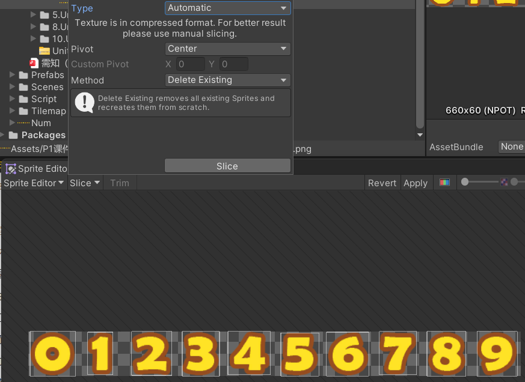

## 按格子数量切

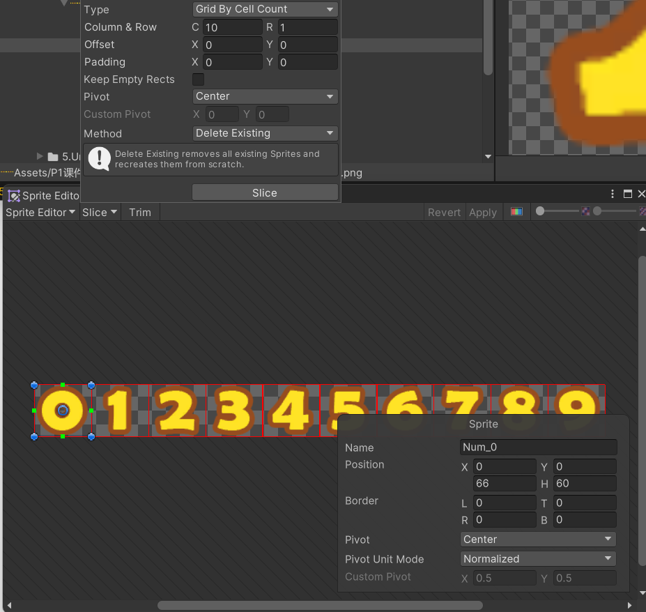

## 切割时可以指定中心点

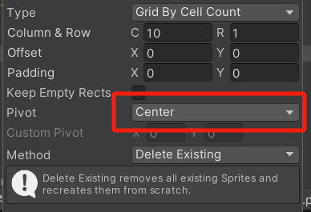

# SpriteRender

## sortinglayer月下方优先级越高
