# UI

# Unity2D和UI的区别

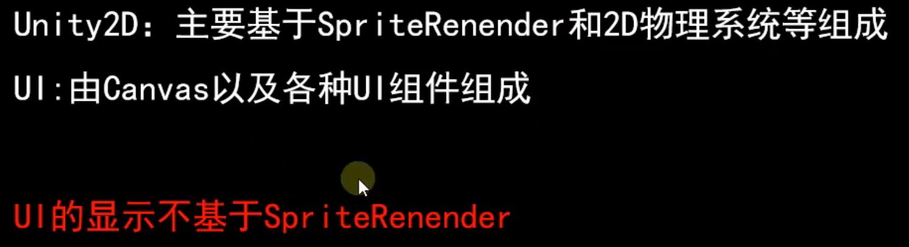

# EventSystem

事件系统，实现了UI的各种事件

# 设置UI层级

```csharp
head.transform.SetAsLastSibling();
```

# UI的类型


## UGUI

### 六大基础组件


#### Canvas

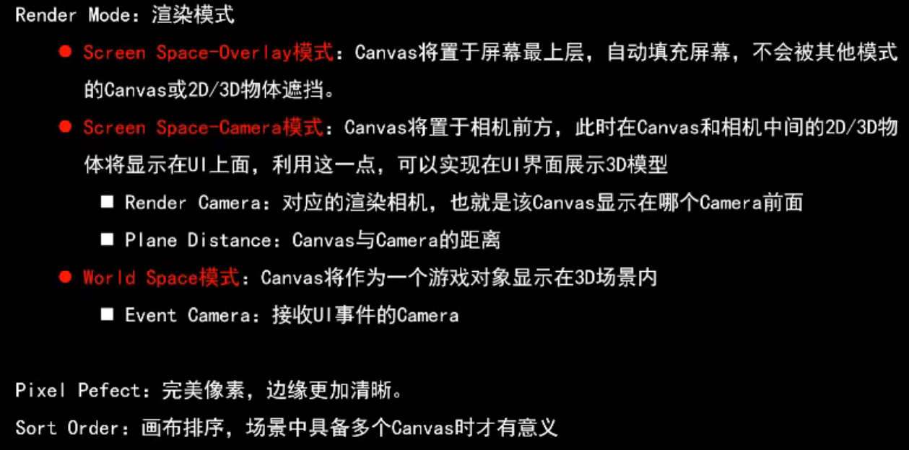

##### 三种模式

覆盖模式


相机模式，不推荐把主相机作为渲染相机

关闭主摄像机对UI层的渲染，UI摄像机只渲染UI


UI摄像机改成Depth only 不覆盖3d物体的渲染


World Space


#### 想要渲染在UI前的物体


# 布局

## 锚点


适应父级宽度

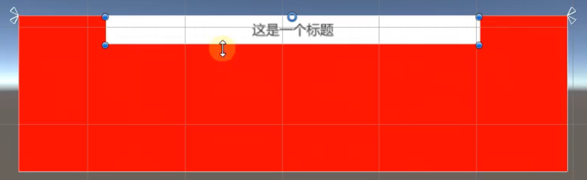

## 网格布局

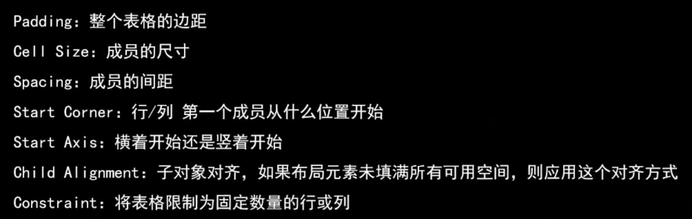


### <span id="20250321195159-njxha0m" style="display: none;"></span>实现自动排布并且父物体适应子物体尺寸


## 水平/垂直布局

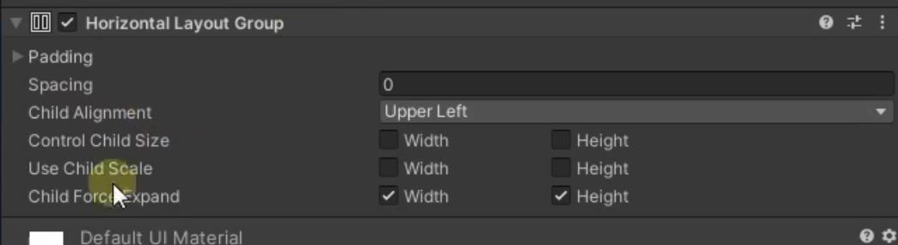

# 点击行为

## 方法一、实现 IPointerClickHandler

## 方法二、Event Trigger


# RaycastTarget决定UI是否可以点触


# 设置分辨率缩放


# Scroll View

content里面才是内容，scrollbar是根据content内容大小缩放的


## 隐藏滚动条


现在才可以隐藏


## 开关两种滚动条


## 事件

事件的参数是Vector2，代表在x和y方向上滚动了多少，值在0-1之间

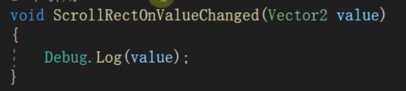

# Button

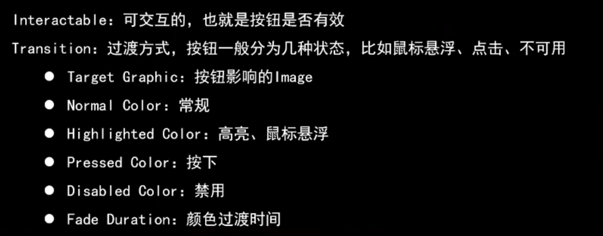

Target Graphic必须设置


## Navigation（重要）

方向输入来控制选中

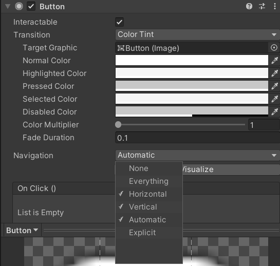

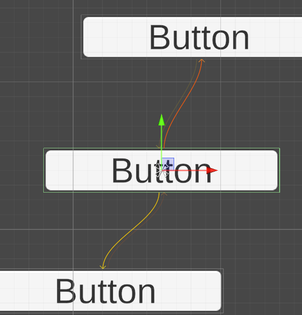

## 点击事件

- 把text组件的值修改
- 修改Main Camera的name
- 修改Main Camera的父节点

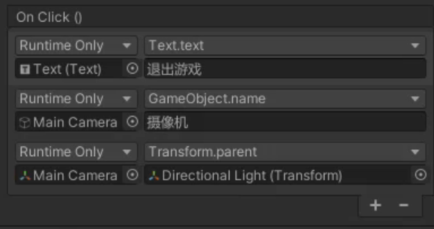

# Image

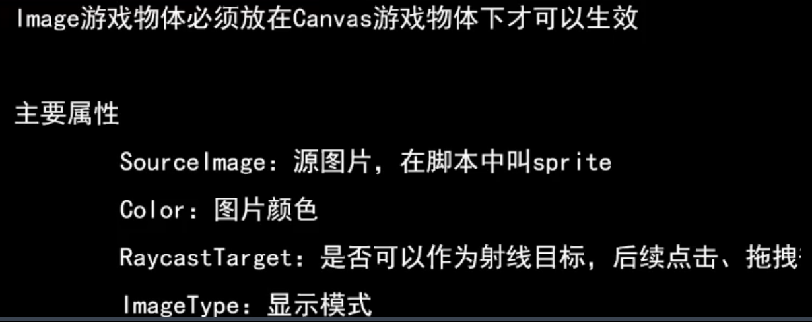

## Set Native Size

设置图片组件大小为sprite原始尺寸


## Image Type

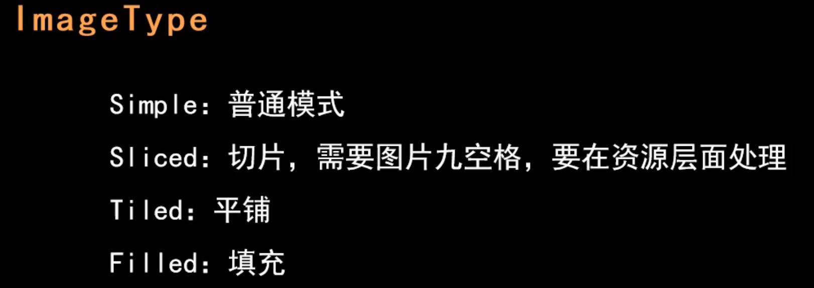

### Filled 可以用来做进度条之类的效果

### Sliced

需要图片九宫格

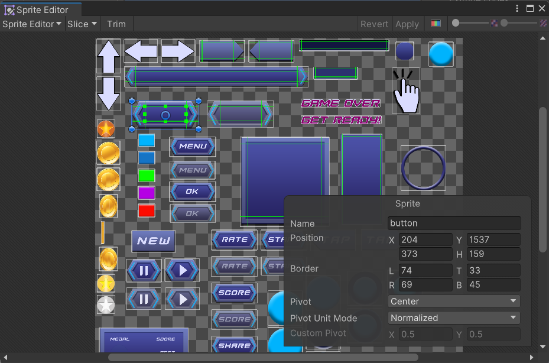


- 好处在于拉伸之后可以控制sprite的哪些部分缩放，哪些部分不变
- 如下图水平拉伸只有中间缩放了

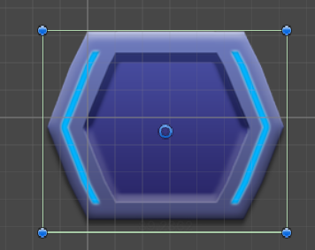

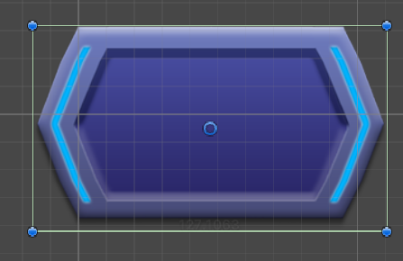

# Text

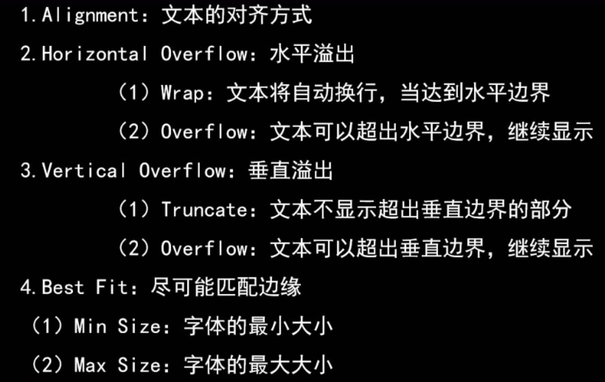

## Best Fit

字体自适应文本框大小

# InputField

可以约束输入的内容类型

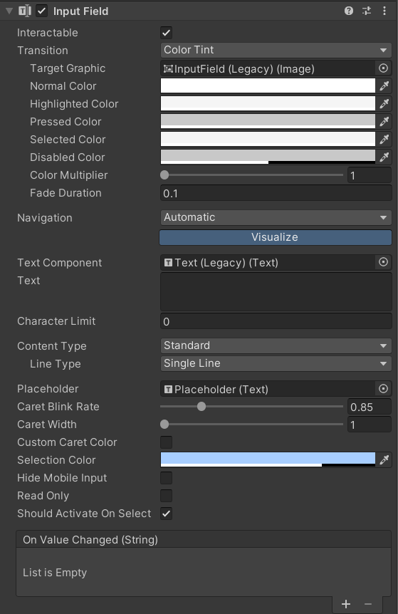

## 事件

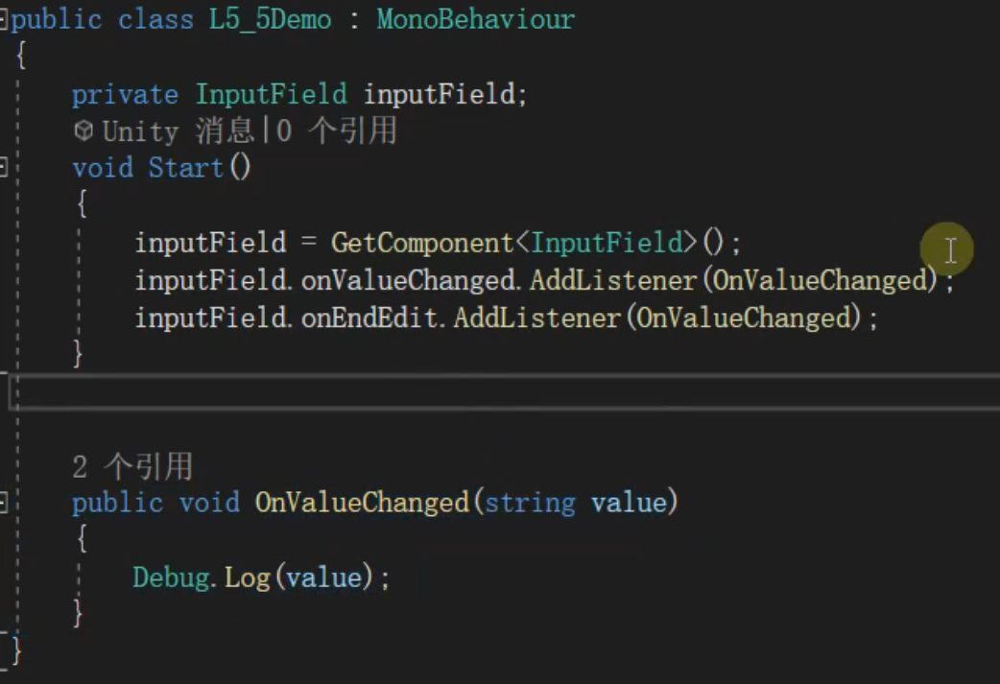

# Toggle

## Toggle Group   实现单选

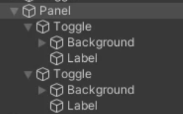

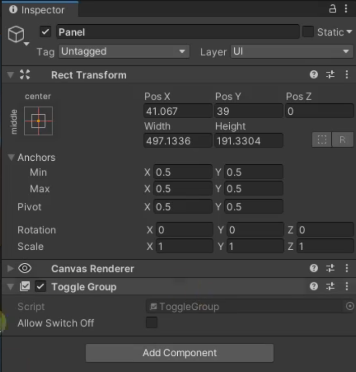

在子级添加Group的引用

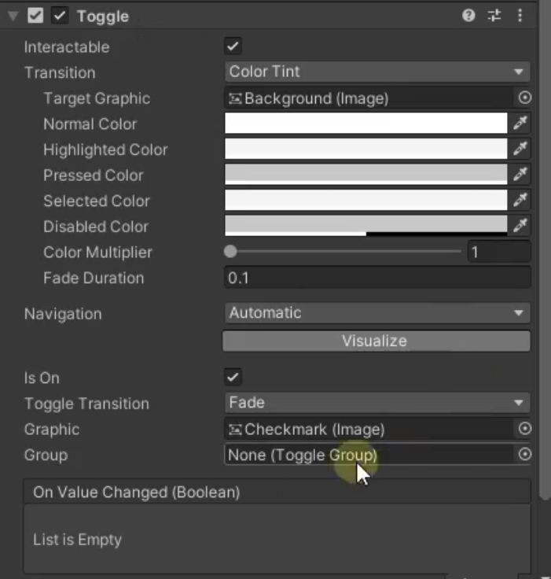

# Dropdown

Dropdown的template是下拉后的样式

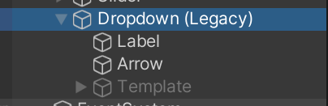

如果要显示sprite，需要手动指定一个载体

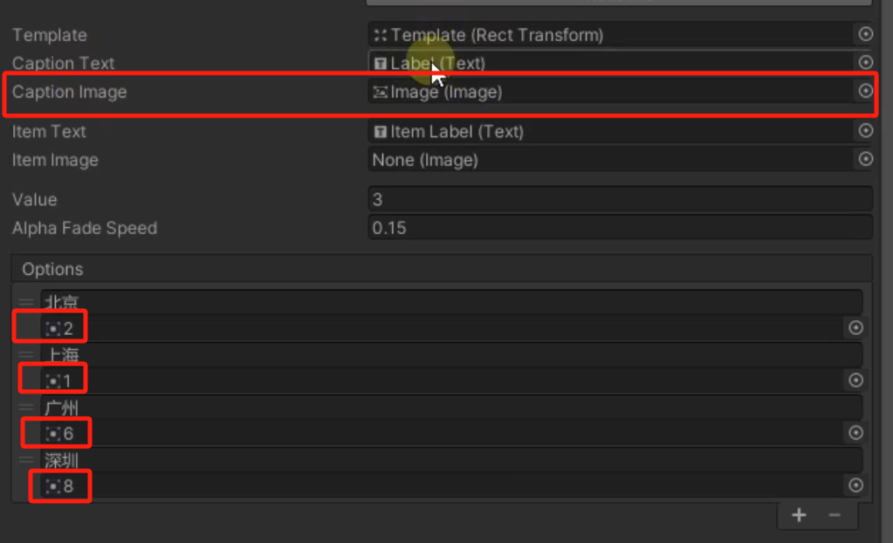


事件的回调参数是int

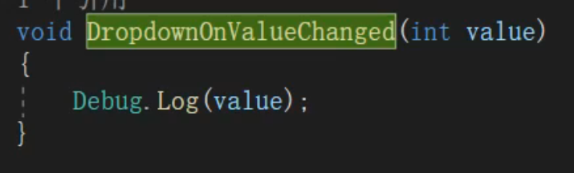

# Mask

## 效果


## 层级结构

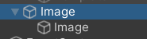

父节点添加一个Mask组件

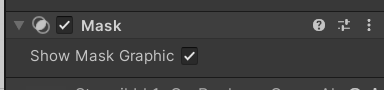

# 事件系统

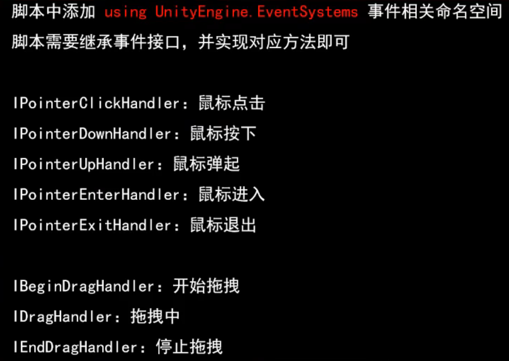
