# UI

# 设置UI层级

```csharp
head.transform.SetAsLastSibling();
```

# UI的类型

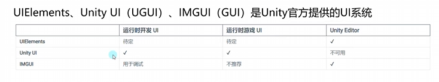

## UGUI

### 六大基础组件

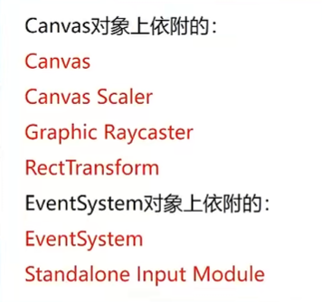

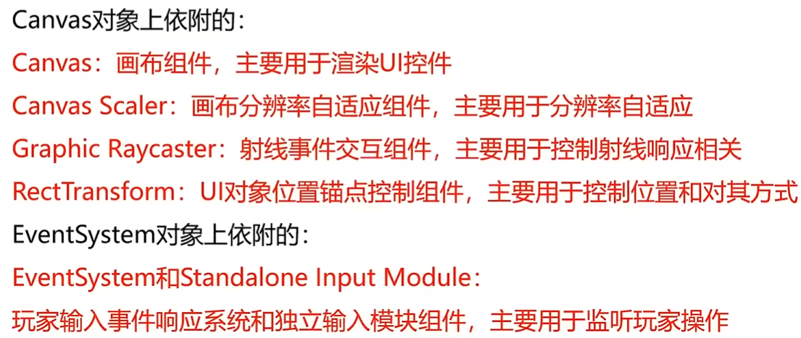

#### Canvas

##### 三种模式

覆盖模式

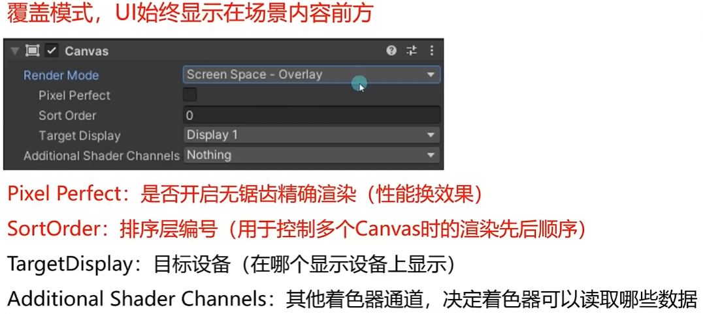

相机模式，不推荐把主相机作为渲染相机

关闭主摄像机对UI层的渲染，UI摄像机只渲染UI

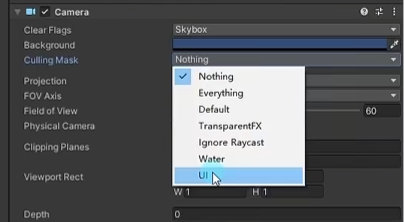

UI摄像机改成Depth only 不覆盖3d物体的渲染

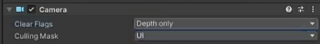

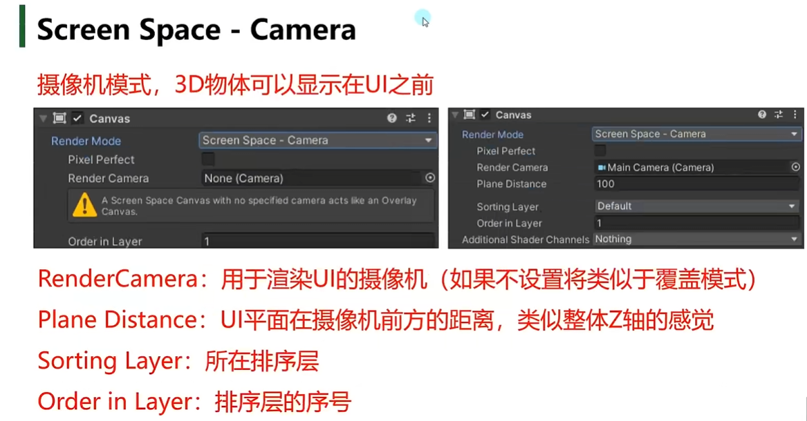

World Space

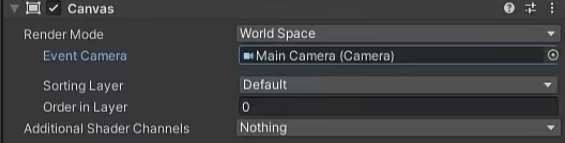

#### 想要渲染在UI前的物体

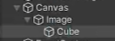

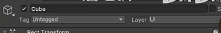

# 布局

## 网格布局

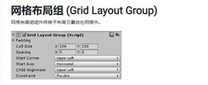

### <span id="20250321195159-njxha0m" style="display: none;"></span>实现自动排布并且父物体适应子物体尺寸

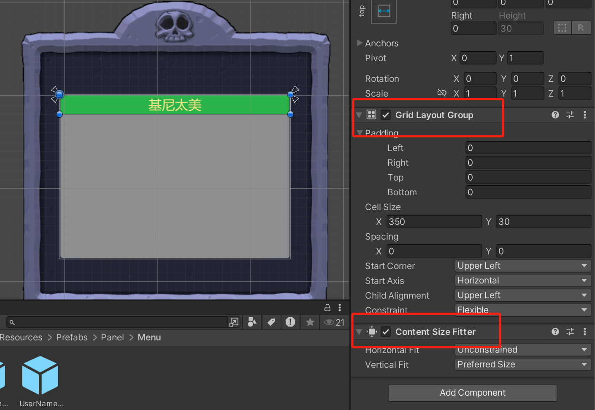

# 点击行为

## 方法一、实现 IPointerClickHandler

## 方法二、Event Trigger

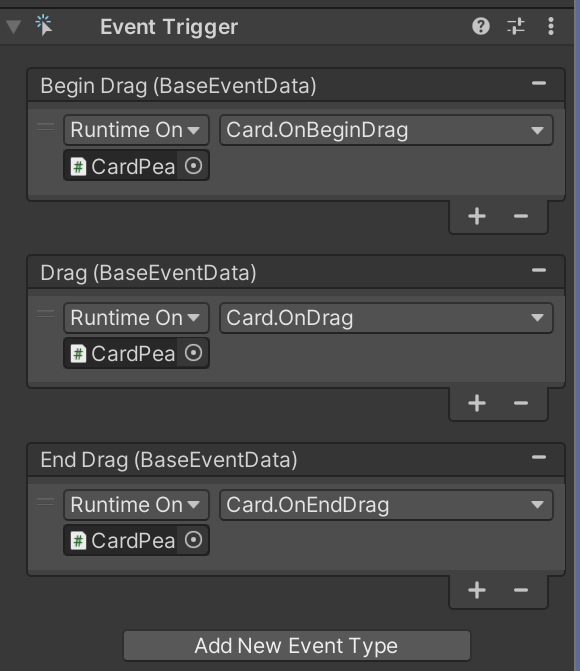

# RaycastTarget决定UI是否可以点触

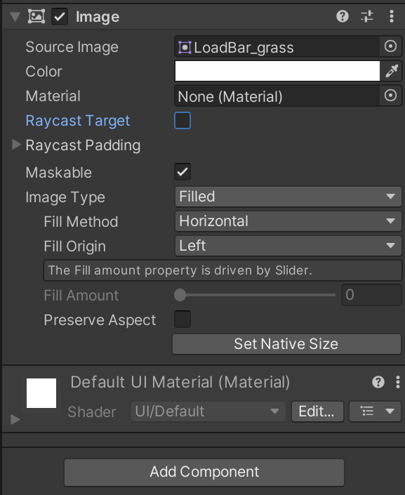

# 设置分辨率缩放

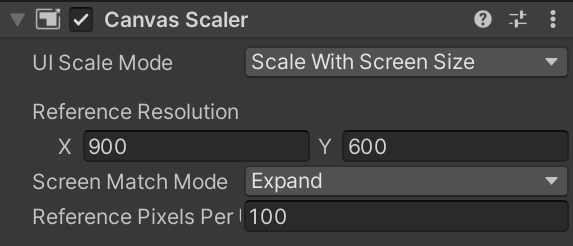

# Scroll View

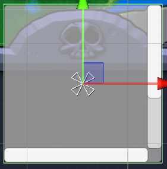

## 隐藏滚动条

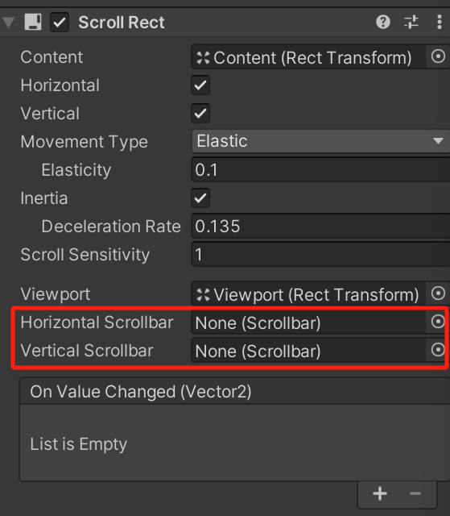

现在才可以隐藏

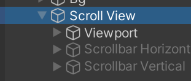

## 开关两种滚动条

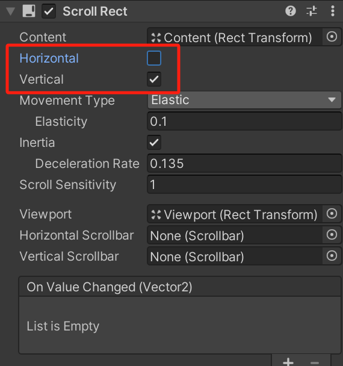

# Button

Target Graphic必须设置

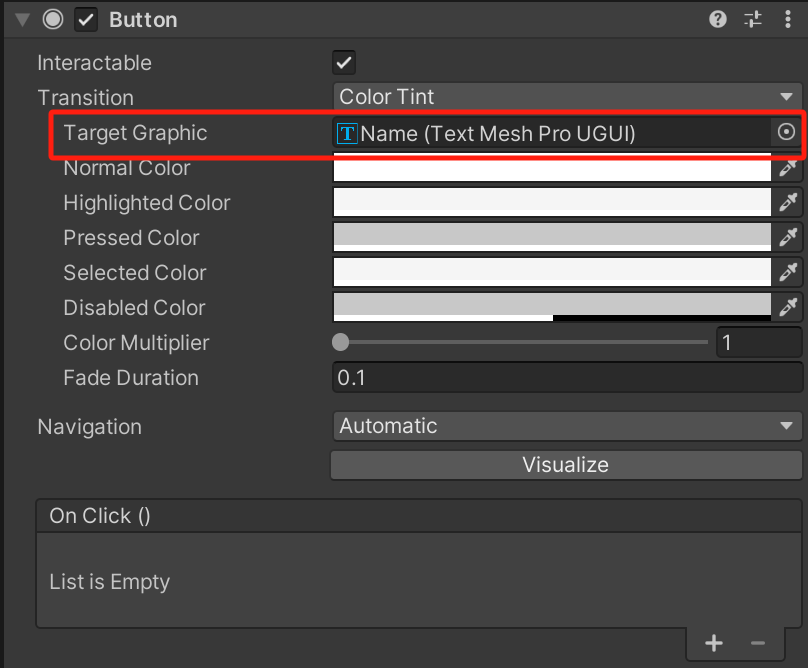
