# unity

[TOC]

# unity的架构


# C#的反射机制

编译器会为每个类生成**Type**的描述

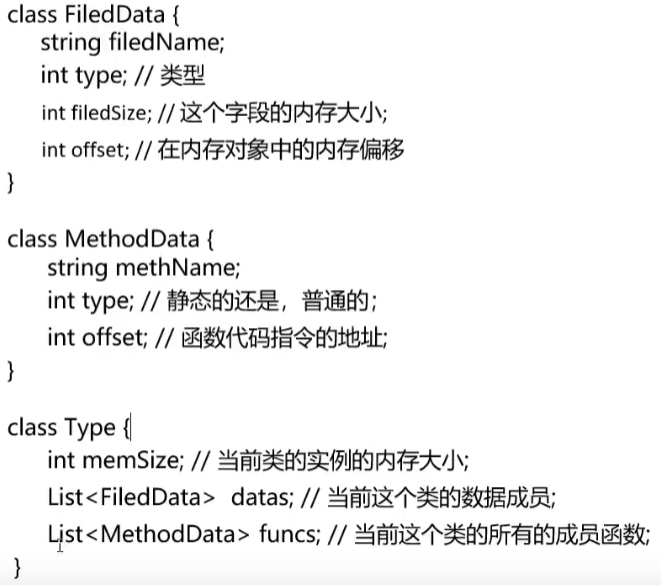

例如：

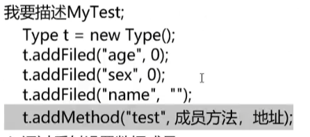

‍

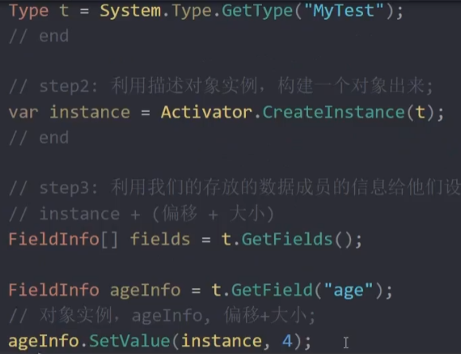

代码实现：

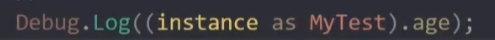


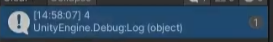

‍

**在unity中脚本的名字必须和类名相同，这是由于创建脚本实例的时候需要读取文件名/类名来创建类**

# 常用操作

- Alt+RMB 缩放
- Alt+RML 旋转
- 中键 平移
- F 置于视图中心
- backspace 回退
- gameobject中选中camera然后 algin with view，可使scene和game视角一致
- edit中 lockViewToSelected
- ctrl+移动 增量移动
- v 顶点对齐
- 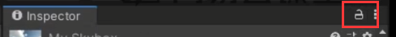

# 常用设置

- 在increment snapping 设置旋转角度

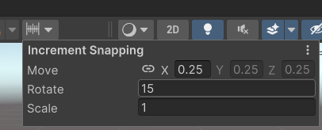

# 约定

- 一格约定为1m

# 坐标

左手系，与opengl的z轴相反

## 局部坐标（local）（Space.Self）

每个物体包括相机都有：x = right，y = up，z = forword

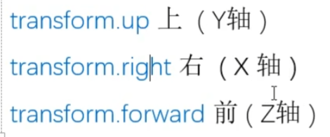

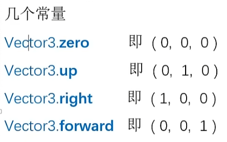

## global 全局/世界坐标

## 屏幕坐标

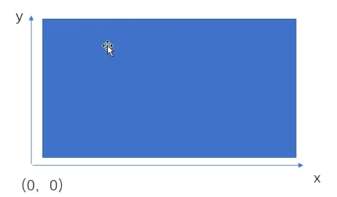

#### 获取屏幕尺寸

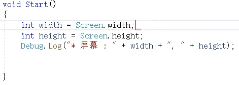

#### 获取一个物体在屏幕上的位置

Z值是离摄像机的距离

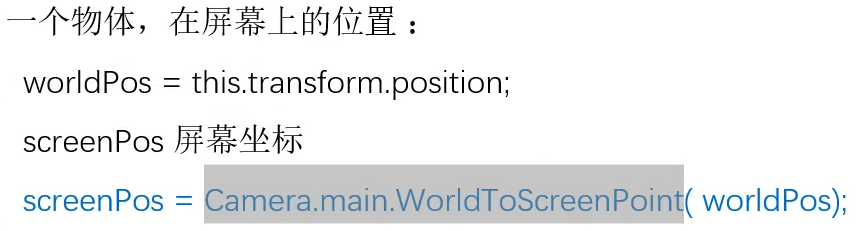


#### 判断一个物体是否出了屏幕

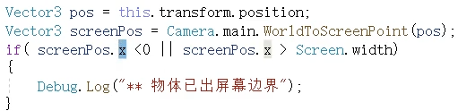

# 颜色空间

gamma和linear具有不同的表现

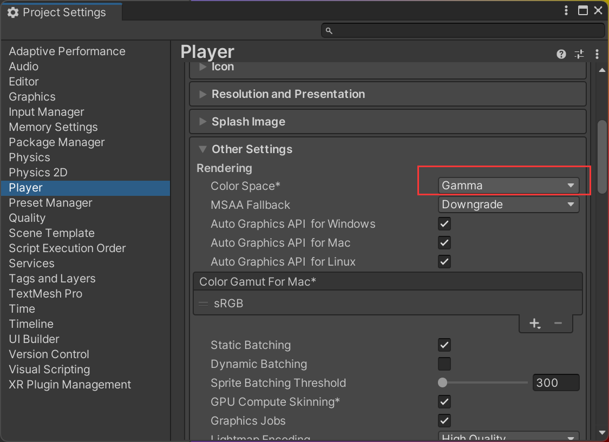

# 空物体

组织和管理其他节点

# 层级关系

Unity的父子节点关系是由**Transform**组件来维持的

gameObject可以忽略

## 获取子节点数量

```c#
int childCount = this.transform.childCount;
```

## 获取子节点

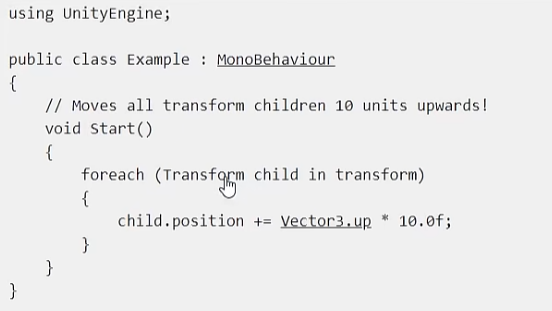

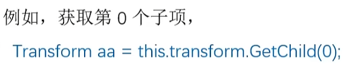

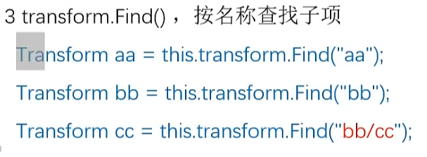

## 获取父节点

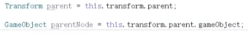

## 设置父级

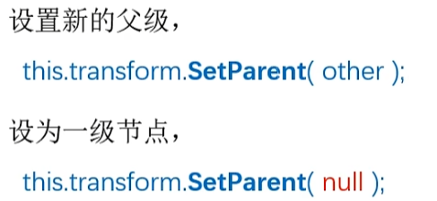​

## 从根开始查找


# 外部模型

## FBX：unity标准格式

修改材质的方式

1、材质重映射

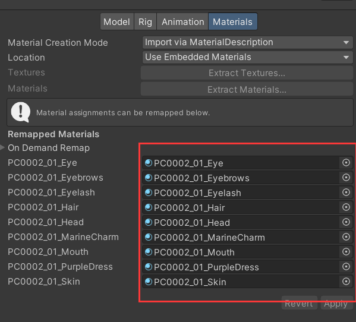

2、使用外部材质

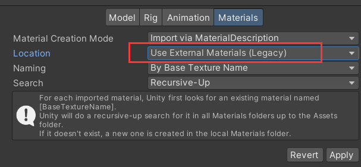

3、分解重组

# 组件

## 1、Audio souce

属性

- Audio clip 音频源
- 自动播放

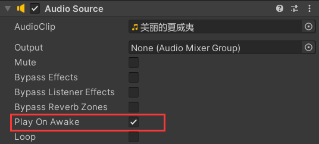

## 2、transform（基础组件，无法删除）

Inspector显示的transform是**相对坐标**

## 3、脚本组件

- 文件名就是类名
- 反射机制实现的

# 运行时的参数如何保留

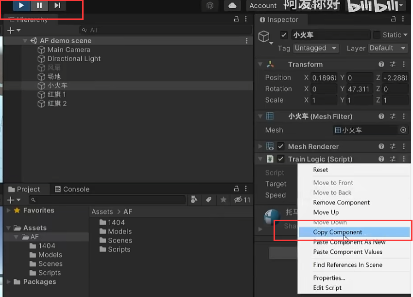

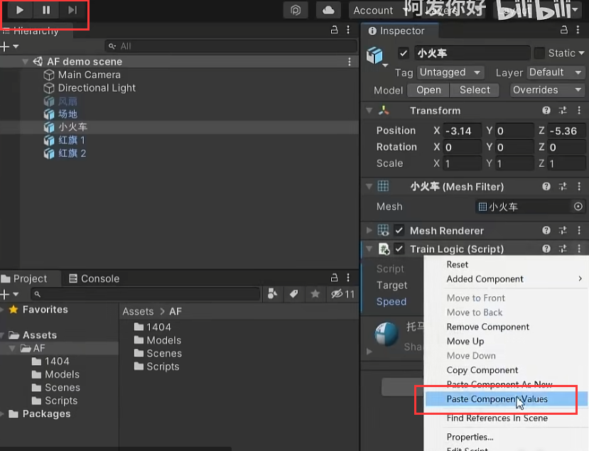

# 脚本

## 属性

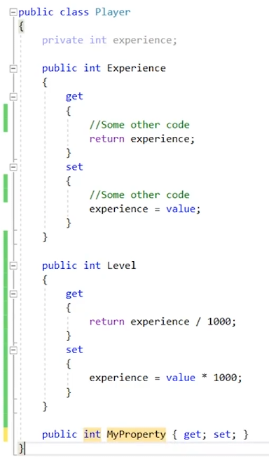

## 注解编程

```c#
[Tooltip("y轴向的角速度")]
public float rotateSpeed = 5.0f; // 30°/s
```

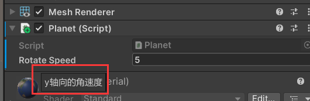

### 常用注解

https://blog.csdn.net/mr_five55/article/details/134721810

## 消息函数

Awake/Start只执行一次

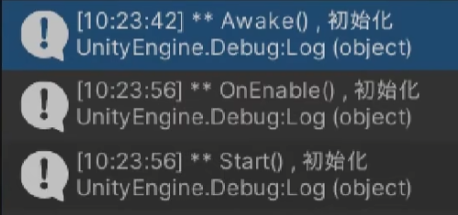

## 脚本执行顺序

每一阶段的执行顺序是不确定的，但是阶段是有顺序的

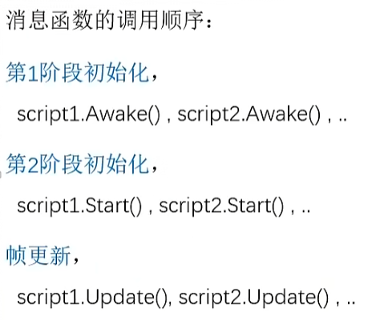

优先级的设定——值越小优先级越高，默认全都是0

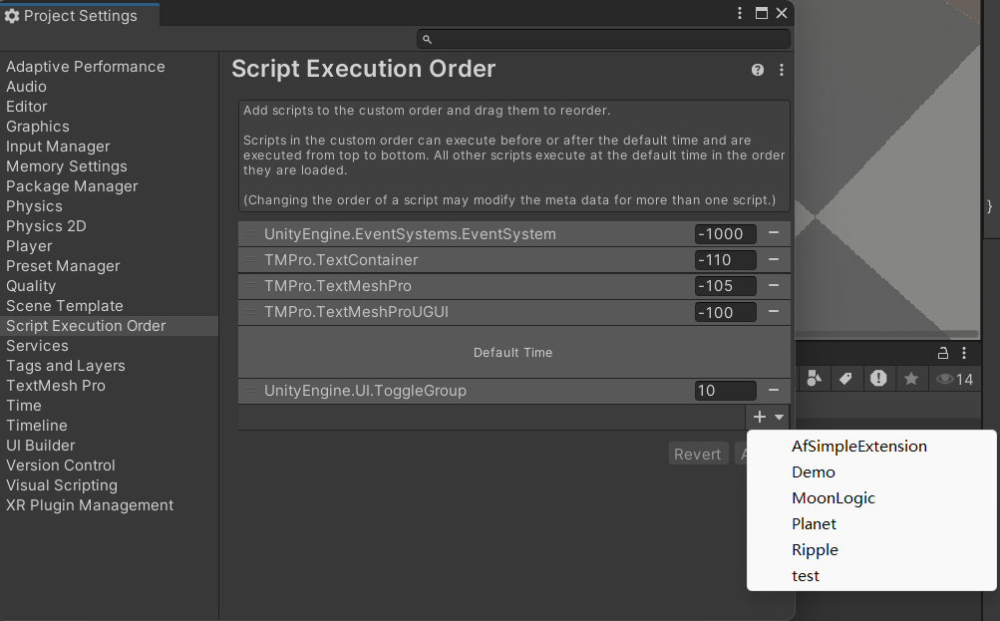

## 脚本参数

public修饰

## 参数的赋值顺序

1、public float rotateSpeed = 5.0f;

2、inspector

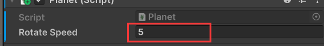

3、Awake

4、Start

## 值类型

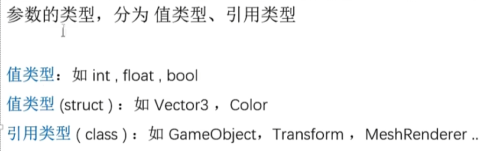

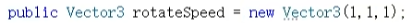

## 引用类型

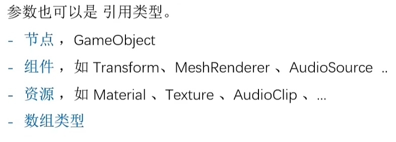

## 常用函数和属性

- ### forward（z）朝向函数

  this.transform.LookAt(targetPos);

  this.transform.LookAt(obj.transform);
- ### 获取scene 中的gameobject

  GameObject.Find("TagName");

  GameObject.Find("a/b/c");
- ### 向量模

  distance.magnitude
- ### 单位向量

  distance.normalized
- ### 旋转

  transform.eulerAngles = new Vector3(x,y,z) // 输入度

  transform.localEulerAngles  = new Vector3(x,y,z) // 输入度
- ### 限制帧率

  Application.targetFrameRate = 60; // 16.7ms

## 获取transform的坐标

```c#
void Start()
{
    GameObject obj = this.gameObject;
    Transform trans = obj.transform;
    // 全局
    Vector3 postion = trans.position;
    // 局部
    Vector3 localPostion = trans.localPosition;
    Debug.Log(postion.ToString("F3"));
    Debug.Log(localPostion.ToString("F3"));
    Debug.Log(obj.name); 
}
```

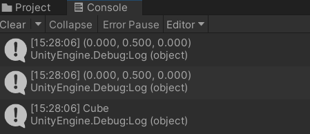

## 帧更新

帧更新时间是不固定的

```c#
void Update()
{
    // Debug.Log("现在的时间是: " + Time.time);
    Debug.Log("帧生成时间差: " + Time.deltaTime);
}
```

锁帧率

```c#
void Start()
{
    Application.targetFrameRate = 60; // 16.7ms
}
```

## 利用transform组件移动

并不是匀速的，因为帧生成不稳定

```c#
void Update()
{
    Vector3 pos = this.transform.localPosition;
    pos.x += 0.01f;
    this.transform.localPosition = pos;
}
```

匀速的运动

```c#
void Update()
{
    // 3m/s
    float speed = 3.0f;
    float distance = Time.deltaTime* speed;
    Vector3 pos = this.transform.localPosition;
    pos.x += distance;
    this.transform.localPosition = pos;
}
```

等价的 Translate(dx,dy,dz,space)

- Space.World
- Space.Self // 默认

```c#
void Update()
{
    // 3m/s
    float speed = 3.0f;
    float distance = Time.deltaTime* speed;
    // 向右移动
    this.transform.Translate(distance, 0, 0);
}
```

## 射线检测实现Moba移动

目前存在射线击中自己时的bug

```c#
using System.Collections;
using System.Collections.Generic;
using UnityEngine;

public class Demo : MonoBehaviour
{
    // Start is called before the first frame update
    private Camera mainCamera;
    void Start()
    {
        // TODO 获取相机
        mainCamera = Camera.main.GetComponent<Camera>();
        Application.targetFrameRate = 60; // 16.7ms
    }

    // Update is called once per frame
    private Vector3 targetPos;
    void Update()
    {
        if(Input.GetMouseButton(0))
        {
            Ray ray = mainCamera.ScreenPointToRay(Input.mousePosition);
            RaycastHit hit;
            if (Physics.Raycast(ray, out hit))
            {
                targetPos = hit.point;
                // 看向目标
                this.transform.LookAt(targetPos);
            }
        }
        // 停止条件
        float distance = (targetPos - this.transform.position).magnitude;
        if (distance > 0.5)
        {
            // 移动
            // 3m/s
            float speed = 3.0f;
            float deltaDistance = Time.deltaTime * speed;
            this.transform.Translate(0, 0, deltaDistance, Space.Self);
        }
        
    }
}

```

## 旋转

读取 .eulerAngles 属性时，Unity 会将四元数的旋转内部表示形式转换为 Euler 角。因为使用欧拉角表示任何给定旋转的方法不止一种，所以读回的值可能与分配的值完全不同，**在实现递增时尽量避免使用Rotate或者读取eulerAngles**，Rotate内部实现读取了 .eulerAngles

unity inspector上的rotation是一个**四元数**，不方便代码使用，常用的是**欧拉角**

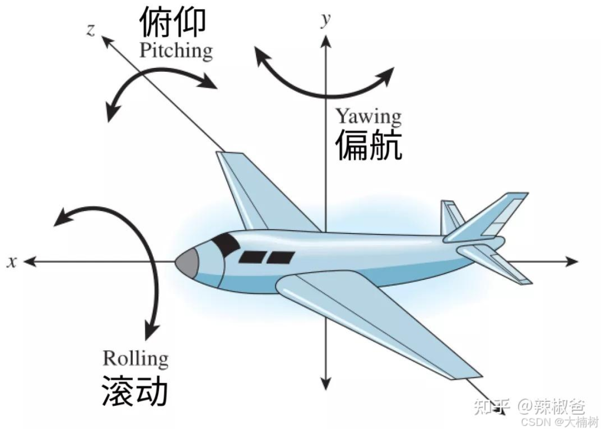

```c#
void Update()
{
    float speed = 30.0f; // 30°/s
    float deltaAngle = speed * Time.deltaTime;
    Vector3 angle = this.transform.localEulerAngles;
    angle.y += deltaAngle;
    this.transform.localEulerAngles = angle;
}
```

使用Rotate函数

```c#
void Update()
{
    float speed = 30.0f; // 30°/s
    float deltaAngle = speed * Time.deltaTime;
    this.transform.Rotate(0, deltaAngle, 0, Space.Self);
}
```

火控

```c#
using System.Collections;
using System.Collections.Generic;
using UnityEngine;

public class FireLogic : MonoBehaviour
{
    public float bulletSpeed;
    public float bulletLifetime;
    public float shotSpeed; // 射速
    public float rotateSpeed = 1.0f;

    public GameObject bulletPrefab;
    public Transform bulletFolder;
    public Transform firePoint;
    public Transform cannon;

    private bool isFire = false;

    public Vector3 currentEurlerAngles;
    // Start is called before the first frame update
    void Start()
    {
        InvokeRepeating("TestFire", 0.0f, shotSpeed);
    }
    
    // Update is called once per frame
    void Update()
    {
        isFire = Input.GetMouseButton(0);
        if(Input.GetKey(KeyCode.W))
        {
            currentEurlerAngles.x -= rotateSpeed * Time.deltaTime;
        }
        else if (Input.GetKey(KeyCode.S))
        {
            currentEurlerAngles.x += rotateSpeed * Time.deltaTime;
        }
        else if (Input.GetKey(KeyCode.A))
        {
            currentEurlerAngles.y -= rotateSpeed * Time.deltaTime;
        }
        else if (Input.GetKey(KeyCode.D))
        {
            currentEurlerAngles.y += rotateSpeed * Time.deltaTime;
        }
        currentEurlerAngles.x = Mathf.Clamp(currentEurlerAngles.x, -60.0f, 60.0f);
        currentEurlerAngles.y = Mathf.Clamp(currentEurlerAngles.y, -60.0f, 60.0f);
        cannon.localEulerAngles = currentEurlerAngles;
    }

    void TestFire()
    {
        if(isFire)
        {
            GameObject node = Object.Instantiate(bulletPrefab, bulletFolder);
            node.transform.position = firePoint.position;
            node.transform.eulerAngles = cannon.eulerAngles;
            BulletLogic script = node.GetComponent<BulletLogic>();
            script.speed = bulletSpeed;
            script.maxDistance = script.speed * bulletLifetime; // 5m，10s后消失
        }
    }
}
```

## 自转和公转

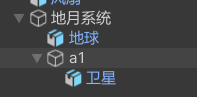

a1和地球都位于原点

1、地球自转

```c#
void Update()
{
    float speed = 30.0f; // 30°/s
    float deltaAngle = speed * Time.deltaTime;
    this.transform.Rotate(0, deltaAngle, 0, Space.Self);
}
```

2、卫星公转

```c#
void Update()
{
    float speed = 60.0f; // 30°/s
    float deltaAngle = speed * Time.deltaTime;
    Transform parent = this.transform.parent;
    parent.Rotate(0, deltaAngle, 0, Space.Self);
}
```

## 游戏输入

### 鼠标输入

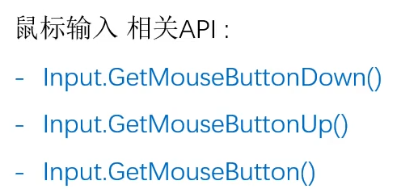

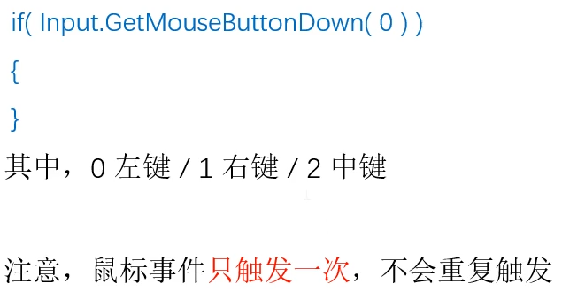

#### 事件探测和状态探测

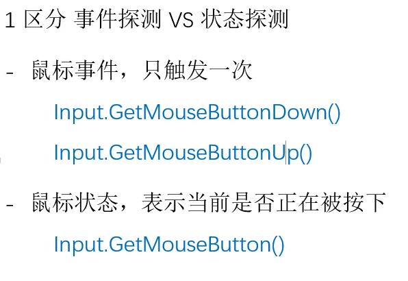

#### 获取鼠标按下位置

```c#
if ( Input.GetMouseButtonDown( 0 ))
{
    Debug.Log(Input.mousePosition);
}
```

### 键盘输入

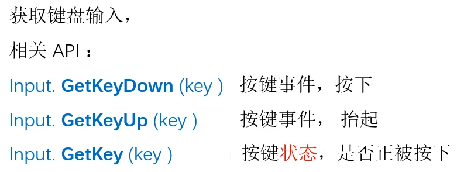

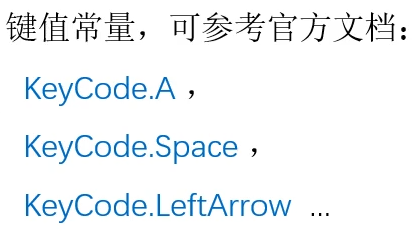

对于每帧都需要判断的逻辑使用**状态**

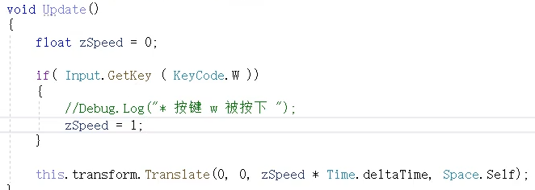

## 组件的调用

### 音频组件

```c#
void PlayMusic()
{
    AudioSource audio = this.GetComponent<AudioSource>();
    if(audio.isPlaying)
    {
        audio.Stop();
    }
    else
    {
        audio.Play();
    }
}
```

### 调用其他GameObject的音频组件

```c#
private void Awake()
    {
        Application.targetFrameRate = 60;
        GameObject bgMusic = GameObject.Find("背景音乐");
        bgMusic.GetComponent<AudioSource>().Play(); 
    }
```

unity对音频组件的调用做了优化

1、定义AudioSouce成员而不是GameObject

```c#
public AudioSource bgm;
private void Awake()
{
    Application.targetFrameRate = 60;
    bgm.Play(); 
}
```

2、把带有AudioSource的GameObject拖入能够自动识别

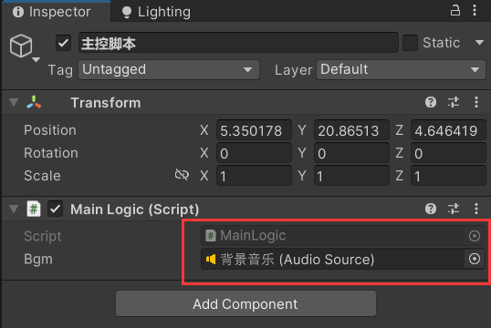

### 脚本组件的引用

```c#
Planet planet = earth.GetComponent<Planet>();
planet.rotateSpeed = 30;
```

常用

```c#
public Planet bgm;
```

## 组件通信

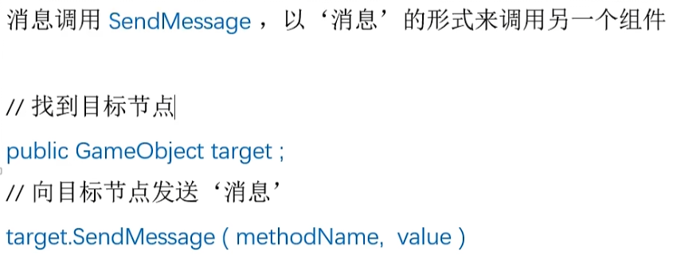

## 物体的显示和隐藏

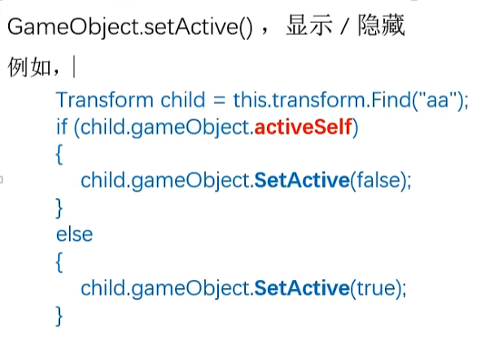

## 音乐资源的引用——音效

调用**AudioSource**组件播放不同音频资源

```c#
using System.Collections;
using System.Collections.Generic;
using UnityEngine;

public class AudioTest : MonoBehaviour
{
    public AudioClip audioSuccess;
    public AudioClip audioFail;
    // Start is called before the first frame update
    void Start()
    {
        
    }
    // Update is called once per frame
    void Update()
    {
        if(Input.GetKeyDown(KeyCode.A))
        {
            AudioSource audioSource = this.GetComponent<AudioSource>();
            audioSource.PlayOneShot(audioSuccess);
        }
        if (Input.GetKeyDown(KeyCode.D))
        {
            AudioSource audioSource = this.GetComponent<AudioSource>();
            audioSource.PlayOneShot(audioFail);
        }

    }
}
```

## 音乐资源的引用——音乐盒

```c#
void NextSong()
{
    int index = Random.Range(0, songs.Length);
    AudioSource audioSource = this.GetComponent<AudioSource>();
    audioSource.clip = this.songs[index];
    audioSource.Play();
}
```

## 材质资源的引用——三色球

```c#
void ChangeColor()
{
    cur++;
    if(cur >= this.colors.Length)
    {
        cur = 0;
    }
    Material selected = this.colors[cur];
    this.GetComponent<MeshRenderer>().material = selected;
}
```

## 定时器

- 反射机制实现的
- **事件函数的执行是一个大循环，任何的事件调度都塞进 **​***脚本生命周期大循环***​ ** ，在合适的时间发生调度**
- 每次InvokeRepeating都会增加新的调度

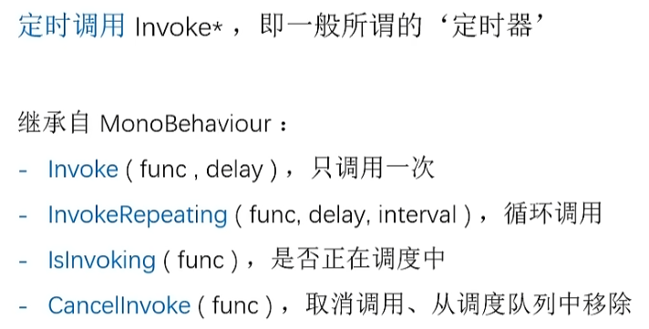

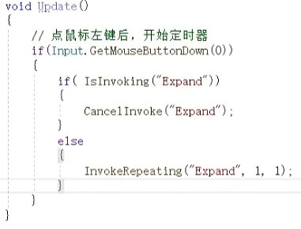

### 弹跳的小球

```c#
using System.Collections;
using System.Collections.Generic;
using UnityEngine;

public class InvokeTest : MonoBehaviour
{
    public float speed = 1.5f;
    // Start is called before the first frame update
    void Start()
    {
        Debug.Log(Time.time);
        this.InvokeRepeating("doSomething", 2 , 2);
    }

    // Update is called once per frame
    void Update()
    {
        this.transform.Translate(0, speed * Time.deltaTime, 0, Space.Self);
    }
    private void doSomething()
    {
        Debug.Log("do something " + Time.time);
        speed = -speed;
    }
}
```

### 红绿灯

```c#
using System.Collections;
using System.Collections.Generic;
using UnityEngine;

public class hongludeng : MonoBehaviour
{
    public Material[] colors;
    private int cur;
    // Start is called before the first frame update
    void Start()
    {
        ChangeColor();
    }

    // Update is called once per frame
    void Update()
    {
        
    }

    void ChangeColor()
    {
        Material color = colors[cur];
        MeshRenderer meshRenderer = GetComponent<MeshRenderer>();
        meshRenderer.material = color;
        if(cur == 0)
        {
            Invoke("ChangeColor", 4);
        }
        else if(cur == 1)
        {
            Invoke("ChangeColor", 4);
        }
        else if (cur == 2)
        {
            Invoke("ChangeColor", 1);
        }
        cur++;
        if (cur >= colors.Length)
        {
            cur = 0;
        }
    }
}
```

## 加速减速

```c#
using System.Collections;
using System.Collections.Generic;
using UnityEngine;

public class jiasujiansu : MonoBehaviour
{
    float a = 100; // 加速度
    float speed = 0;
    // Start is called before the first frame update
    void Start()
    {
        
    }

    // Update is called once per frame
    void Update()
    {
        // 鼠标按下时加速
        if(Input.GetMouseButton(0))
        {
            // 计算速度的增加
            speed += Time.deltaTime * a;
        }
        // 鼠标松开时减速
        else
        {
            speed += Time.deltaTime * -50;
        }
        if (speed < 0) speed = 0;
        transform.Rotate(0, Time.deltaTime*speed, 0, Space.Self);
    }

}

```

```c#
using System.Collections;
using System.Collections.Generic;
using UnityEngine;

public class jiasujiansu : MonoBehaviour
{
    public float maxSpeed = 720;
    float speed = 0;
    bool isAcc = false;
    // Start is called before the first frame update
    void Start()
    {
        InvokeRepeating("AdjustSpeed", 0.1f, 0.1f);
    }

    // Update is called once per frame
    void Update()
    {
        // 切换开关
        if(Input.GetMouseButton(0))
        {
            isAcc = !isAcc;
        }
        
        if(speed > 0)
        {
            transform.Rotate(0, Time.deltaTime * speed, 0, Space.Self);
        }
    }

    void AdjustSpeed()
    {
        if(isAcc)
        {
            if (speed < maxSpeed)
                speed += 10;
        }
        else
        {
            if (speed > 0)
                speed -= 10;
        }
    }
}

```

## 向量

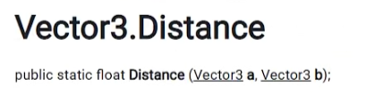

# 预制体

prefab发生修改，实例也会同步的发生修改

## 创建

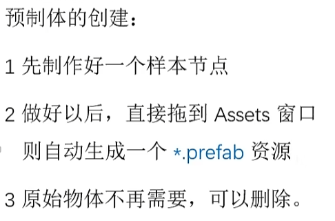

## 导出

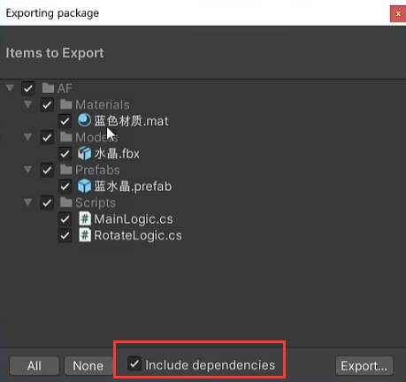

## 转为普通物体


## 编辑


# 动态创建实例


子弹

```c#
void TestFire()
{
    GameObject node = Object.Instantiate(bulletPrefab, bulletFolder);
    node.transform.position = firePoint.position;
    node.transform.eulerAngles = cannon.eulerAngles;
    node.GetComponent<BulletLogic>().speed = 1;
}
```

# 销毁实例


# 物理系统

## 刚体

## 碰撞体


# 天空盒

## 天空盒材质


## 天空盒贴图

天空盒贴图设置为clamp确保无缝


# 光照

## 环境光设置


# 粒子系统

## 基础参数


## 粒子发生器


## 广告牌


## 粒子贴图


### Additve


黑色叠加


### Multiply

Start Color和贴图相乘

### 两个效果叠加


## 黑底白图


## 透明底图


## 区间随机值


## 周期与时长


## 模拟空间


world模式下已经发射的粒子不会随着粒子发射系统移动


## 匀速发射


## 最大粒子数量


## 爆发发射


一般去掉looping


## 爆炸参数


## 发射器形状


## Cone


angle是单边的

## Color Over LifeTime


### 淡入淡出


## 渐变和start color的混合规则


## 大小渐变


## 速度控制


## 环绕


## 速度叠加


## 速度调节因子


## 粒子受力


### 模拟重力


### 介质阻力


### 噪声


## 粒子的旋转


### 花瓣飞舞效果


## 拉伸广告牌模式

粒子贴图左边为头部方向，粒子转向头部方向


### 火星飞溅


## 水平广告牌模式


### 旋转法门

8s发射一个粒子，一个粒子每秒转45度需要8秒转完一周


## 拖尾


### 拖尾的长度


### 拖尾的宽度


### 拖尾的颜色


### 拖尾的形状


### 烟花爆炸


## Texture Sheet Animation


### 材质的HDR可以调整亮度


### 火焰的轴心


### 烛火效果


## 粒子发光

### 携带点光源


### Lights模块


## 空粒子系统

禁用emission的粒子系统


## 二级粒子


### 注意


## 粒子的碰撞


### 粒子碰撞事件

脚本挂在粒子上


## 播放完毕后自毁


## 均匀分布


# 动画


## 动画曲线


## 曲线的编辑


## 动画事件


## 播放模式


# 动画状态机


## 绑定动画


## 状态转移


## ExitTime


## 状态机API


### 按住不动


## 状态机行为


### 结合ExitTIme 可以在dance退出到idle的时候，用该脚本重置参数


## 精细控制


# 视角跟随

## 方法一：

```c#
ublic class CameraController : MonoBehaviour
{
    public Transform obj;
    private Vector3 distance = new Vector3(0,8,-8);
    // Start is called before the first frame update
    void Start()
    {
    }

    // Update is called once per frame
    void Update()
    {
        transform.position = obj.position + distance;
    }
}
```

## 方法二：

将相机作为玩家的子节点
