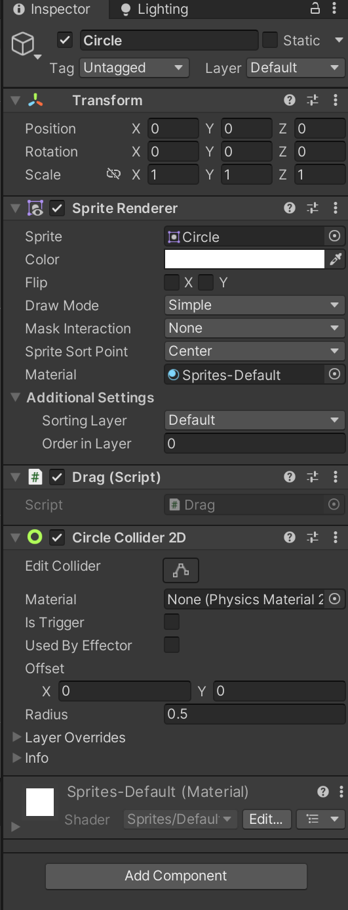
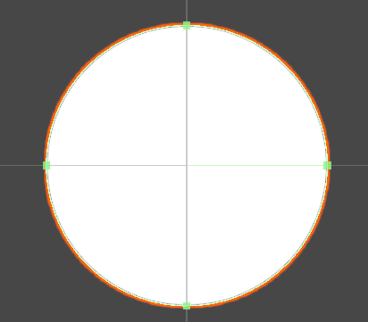

# 实现精灵的拖拽（MonoBehavior拖拽）

# 需要2D Sprite 加碰撞体组件





```c#
    private void OnMouseDown()
    {
      
    }
    private void OnMouseDrag()
    {
       
    }
    private void OnMouseUp()
    {
        
    }


```

‍
