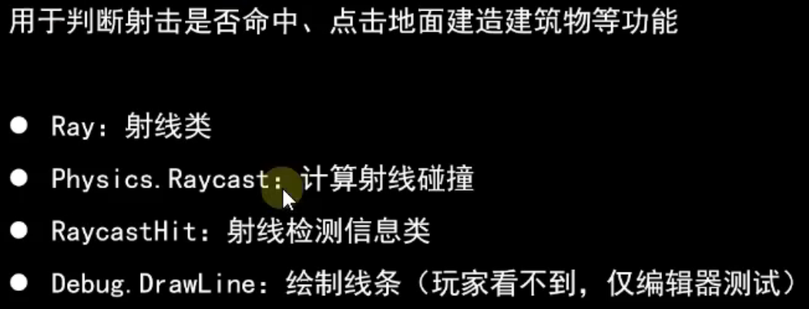
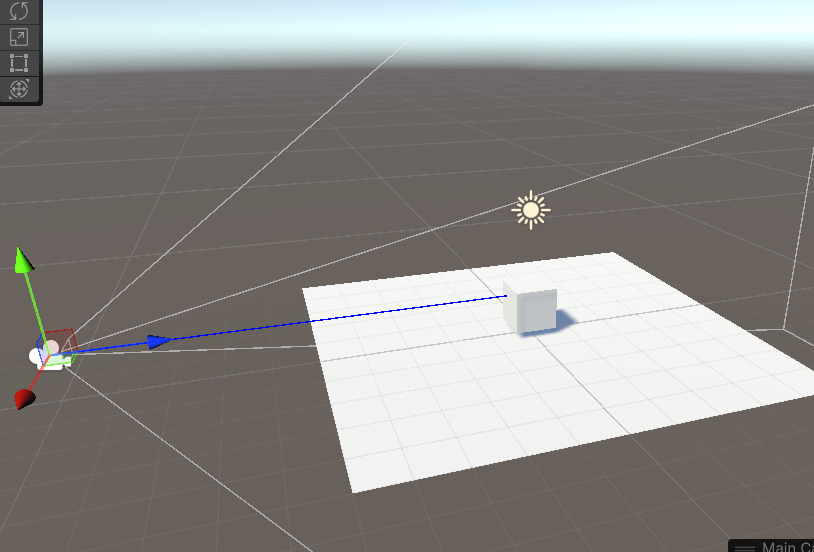

# 射线检测



```c#
Ray ray = new Ray(Vector3.zero, new Vector3(0,1,0));
/*
if (Physics.Raycast(ray))
{
    Debug.Log("射线碰到了某个物体");
}
*/
// 射线方向1000米内
if (Physics.Raycast(ray,out RaycastHit hitinfo, 1000))
{
    Debug.Log(string.Format("射线碰到了{0}，在什么位置{1}",hitinfo.collider.gameObject.name,hitinfo.point) );
    Debug.DrawLine(ray.origin,hitinfo.point,Color.blue);
}
```

# 获得从相机位置出发，射向屏幕的一条射线

```c#
Ray ray = Camera.main.ScreenPointToRay(Input.mousePosition);
```



‍
