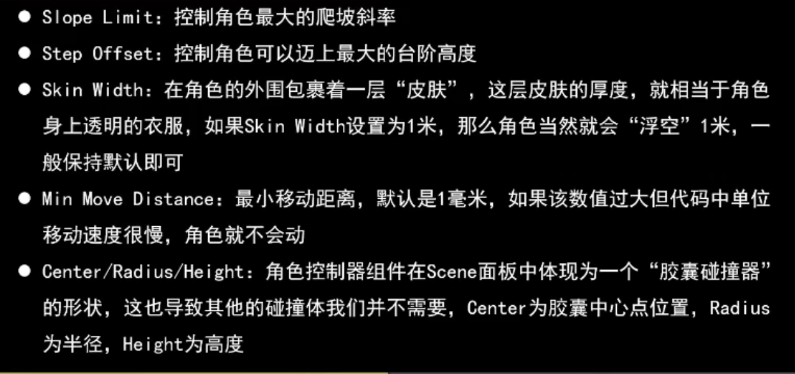
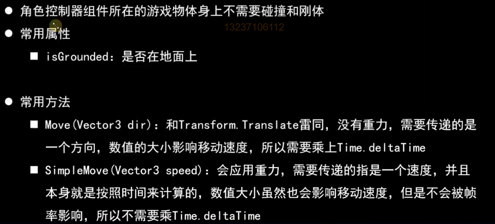

# 角色控制器

‍





# Move方法

```c#
void Update()
    {
        Debug.Log(characterController.isGrounded);

        float horizontal = Input.GetAxis("Horizontal");
        float vertical = Input.GetAxis("Vertical");
		
		// 施加了重力
        Vector3 dir = new Vector3(horizontal,-9.8f, vertical);
        characterController.Move(dir * Time.deltaTime * 30);
    }
```

# SimpleMove方法

- 自带重力
- 参数是速度，不需要再乘以Time.deltaTime

```c#
    void Update()
    {
        Debug.Log(characterController.isGrounded);

        float horizontal = Input.GetAxis("Horizontal");
        float vertical = Input.GetAxis("Vertical");

        Vector3 dir = new Vector3(horizontal,-9.8f, vertical);
        //characterController.Move(dir * Time.deltaTime * 30);

        characterController.SimpleMove(dir * 30);
    }
```

# 角色移动

```c#
private void Update()
    {
        float horizontal = Input.GetAxis("Horizontal");
        float vertical = Input.GetAxis("Vertical");

        if (horizontal != 0 || vertical != 0)
        {
            animator.SetBool("Run", true);
        }
        else
        {
            animator.SetBool("Run", false);
        }

        Vector3 dir = new Vector3(horizontal,0,vertical).normalized;

        Vector3 curDirection = Vector3.Slerp(transform.forward ,dir,Time.deltaTime*10);
        //dir = transform.TransformDirection(dir);
        //characterController.SimpleMove(dir * speed);

        //Vector3 dir = new Vector3(0, 0, vertical);

        //dir = transform.TransformDirection(dir);
        characterController.SimpleMove(dir * speed);
        transform.rotation = Quaternion.LookRotation(curDirection);
        // transform.eulerAngles = new Vector3(0,transform.eulerAngles.y + horizontal * Time.deltaTime *45,0);
    }
```
