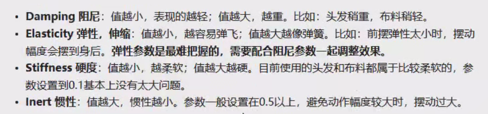
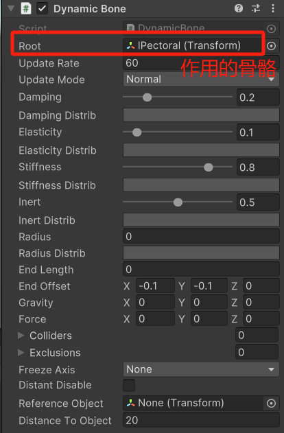
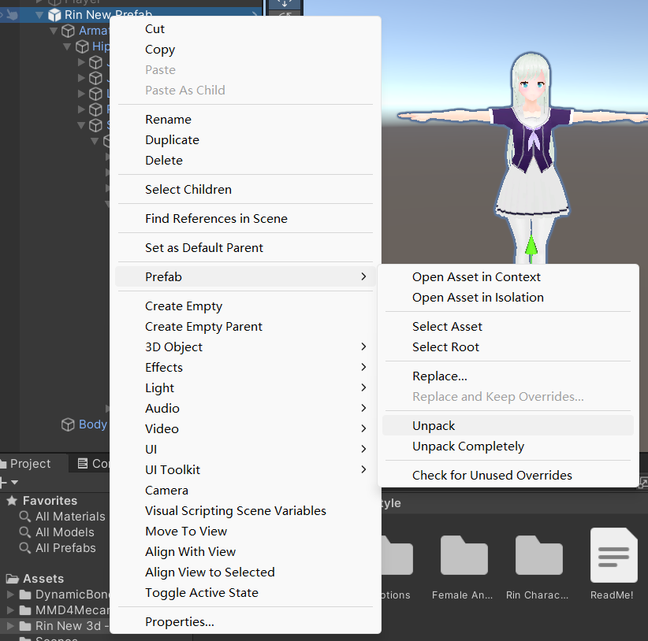
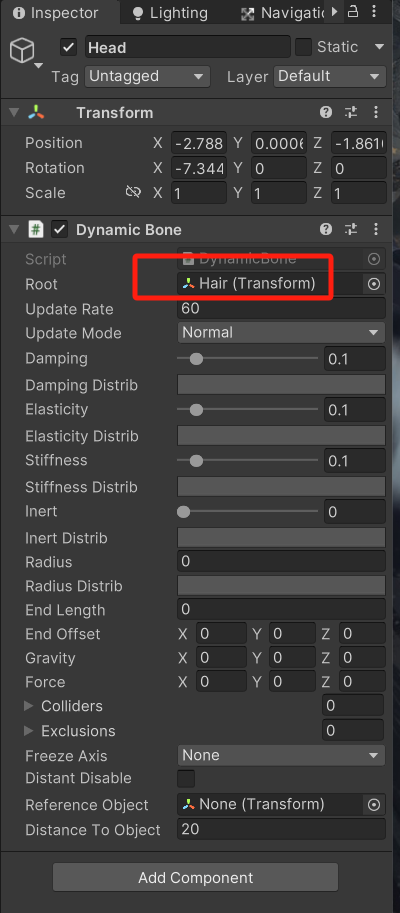
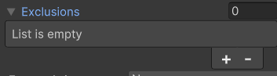
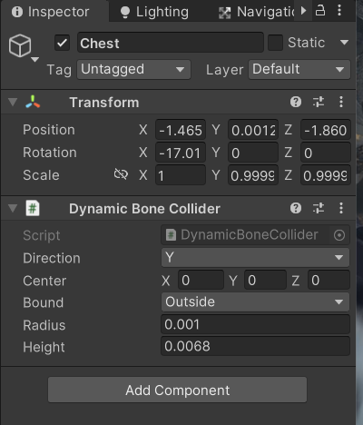
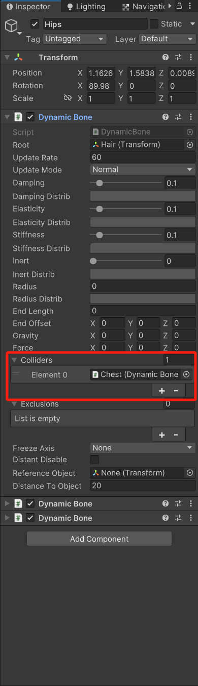

# DynamicBone

# DynamicBone介绍

基于模拟模拟弹簧振子算法

- Damping：弹簧的摩擦力
- Elasticity：弹簧的弹力
- Stiffness：刚性，限制形变程度
- Inert：惯性



虚拟点


# 抖动效果



# 自定义角色

## 解开prefab



## 头发效果



## 排除项

排除不需要运动的骨骼节点



## 统一管理，添加碰撞





## 飘动效果（风）

### Perlin Noise (柏林函数)设置DynamicBone的重力

```c#
public class DynamicRandomWind : MonoBehaviour
{
    private DynamicBone[] bones;
    public bool isWindActive = true;
    public float windForceValue;

    // Start is called before the first frame update
    void Start()
    {
        bones = GetComponents<DynamicBone>();
    }

    // Update is called once per frame
    void Update()
    {
        Vector3 force = Vector3.zero;
        if (isWindActive)
        {
            force = new Vector3(Mathf.PerlinNoise(Time.time, 0.0f) * 0.005f * windForceValue, 0, 0);
        }
        for (int i = 0; i < bones.Length; i++)
        {
            bones[i].m_Gravity = force;
        }
    }
}
```
