# Playable

# API内容

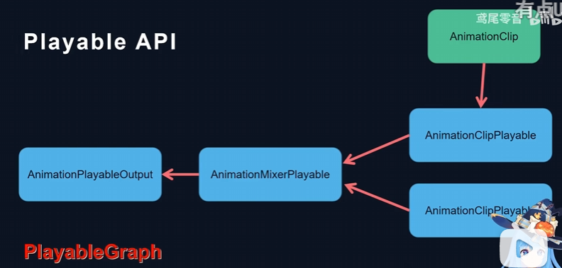

## Playables基础

### 使用Playable需要创建一些结构体去包裹其他参数


# 可视化工具

https://github.com/SolarianZ/UnityPlayableGraphMonitorTool

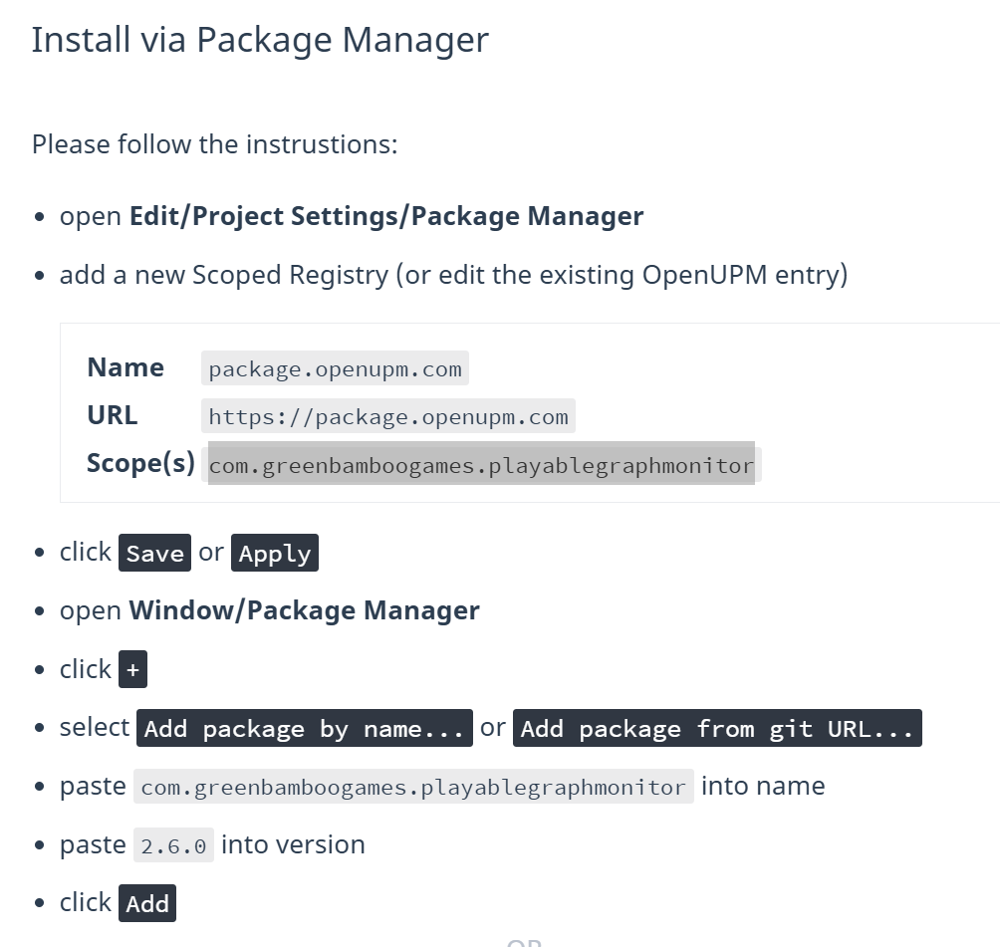

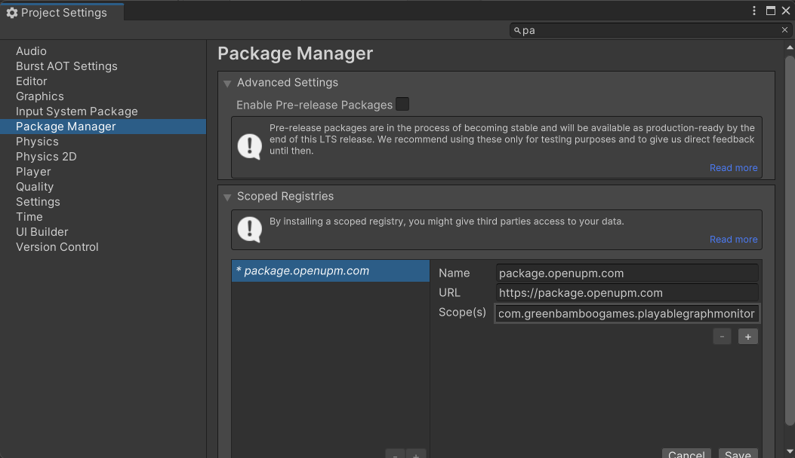

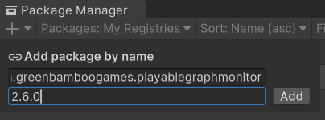

## 使用

**Window/Analysis/PlayableGraph Monitor**

# 命名空间

```csharp
using UnityEngine.Playables;
using UnityEngine.Animations;
```

# 实现步骤

## 角色挂上Animator组件

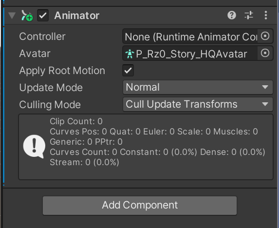

## 播放AnimationClip

### 1、创建PlayableGraph，并设置更新模式

### 2、创建AnimationClipPlayable，用于存放AnimationClip

### 3、创建并设置AnimationPlayableOutput的源AnimationClipPlayable和输出的Animator

### 4、使用PlayableGraph播放

### 5、最后要释放PlayableGraph

```csharp
public class PlayAnimationSample : MonoBehaviour
{

    public AnimationClip animationClip;
    private PlayableGraph graph;


    private void Start()
    {
        graph = PlayableGraph.Create();
        graph.SetTimeUpdateMode(DirectorUpdateMode.GameTime);

        AnimationClipPlayable clipPlayable = AnimationClipPlayable.Create(graph, animationClip);
        AnimationPlayableOutput output = AnimationPlayableOutput.Create(graph, "Anim", GetComponent<Animator>());
        output.SetSourcePlayable(clipPlayable);

        graph.Play();
    }

    private void Update()
    {
        
    }

    private void OnDisable()
    {
        graph.Destroy();
    }
}
```

# 连接节点

```csharp
graph.Connect(playable1, 0, animationMixer,0);
graph.Connect(playable2, 0, animationMixer,1);
```

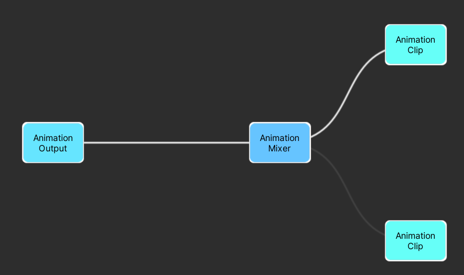

# 混合动画

```csharp
AnimationMixerPlayable animationMixer = AnimationMixerPlayable.Create(graph, 2);
animationMixer.SetInputWeight(0, 1 - weight);
animationMixer.SetInputWeight(1, weight);
```

# 连接节点的同时设置权重

```csharp
// source ， sourcePort ， weight
animationMixer.AddInput(playable1,0,1f);
animationMixer.AddInput(playable2,0,0f);
```

使用这个接口，不需要再创建Mixer时指定端口数量，AddInput会自动增加一个端口

```csharp
animationMixer = AnimationMixerPlayable.Create(graph);
```

# 暂停和播放动画

```csharp
    private void Update()
    {
        if (Input.GetKeyDown(KeyCode.Space))
        {
            if (clipPlayable.GetPlayState() == PlayState.Playing)
            {
                clipPlayable.Pause();
            }
            else
            {
                clipPlayable.Play();
                clipPlayable.SetTime(0); // 重新播放
            }
        }
    }
```

# 自定义Playable

## 序列播放动画

```csharp
using System.Collections;
using System.Collections.Generic;
using UnityEngine;
using UnityEngine.Playables;
using UnityEngine.Animations;

public class PlayableQueue : PlayableBehaviour
{

    private AnimationMixerPlayable mixer;
    private float timeToNext;
    private int currentClip;

    public void Init(PlayableGraph graph, Playable owner,AnimationClip[] clips)
    {
        owner.SetInputCount(1);
        mixer = AnimationMixerPlayable.Create(graph);

        for (int i = 0; i < clips.Length; i++)
        {
            mixer.AddInput(AnimationClipPlayable.Create(graph, clips[i]),0,0);
        }

        mixer.SetInputWeight(0 , 1f);

        graph.Connect(mixer,0,owner,0);

        timeToNext = clips[0].length;

    }

    public override void PrepareFrame(Playable playable, FrameData info)
    {
        base.PrepareFrame(playable, info);

        timeToNext -= info.deltaTime;
        if (timeToNext < 0 && currentClip < mixer.GetInputCount() - 1)
        {
            mixer.SetInputWeight(currentClip, 0f);
            mixer.SetInputWeight(++currentClip, 1f);

            mixer.GetInput(currentClip).SetTime(0);
            timeToNext = ((AnimationClipPlayable)mixer.GetInput(currentClip)).GetAnimationClip().length;
        }
    }
}

public class PlayableQueueSample : MonoBehaviour
{
    public AnimationClip[] clips;
    private PlayableGraph graph;

    private void Start()
    {
        graph = PlayableGraph.Create();
        graph.SetTimeUpdateMode(DirectorUpdateMode.GameTime);

        ScriptPlayable<PlayableQueue> queuePlayable = ScriptPlayable<PlayableQueue>.Create(graph);
        PlayableQueue queue = queuePlayable.GetBehaviour();
        queue.Init(graph, queuePlayable ,clips);

        AnimationPlayableOutput output = AnimationPlayableOutput.Create(graph, "Anim", GetComponent<Animator>());
        output.SetSourcePlayable(queuePlayable);

        graph.Play();
    }

    private void Update()
    {
        
    }

    private void OnDisable()
    {
        graph.Destroy();
    }

}
```

# 动画系统

## Mixer 动画混合

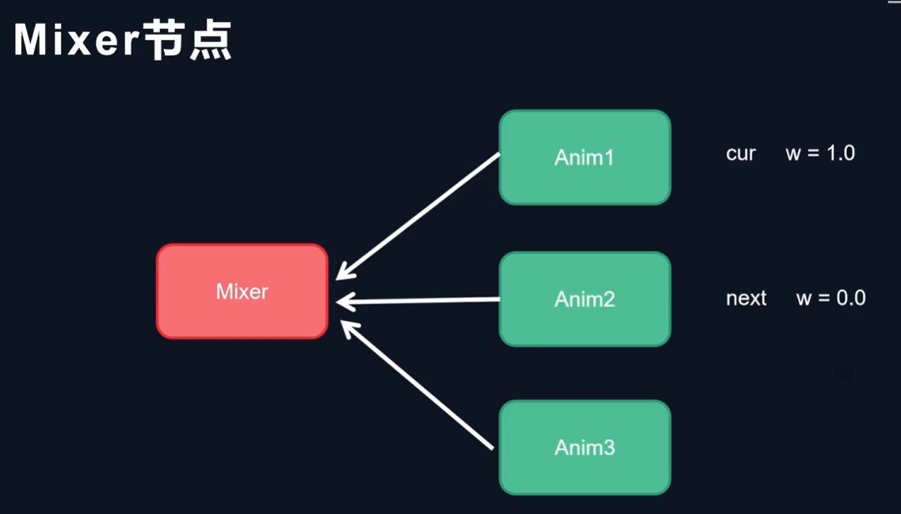

## RandomSelector 随机选择器

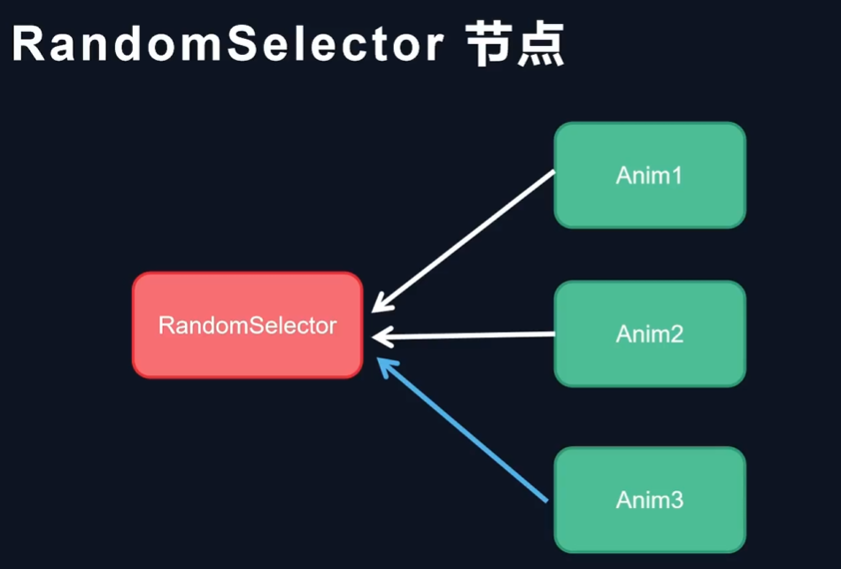

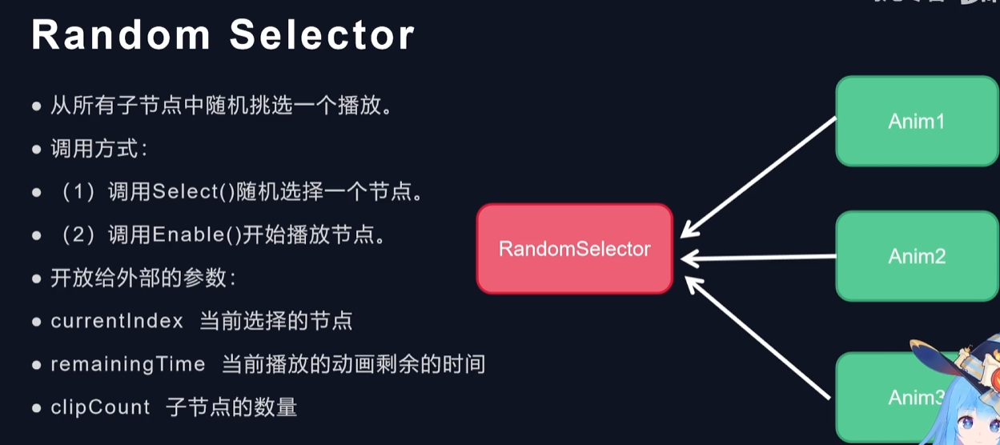

## 待机动画

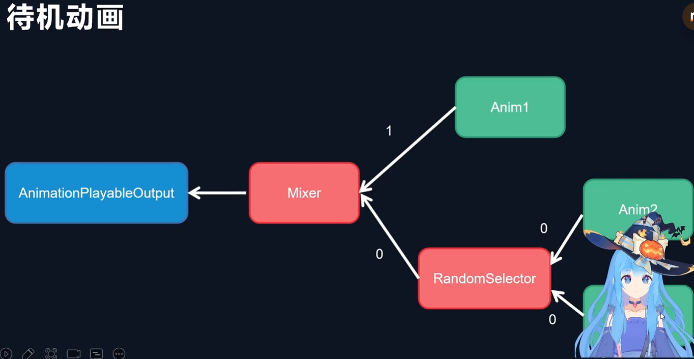

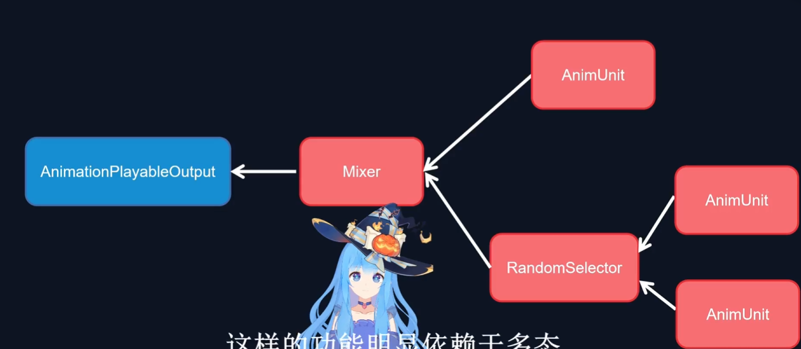

### 实现方式1

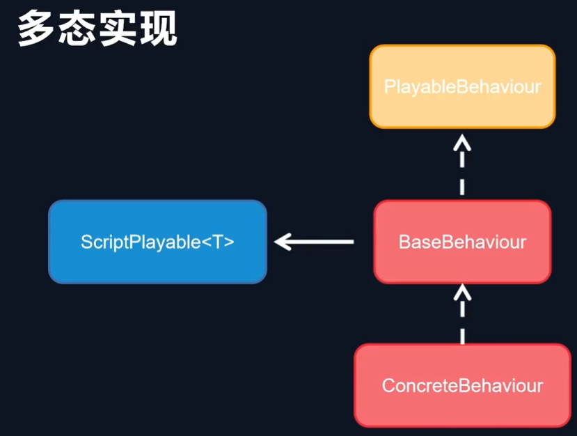

### 实现方式2

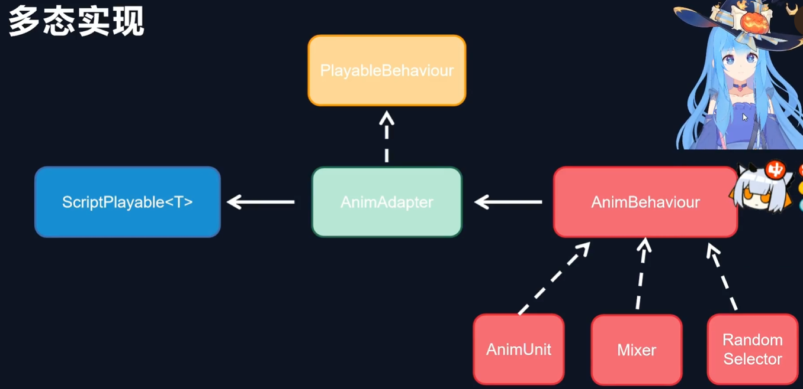

# Mixer实现

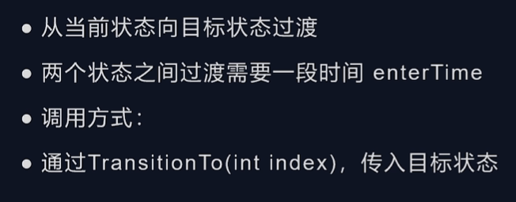

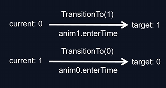

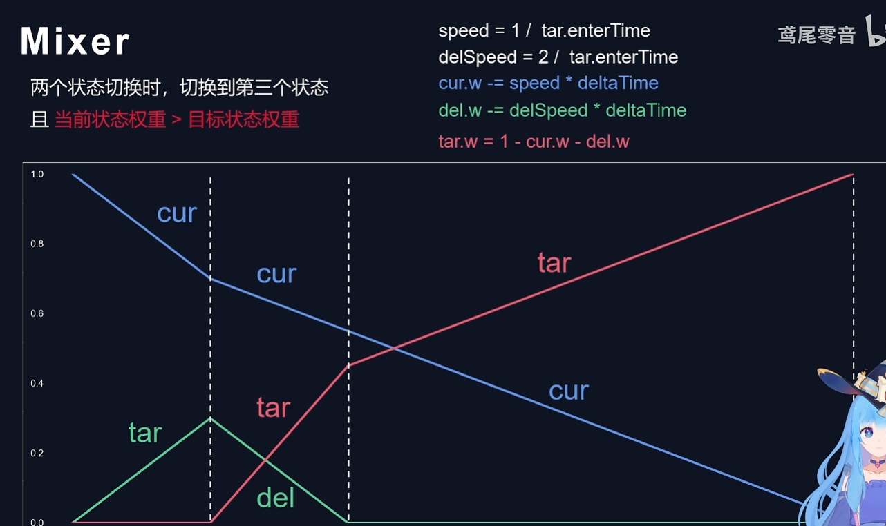

## 频繁打断动画

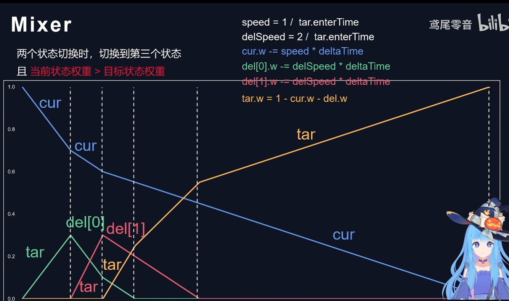

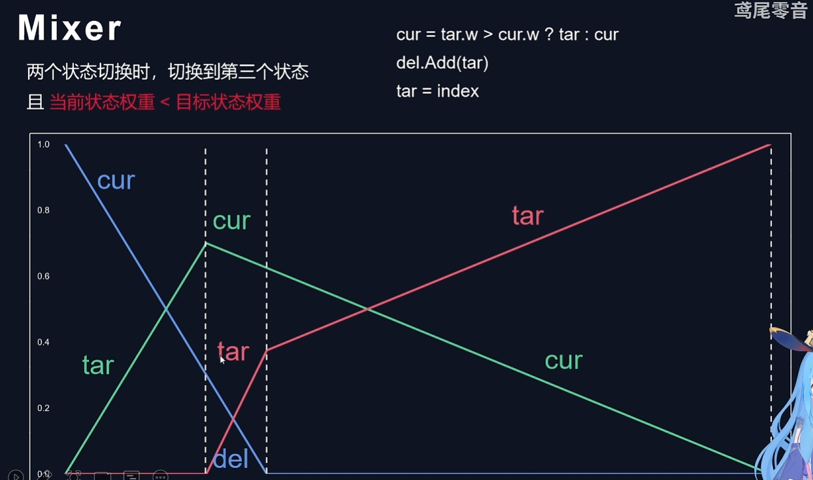

# 2D混合树

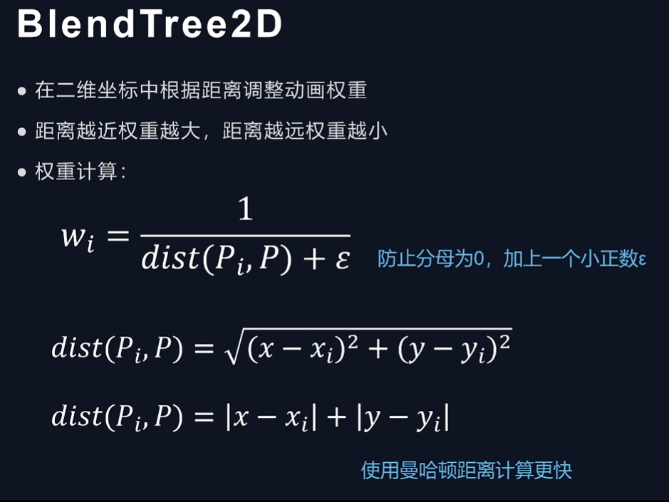

‍
