# whitted风格光线追踪

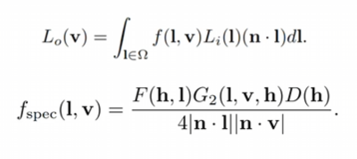

# 光线追踪

## 基于三个idea

- 光直线传播
- 光线之间不会发生碰撞
- 光路的可逆性

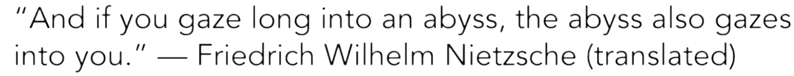

# Whitted风格的光线追踪

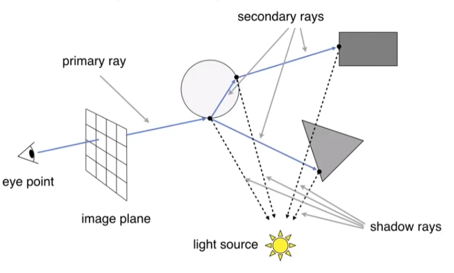

- 将所有能够照亮的点累加起来（假设是blin-phong模型）得到最后的像素值
- 每一次的折射都会使能量损耗

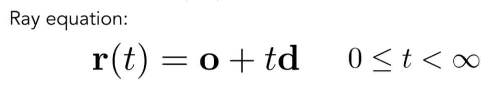

## 光线求交

- 隐式表面，解出t，根据t的解确定交点和有无相交

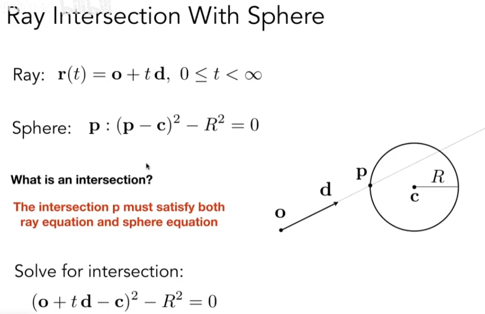

- 网格求交

1、通过三角面确定一个平面（点法式）：

展开

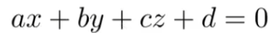

2、光线和平面的交点

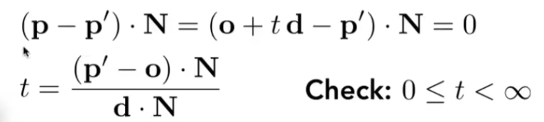

3、判断交点是否再三角面内

另一种解法：

t和b是未知的，但可以由线性方程组解，其中，解需要验证（非负）

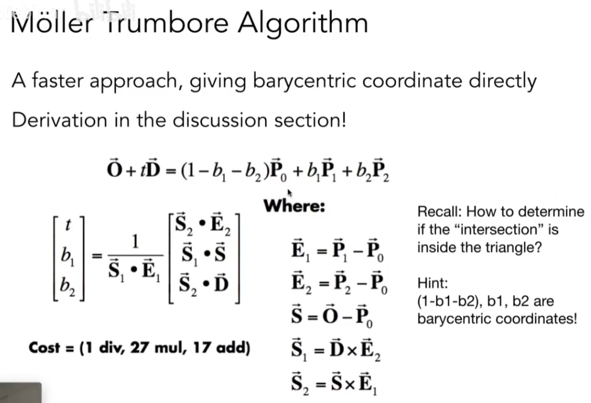

- 网格物体求交

与一个物体的所有三角面计算求交（很慢）

## 加速结构

### 包围盒

#### AABB 包围盒求交

2维情况下，三维同

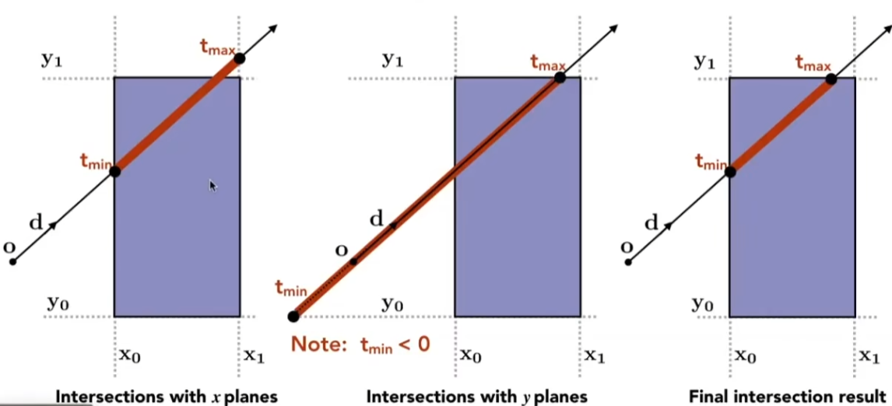

- 光线进入所有对面才进入盒子
- 任意光线离开对面光线就已经离开盒子
- 因此取所有对面的交集

怎么判断求交：

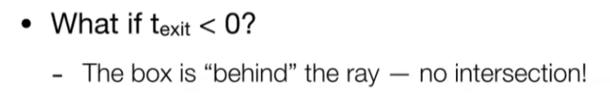

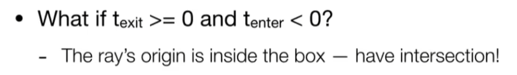

总的来说，条件为

轴对齐的平面求交可以简化为：

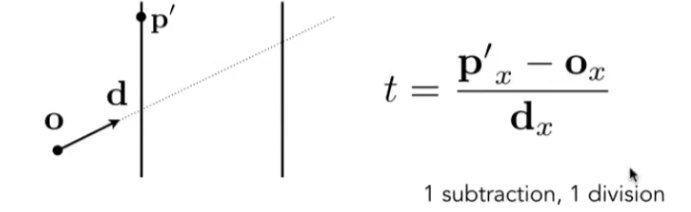

#### 包围盒预处理

##### 把大的AABB划分成小的AABB

预处理 ——划分包围盒为一个个小盒子，标记拥有物体的盒子

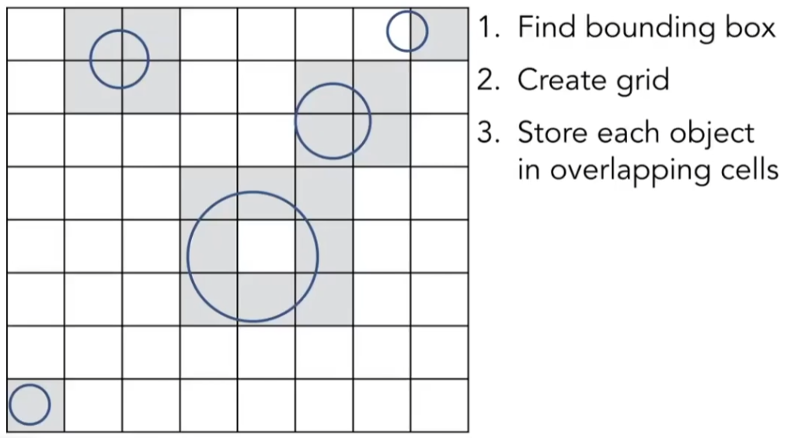

光线与小盒子求交

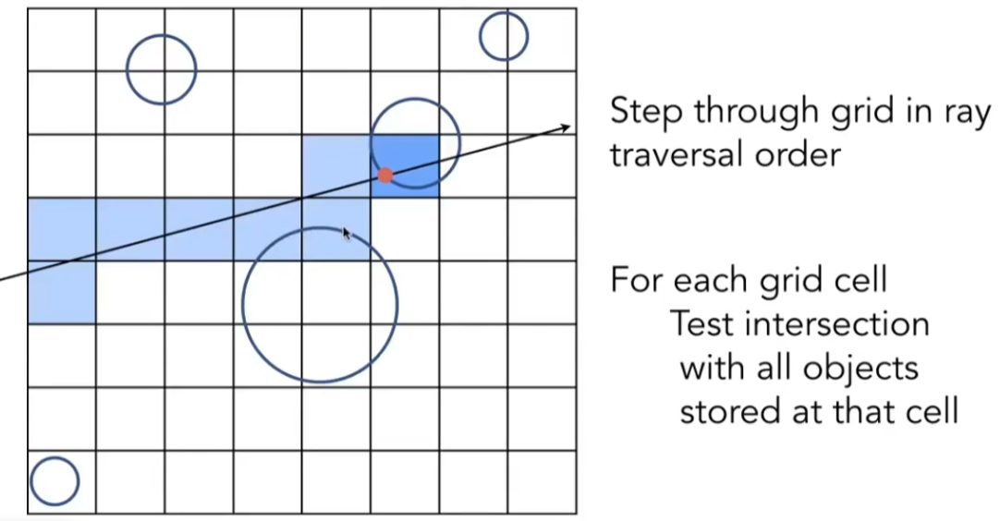

划分成多少格子效率比较高

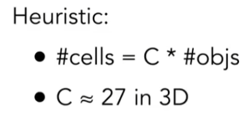

### 空间划分——包围盒的另一种预处理

八叉树的缺点在于节点的数量随着维度的上升而呈指数级上升，BSP基本不考虑，因为不是AABB的

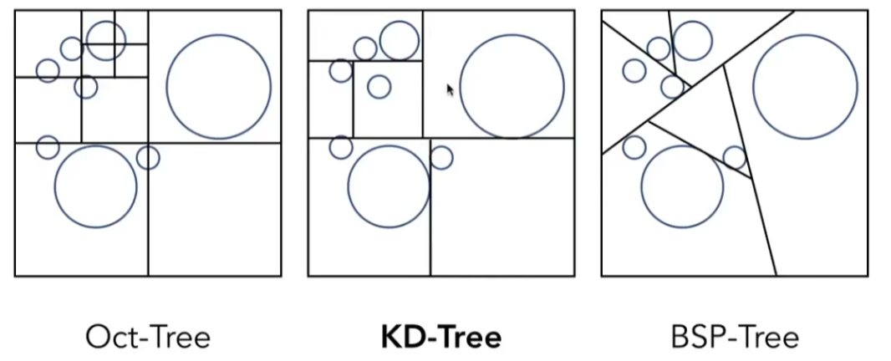

#### KD-Tree预处理

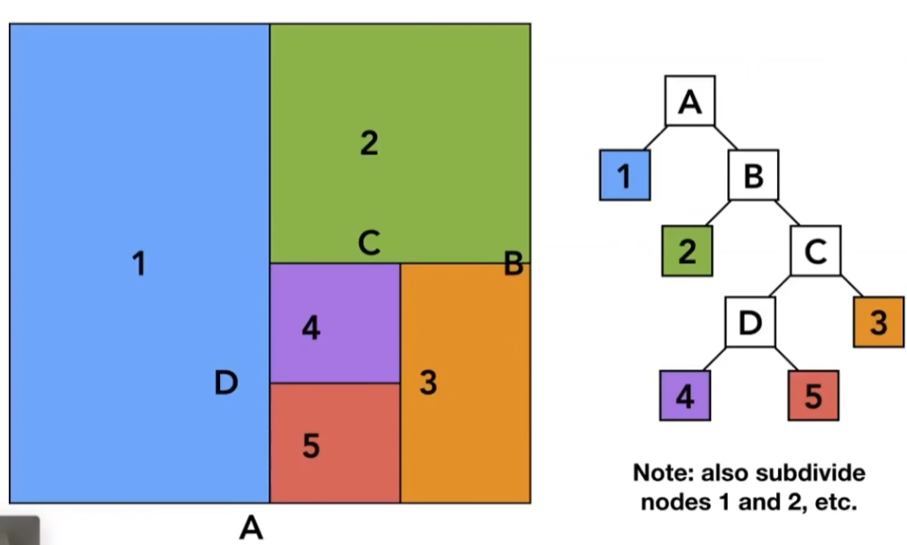

#### KD-Tree求交

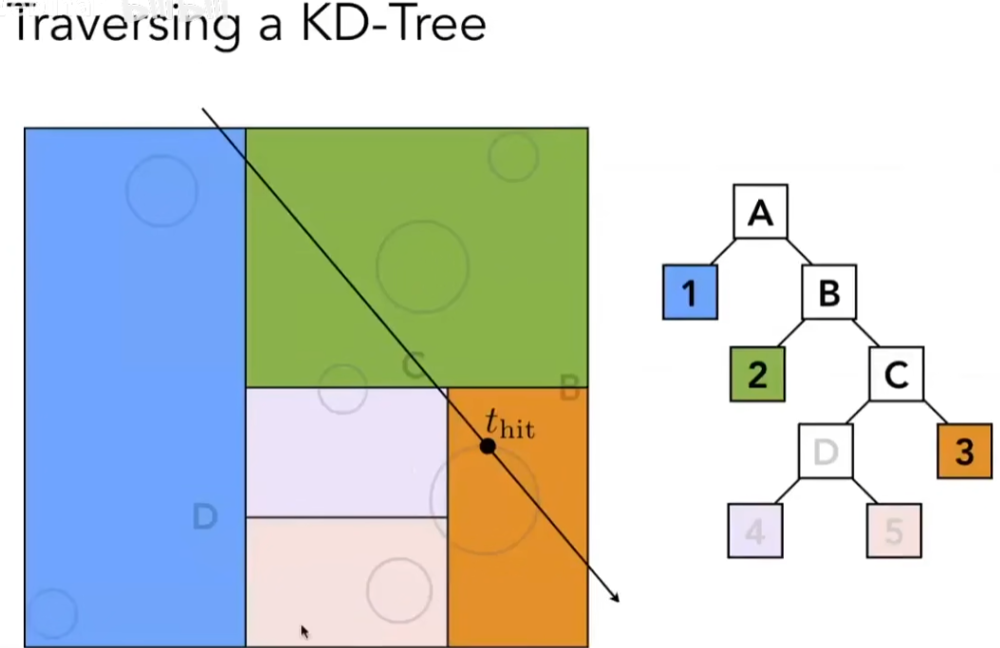

- 光线与包围盒求交
- 光线与最上层两1、B求交
- 1节点已经是叶子节点，与1节点所有物体求交
- 与B节点相交，继续看B的子节点2、C
- ...

#### KD-Tree的缺点

预处理过程中，需要把物体放在某个节点之下，需要判断物体（的三角形）是否与盒子相交，但

- KD-Tree很难判定物体和节点有交点
- 且同一个物体可能出现在不同的节点

### 物体划分BVH

把三角形分为两堆，分别求包围盒

#### 如何划分子节点

1、学习KD-Tree，每次选择不同的轴

2、最长轴法

3、取重心坐标，每次沿xyz找中间的三角形，会使得树更加平衡——快速选择算法O(n)

#### 划分结束

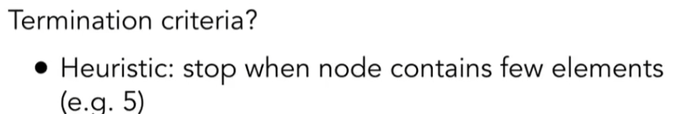

### 伪代码

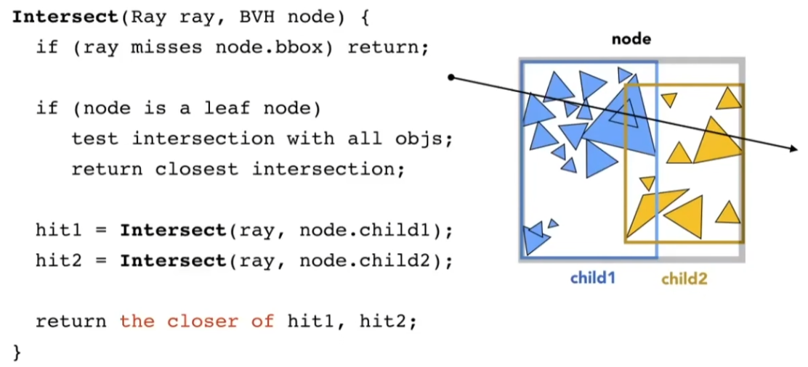
