# 技术美术

# 一、渲染管线

## unity渲染管线组成

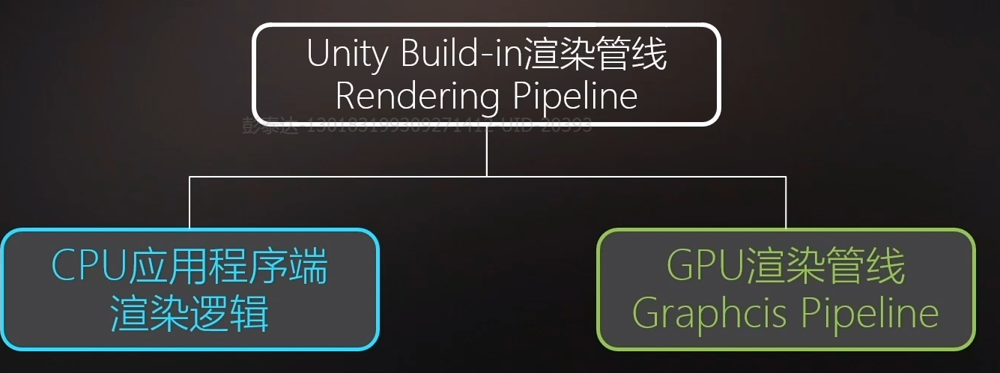

## 渲染流程

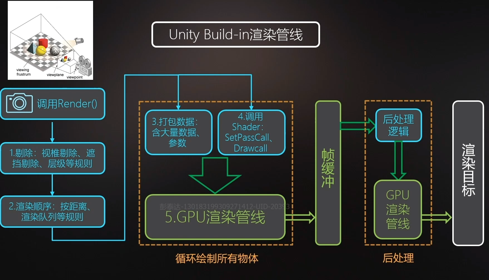

## 渲染管线

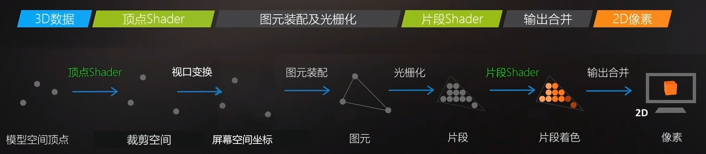

## ”拍照“过程

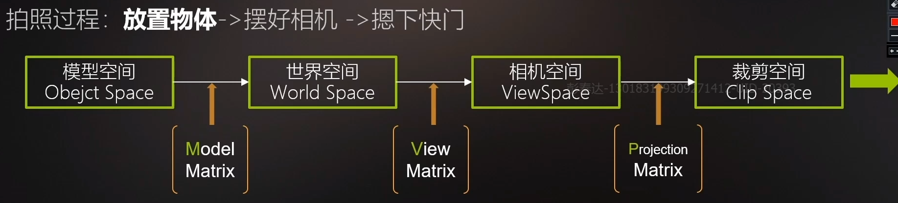

模型空间 => 世界空间

$$
世界空间的基为：E=(e1,e2,e3); 设模型空间的基为 A=(a1,a2,a3) \\
\forall \alpha\in  \mathbb{R}^3 ，\beta_1 = (x_1,y_1,z_1),\beta_2 = (x_2,y_2,z_2) 分别为\alpha在物体空间和世界空间的坐标\\
都有：\alpha=(e1,e2,e3)(x_2,y_2,z_2)^T=(a1,a2,a3)(x_1,y_1,z_1)^T\\
即：(x_2,y_2,z_2)^T=A(x_1,y_1,z_1)^T
\\
基A的位置就描述了物体在世界坐标系下的位置，例如物体在原点时A =  \begin{bmatrix}
1 & 0 & 0 \\
0 & 1 & 0 \\
0 & 0 & 1
\end{bmatrix} 
\\
A即ModelMatrix\\
而ModelMatrix又包括R,S,T 都可以由A推出
$$

# 二、模型数据

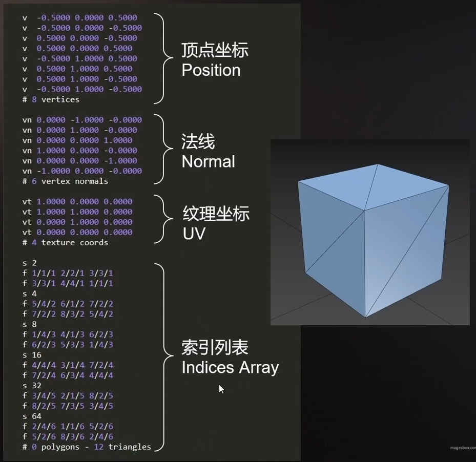

# 三、基础Shader

```
Shader "CS0102/01MiniShader"
{
    // 这里相当于Uniform
    Properties
    {
        // _Float是shader变量名
        // "Float"是在unity中显示的变量名
        //  最后的Float才是变量类型
        _MainTex("MainTex",2D) = "black"{}
        _Float("Float",Float) = 0.0
        _Range("Range",Range(0.0,1.0)) = 0.0
        _Vector("Vector",Vector) = (1,1,1,1)
        _Color("Color",Color) = (0.5,0.5,0.5,0.5)
        
    }
    SubShader
    {
        Pass
        {
            CGPROGRAM
            #pragma vertex vert
            #pragma fragment frag

            #include "UnityCG.cginc"

            // 从cpu获取数据
            struct appdata
            {
                // 基础的5个语义词
                float4 vertex : POSITION;
                float2 uv : TEXCOORD0; // 第一套uv
             /* float3 normal: NORMAL;
                float4 color : COLOR;
                float3 tangent : TANGENT; */
            };

            
            struct v2f
            {
                float4 vertex : SV_POSITION;
                // 插值器
                float2 uv : TEXCOORD0;
            };

            float4 _Color;
            sampler2D _MainTex;
            float4 _MainTex_ST;

            v2f vert (appdata v)
            {
                v2f o;
                o.vertex = UnityObjectToClipPos(v.vertex);
                o.uv = v.uv * _MainTex_ST.xy + _MainTex_ST.zw;
                return o;
            }
            /*  float 32 // 坐标点
                half 16 // UV 大部分向量
                fixed 8 // 颜色   */

            fixed4 frag (v2f i) : SV_Target
            {
                // sample the texture
                fixed4 col = tex2D(_MainTex,i.uv);
                return col;
            }
            ENDCG
        }
    }
}

```

# 四、背面剔除

背面剔除发生在**裁剪空间-&gt;NDC空间**之后

关闭背面剔除：

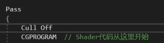

Cull Front

动态修改

```
[Enum(UnityEngine.Rendering.CullMode)]_CullMode("CullMode",float) = 2 // back
...
Cull [_CullMode]
```

# 五、数据类型

```
float 32 // 坐标点
half 16 // UV 大部分向量
fixed 8 // 颜色 
```

# 六、alpha测试

```
half4 frag (v2f i) : SV_Target
{
    // sample the texture
    half gradient = tex2D(_MainTex, i.uv).r;

    clip(gradient - 0.1);
    return gradient.xxxx;
}
```

可以做一些溶解类的特效


# 五、混合

## alpha混合

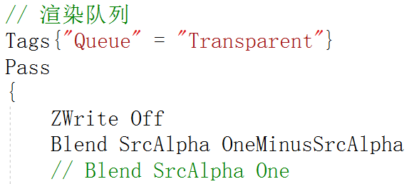

## 边缘光控制计算

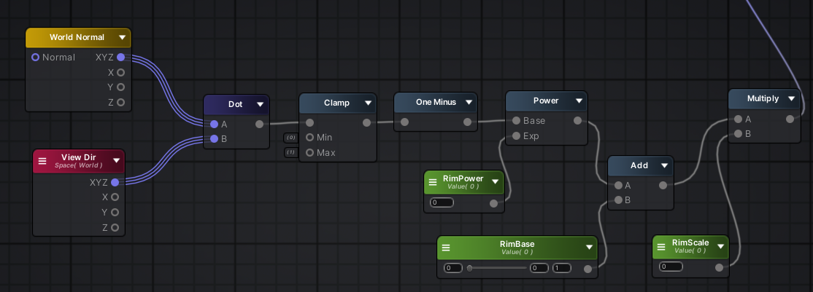

# 六、normal变换

normal到世界坐标系的转换与坐标不同，经过一系列推导得到：

```
o.normal_world = normalize(mul(float4(v.normal, 0), unity_WorldToObject).xyz);
```

# 七、预先写入深度

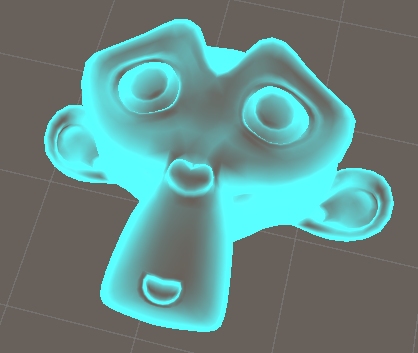

```
Pass
        {
            Cull Off
            ZWrite On
            ColorMask 0
            CGPROGRAM
            float4 _Color;
            #pragma vertex vert
            #pragma fragment frag

            float4 vert(float4 vertexPos : POSITION) :SV_POSITION
            {
                return UnityObjectToClipPos(vertexPos);
            }

            float4 frag(void) : COLOR
            {
                return _Color;
            }
            ENDCG
        }
```

# 八、引擎设置

## lighting setting

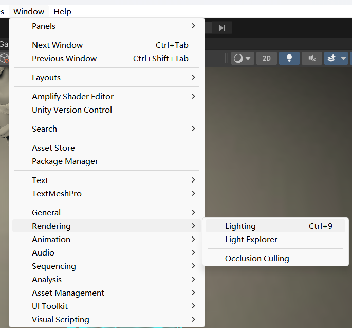

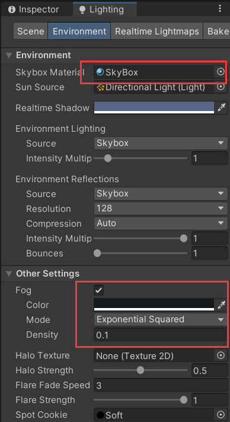

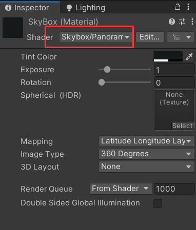

# 九、ASE

创建组快捷键【c】
