# 辐射度量学

# Power

## Radiant energy

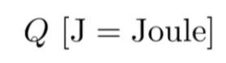

## Radiant flux（power）

功率，单位事件释放的能量

# 光线度量的定义

## 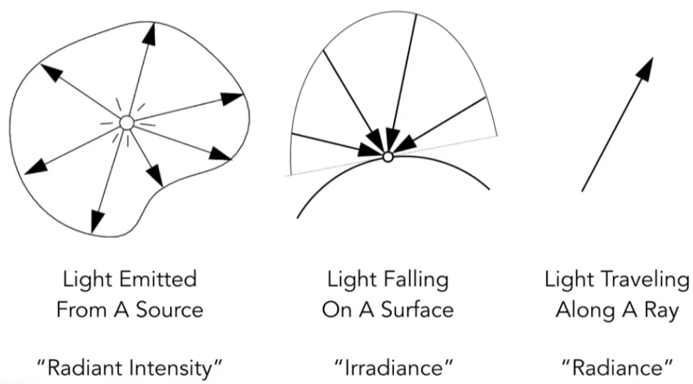

## 发光强度Radiant Intensity——单位立体角上辐射的power

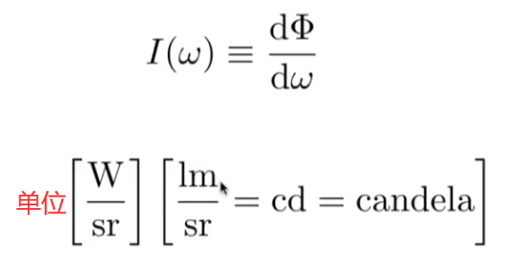

### 立体角的定义

$\omega$  可以作为方向向量

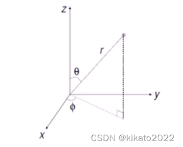

#### 单位（微分）立体角 $d\omega$

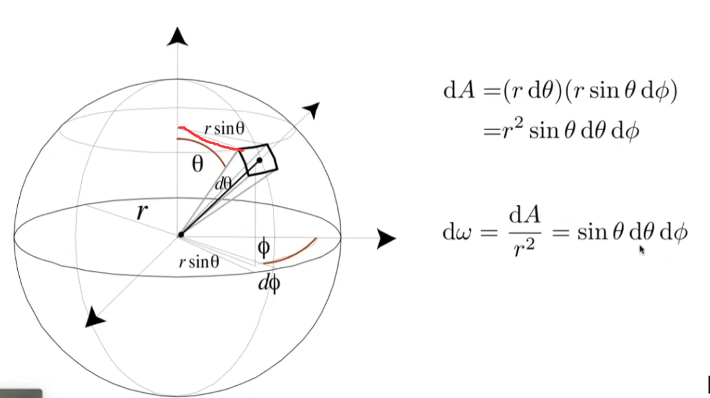

### 均匀的I

$$
\Phi =  I \int_{S^2}d{\omega}
$$

$$
I = \frac \Phi {4 \pi}
$$

## 辉度Irradiance——单位面积上接收 的power（来自各个方向）

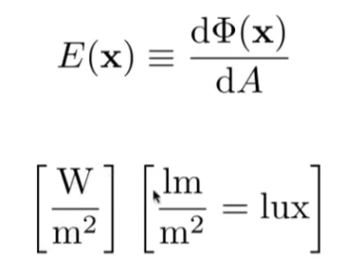

均匀分布情况下$E(x) = \frac  \Phi A$

### 与能量衰减的联系 irradiance 在衰减

### 与Lambert’s Cosine Law的联系

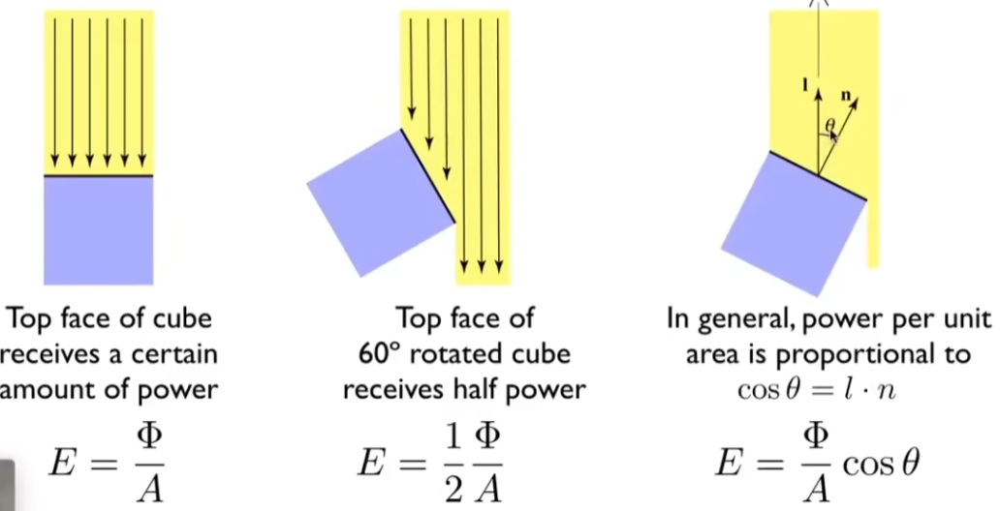

## 光亮度Radiance

### 两种解释

#### Exiting Radiance

单位面积的Intensity

#### Incident Radiance

dA在某方向上收到的Irradiance

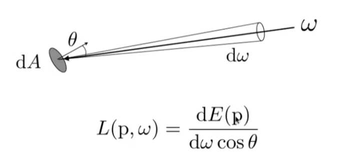

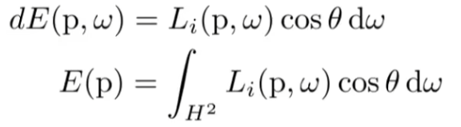

# BRDF的定义

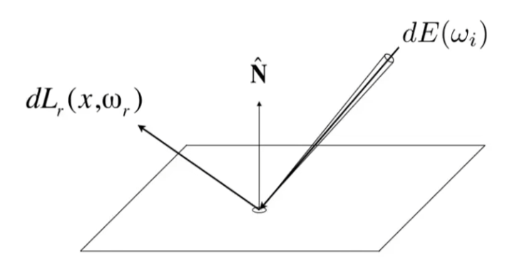

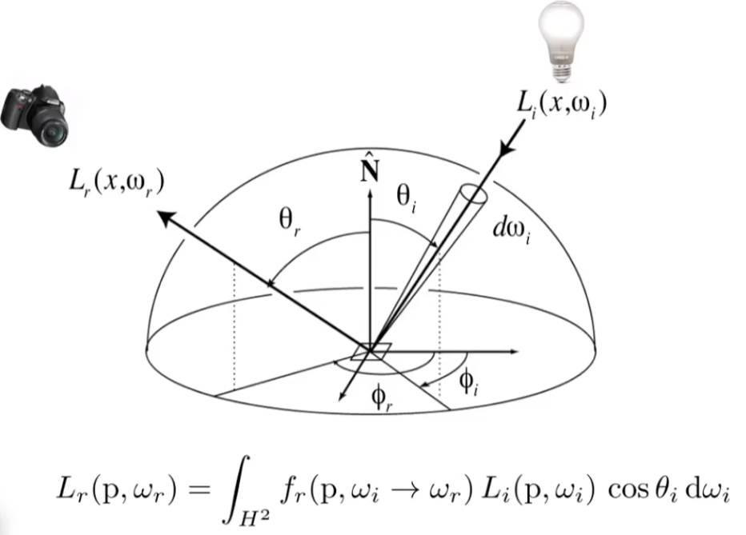

# 渲染方程

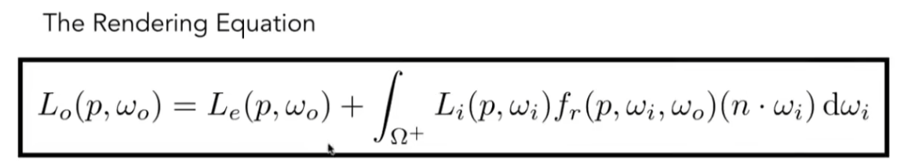

# 光照模型

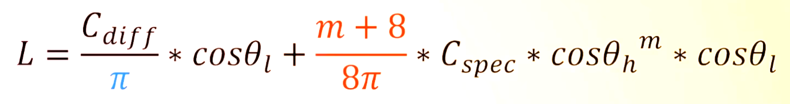

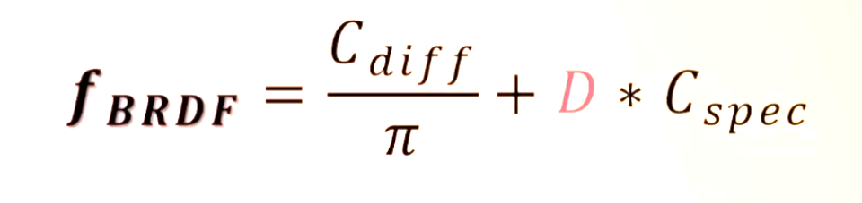

## D：NDF法线分布函数

## V：可见性函数

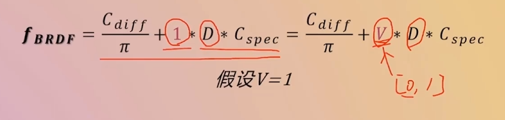

## F：菲涅尔项

高光存在反射和散射，强度不应该是常数

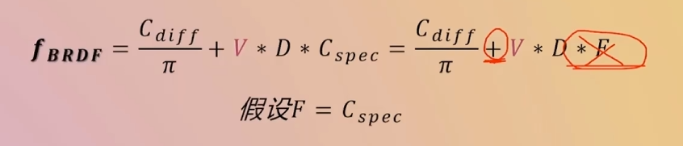

# 材质

## 金属

反射高，不存在次表面反射
