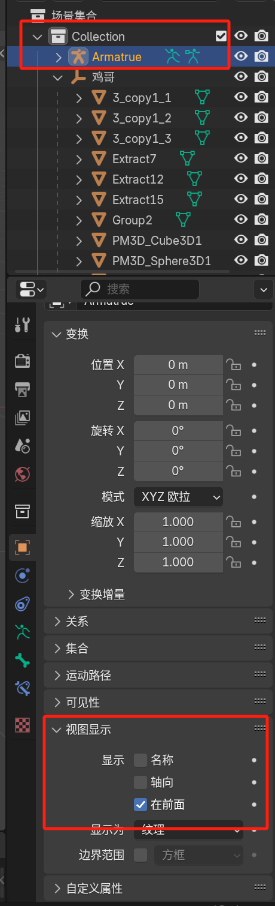
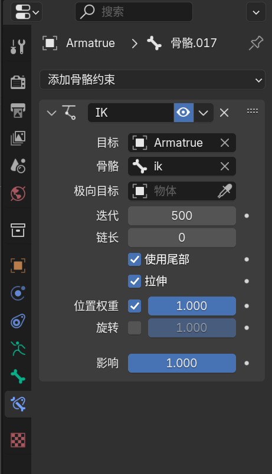
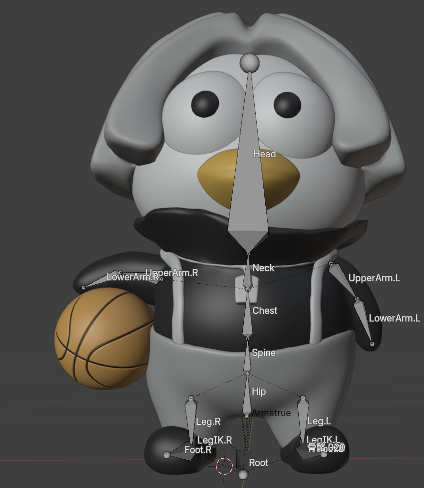
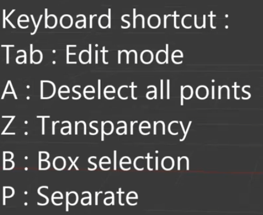

# blender

# 快捷键

## tab+ctrl 长按切换模式

## 骨骼

### alt+p 清空父级

### shift+n -- 查看轴向 重置扭转

### shift + a 创建骨骼

### ctrl + p 创建父级（保持偏移量）

​​

## 视图

### / 局部视图

# 骨骼

## 创建

## IK

## 对称

骨架 ==> 对称

对命名有要求

# 权重

# 分离顶点

