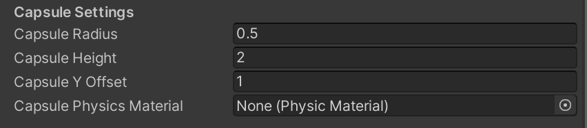

# Kinematic Character Controller

https://www.bilibili.com/opus/709479415803805717

# 核心脚本 KinematicCharacterMotor

控制一切物理行为

## 胶囊体设置

## MyPlayer

负责把输入发送到 MyCharacterController，建立MyCharacterController和Camera的联系

public ExampleCharacterCamera OrbitCamera; // Example camera can be changed to Cinemachine Camera  
public Transform CameraFollowPoint;  
public MyCharacterController Character;

## MyCharacterController : ICharacterController

CameraRotation是一个[四元数](Kinematic%20Character%20Controller/四元数.md)

inputs.CameraRotation * Vector3.forward获取相机旋转后的朝向，ProjectOnPlane投影到法向为Motor.CharacterUp的平面

Vector3 cameraPlanarDirection = Vector3.ProjectOnPlane(inputs.CameraRotation * Vector3.forward, Motor.CharacterUp).normalized;

### 角色旋转和移动 

UpdateRotation（在FixedUpdate被调用）

使用球面插值[Slerp](Kinematic%20Character%20Controller/Slerp.md)，只需要一个方向的单位向量

UpdateVelocity（在FixedUpdate被调用）

插值计算速度时用Lerp，需要保留速度大小

## [RootMotion](Kinematic%20Character%20Controller/RootMotion.md)

‍
