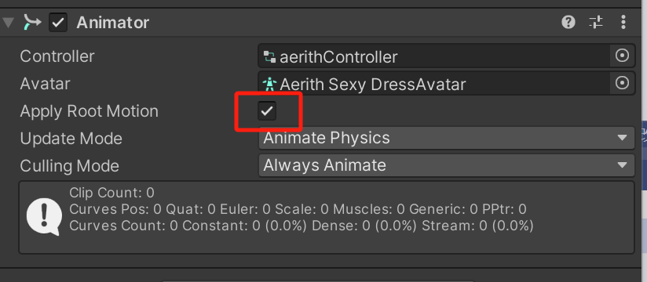
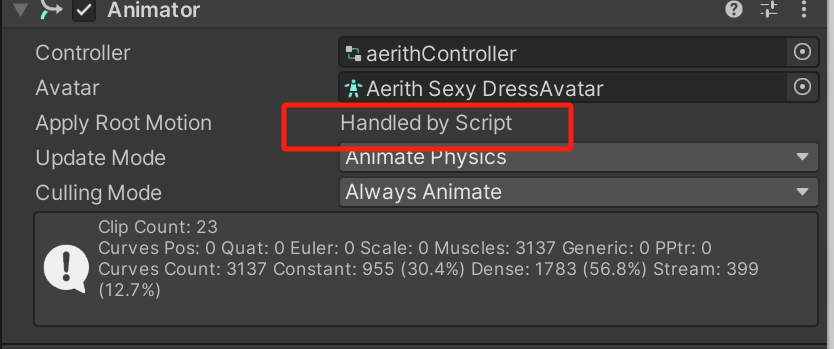
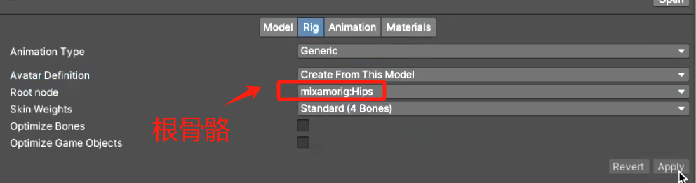
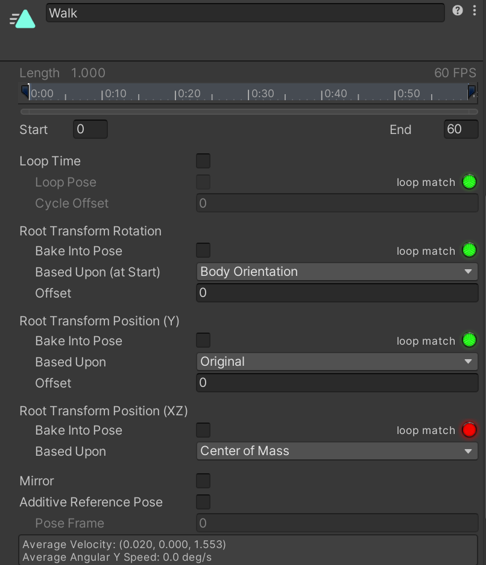
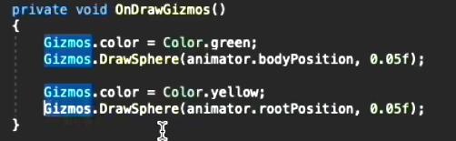
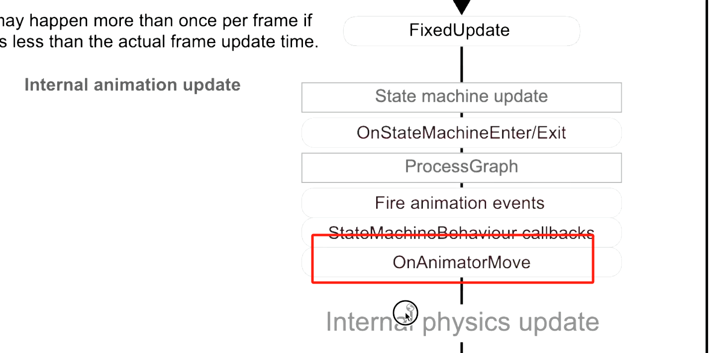

# RootMotion

- RootMotion会根据动画上一帧的相对位置和相对转角，获得一个变换矩阵，之后游戏对象的运动由矩阵获得
- 启用Animator的RootMotion，物体变换的控制权交给动画
- 
- 在开启RootMotion的对象上使用OnAnimatorMove，物体的移动会交由脚本控制
- 
- RootMotion在Generic动画中就是将根骨骼的运动应用到游戏对象上
- 
- Bake into pose是指将rootmotion当作骨骼动画处理，这部分的root motion就无法影响角色运动，绿色表示可以勾选
- 
- humanoid动画中会计算一个RootPosition表示根骨骼，rootMotion根据这个根骨骼影响到对象
- 

‍

## On AnimationMove的刷新时机

要注意在此时赋予角色速度会不会与物理引擎冲突

‍
