# re4

# Blender导出设置

# Avatar替身系统

## spine transform has bone length of zero 问题

检查模型骨骼是否有遮挡

## 创建avatar

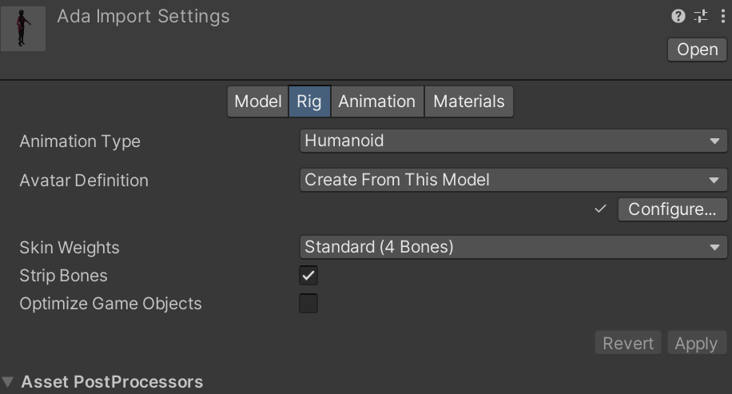

## 使用动画

# Animation Rigging

## 骨骼绘制

# ShaderGraph

# Magica Cloth

依赖：

com.unity.jobs

burst

## 目录结构

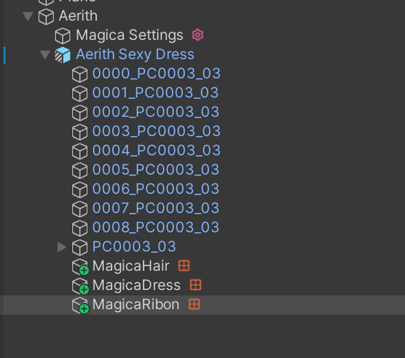

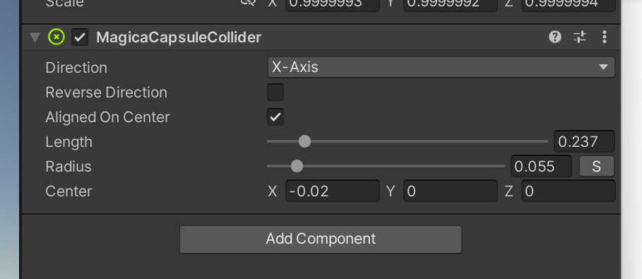

## 画笔修正

## 参数

### 主要参数

#### Root Rotation

根骨是否旋转，一般0.5

#### Animation Pose Ratio

自动蒙皮解算，一般0，消耗大

#### Rotation Interpolation

0.5

### 布料效果

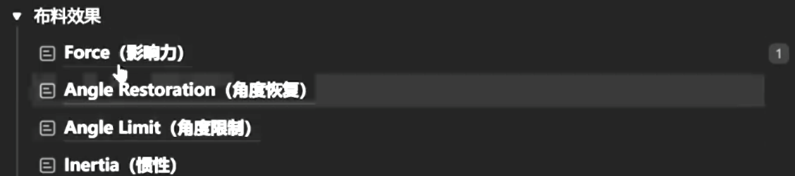

#### Force

damping（阻力）较小时显得布料比较重

StablizationTime 形变恢复时间

#### Angle Restoration

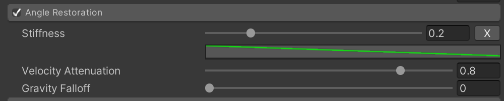

stiffness（刚性）越大布料越硬

Velocity Attenuation（速度衰减）越小越Q弹

Gravity Falloff能够使倒立的状态下维持布料形态，头发应该为1

#### Angle Limit

Limit Angle 限制晃动的角度

Stiffness 相当于限制的权重

#### Inertia 惯性

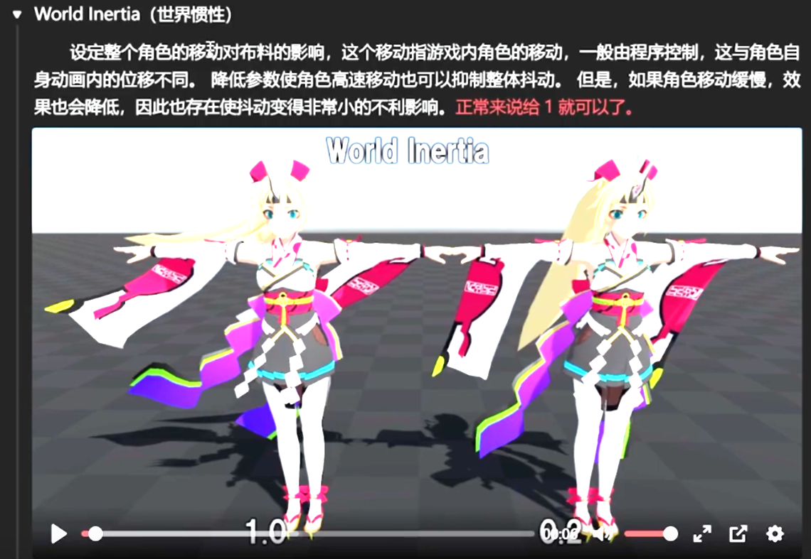

##### 惯性限制

防止速度太快导致布料异常

动画自身产生的惯性

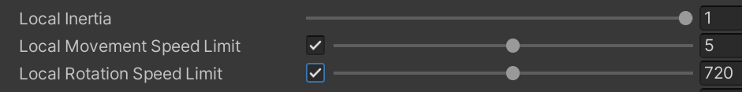

惯性随着深度发送变化，深度是指骨骼离根部的距离

离心力，旋转时布料能否甩起

限制每根骨骼的最大速度

##### 传送判断

一帧之内的判断条件，下面时传送后重置布料解算

### 布料穿插

Collider Collision设置

点模式和边模式

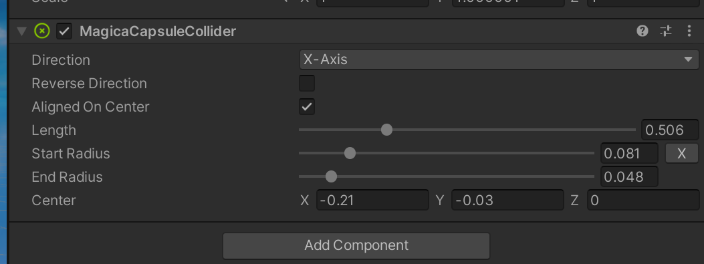

### 形状保持

添加碰撞体之后还需要设置形状保持

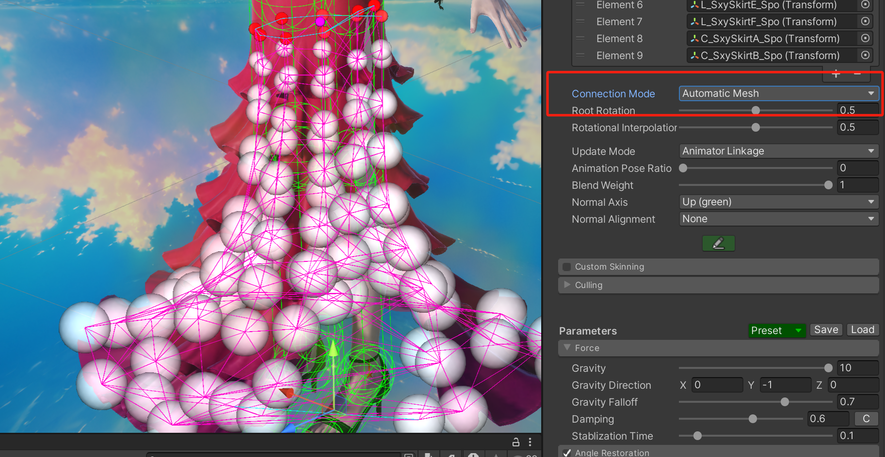

按顺序的一圈

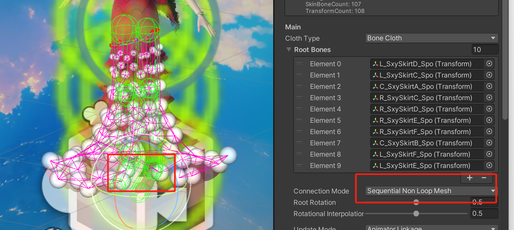

拖拽力，布料压缩程度，三角形变形程度

### Movement Limit

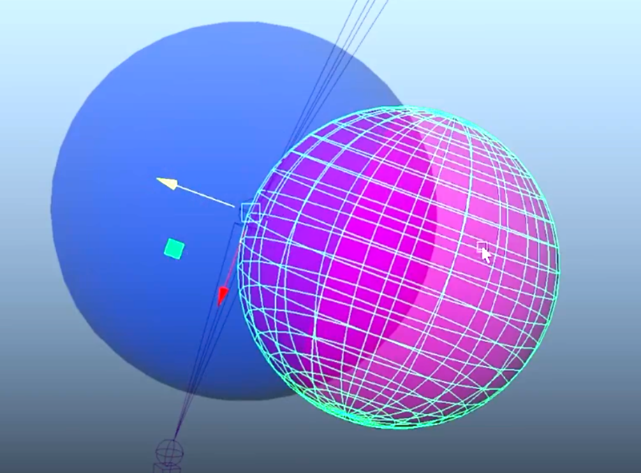

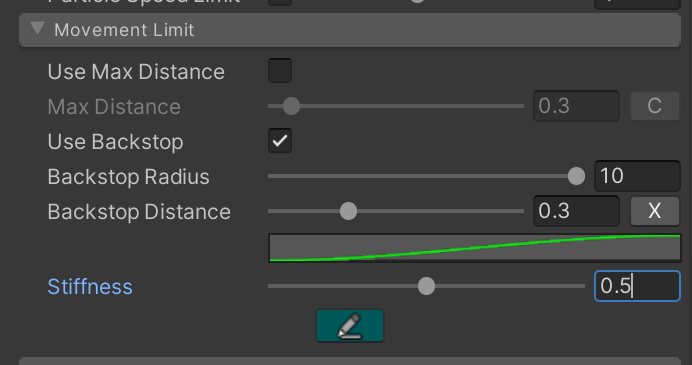

### 风力系统

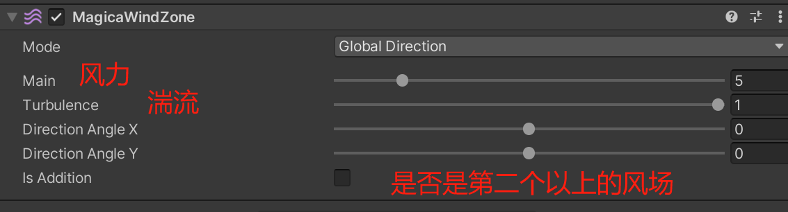

- 风力权重
- 风频
- 湍流权重
- 噪波混合正弦，0.7
- 一个magica cloth脚本骨骼之间的同步，越大越同步
- 深度权重，一般开一点

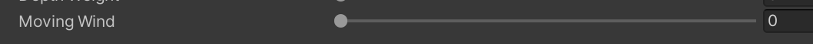

- 移动就有风 不需要风场 效果不再是直的

### 弹簧（breast）

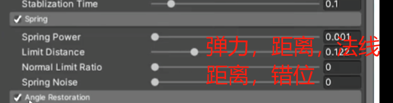

# 雨水效果

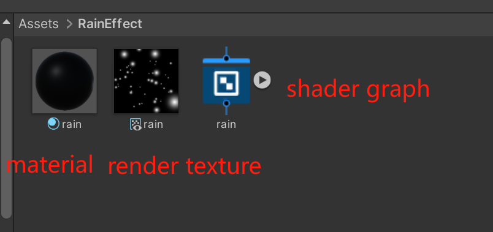

新建一个camera 使他看不到除了粒子系统之外的东西

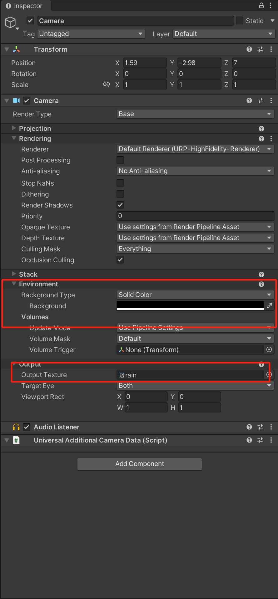

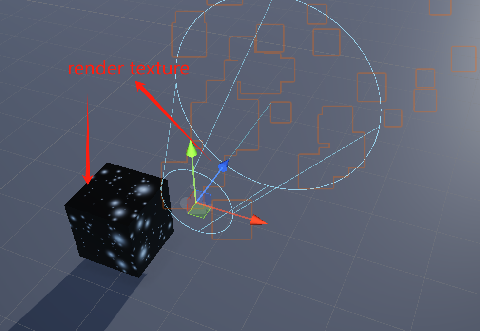

# 雨水效果2

## y轴偏移效果

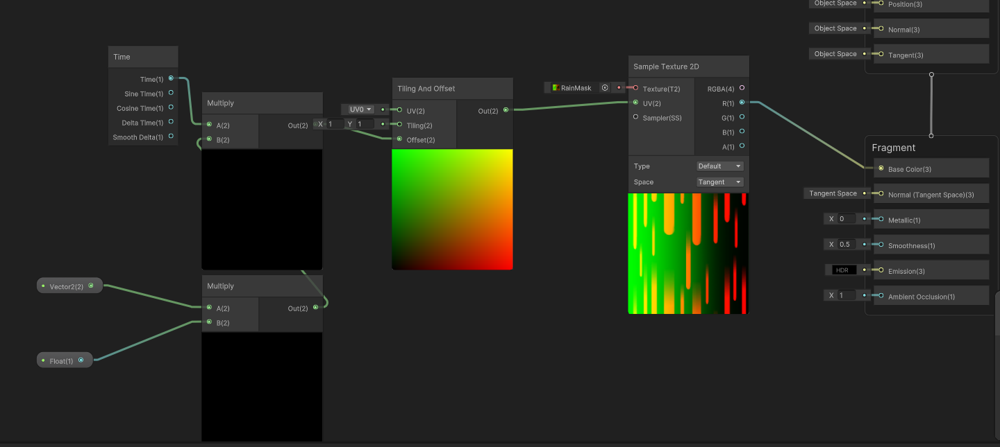

## 世界空间下的法线

## Saturate节点

限制取值在0-1

# 新的输入系统

#
