# 游戏设计中的设计模式

# 七大原则

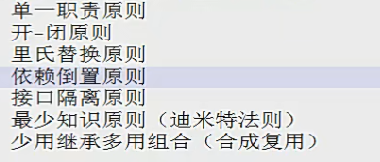

## 开闭原则

对修改关闭，对扩展开放

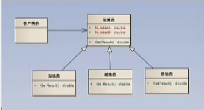

## 依赖倒转原则

高层模块不应该依赖底层模块，他们应该**依赖抽象**，抽象不应该依赖于抽象，抽象不应该依赖于细节，要针对接口编程，不要对实现编程

### 模块层级划分

a调用b，b调用c，a就是顶层

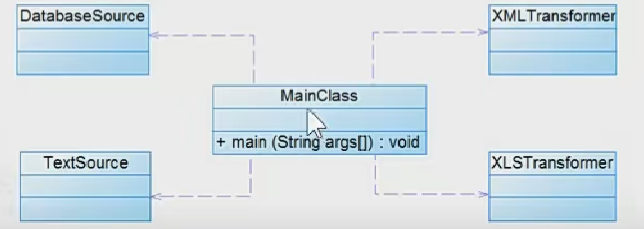

这里MainClass是高层

重构后

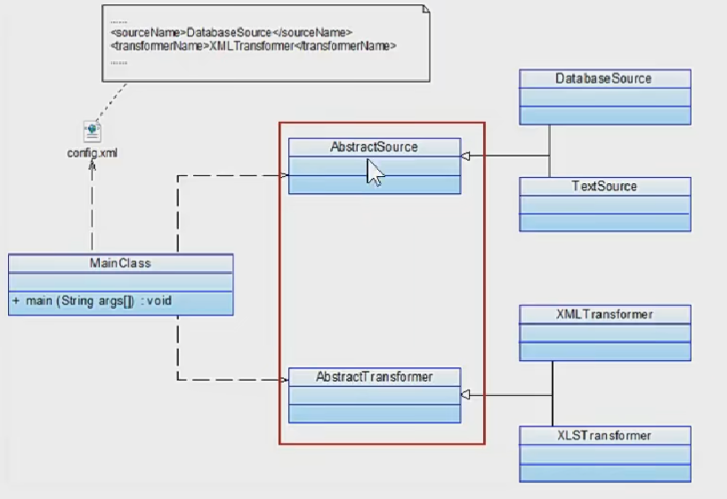

## 里氏替换原则

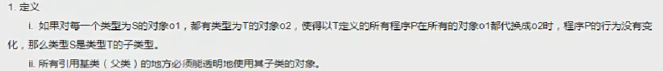

- 里氏替换原则是实现开闭原则的重要方式之一

不符合开闭原则，新增C要修改DataOperator

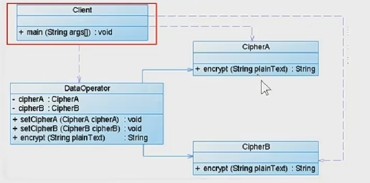

把A全替换成B不影响系统运行就是里氏替换

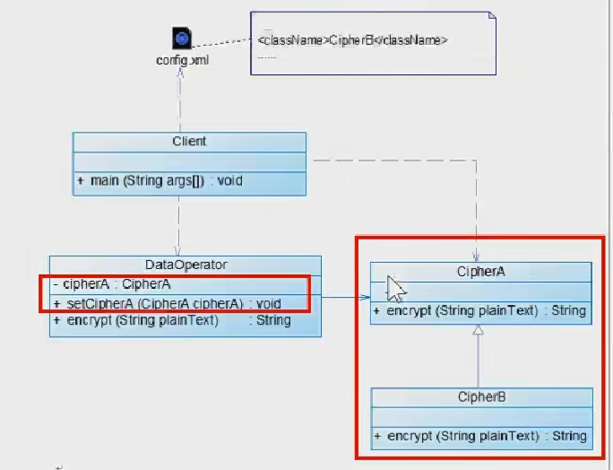

## 单一职责原则

就一个类而言，应该仅有一个引起它变化的原因

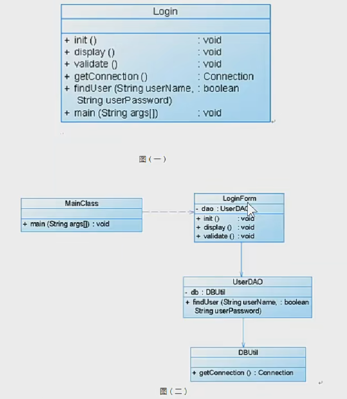

## 接口隔离原则

客户端不应该依赖那些不需要的接口

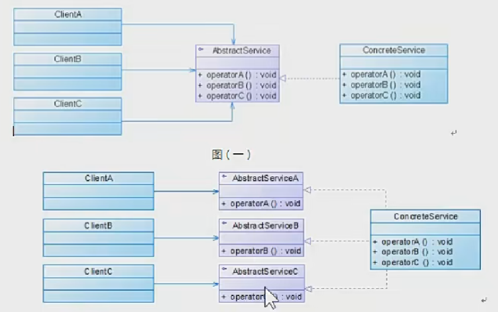

## 合成复用原则

多组合少继承

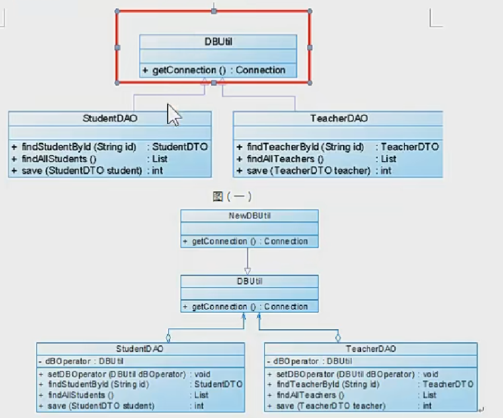

## 迪米特法则

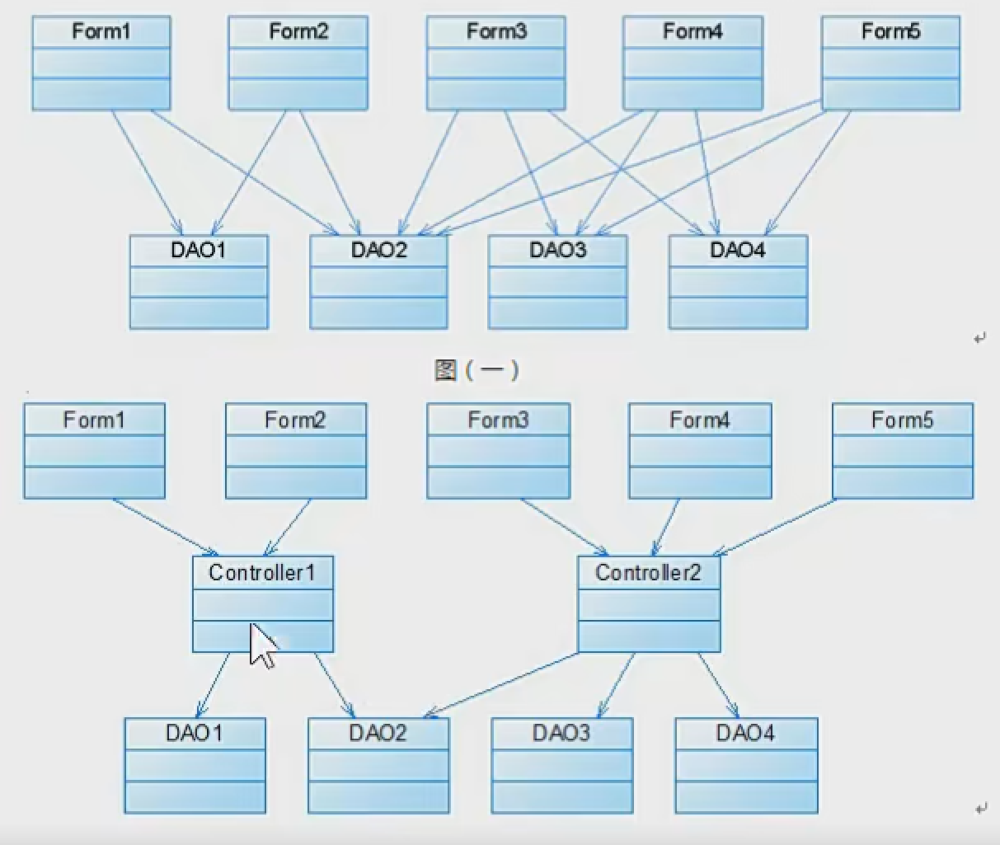

# 推荐书籍

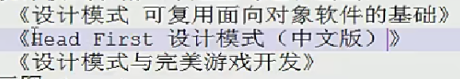
