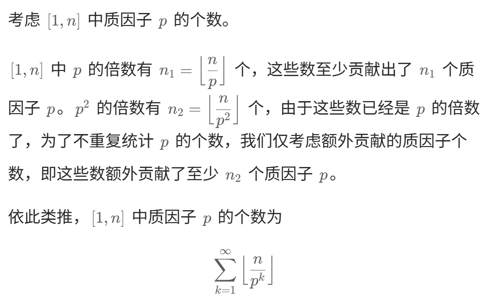
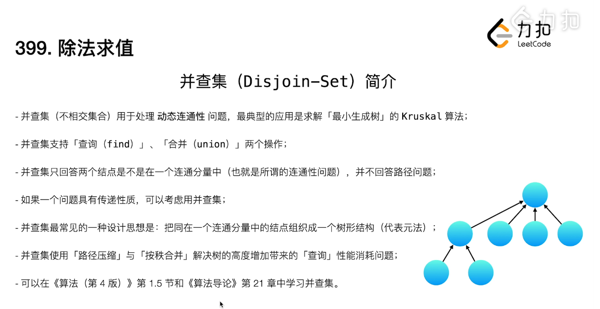
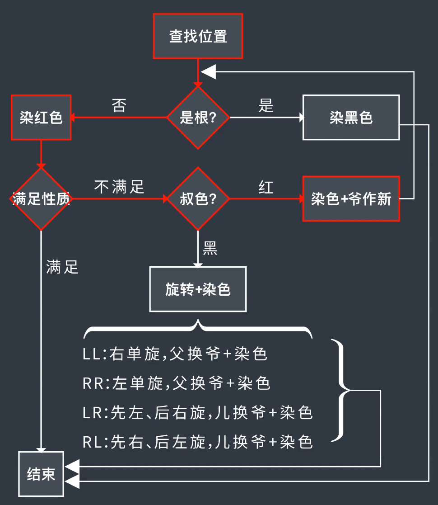

# 算法思想

# 回溯

## 模板

- 不管是for还是其他形式，path.push_back(s[i]); 这部分都代表回溯的当前层
- 而 backTracing(s,i+1);代表的是下一层

```c++
vector<string> res;
string path;

void backTracing(string &s,int startIndex)
{
	if(搜集到了路径)
	{
		res.push_back(path);
	}

	for(int i = startIndex;i<s.size();i++)
	{
		path.push_back(s[i]);
		backTracing(s,i+1);
		path.pop_back();
	}
}
```

## 例：

if中的push操作代表当前层能干的事情，即 ( 、) ，基于上一层而产生的所有组合

```c++
    void backTracing(int left,int right,int n)
    {
        if(path.size() == 2*n)
        {
            res.push_back(path);
        }
        if(left < n)
        {
            path.push_back('(');
            backTracing(left + 1,right,n);
            path.pop_back();
        }
        if(right < left)
        {
            path.push_back(')');
            backTracing(left,right  + 1,n);
            path.pop_back();
        }
    }
```

# 阶乘尾数

n 阶乘有多少个尾随零是由于他的质因子决定的，即2和5，选一个较少的数统计即5



# 并查集

只回答两个节点是否连通，并不回答如何连接



要注意执行find的同时会做路径压缩，即x直接指向xroot

```c++
    // 建立并查集
    class UnionFind {
    private:
        // 父节点
        vector<int> parent;
        // 指向父节点的权重
        vector<double> weight;
    
    public:
        // initialize
        // 初始化
        UnionFind(int n) : parent(n), weight(n, 1.0) {
            for (int i = 0; i < n; i++) {
                parent[i] = i;
            }
        }

        // 将 x 所在的子树连接到 y 所在的子树
        void unite(int x, int y, double value) {
            int rootX = find(x);
            int rootY = find(y);
            if (rootX == rootY)
                return;
            parent[rootX] = rootY;
            weight[rootX] = weight[y]*value/weight[x];
        }

        // find parent node 找父节点并压缩路径
        int find(int x) {
            if (x != parent[x]) {
                int origin = parent[x];
                parent[x] = find(parent[x]);
                weight[x] *= weight[origin];
            }
            return parent[x];
        }
		// x/y = (x/root) / (y/root) = weight[x] / weight[y]
        // compute the result 计算结果
        double isConnected(int x, int y) {
            int rootX = find(x);
            int rootY = find(y);
            if (rootX == rootY)
                return weight[x]/weight[y];
            else return -1.0;
        }
    };
```

## 不带权重版本

```c++
#include <numeric>
class UnionFind {
private:
    vector<int> parent;

public:
    UnionFind() {
        parent.resize(26);
		//  0, 1, 2, ..., n-1
        iota(parent.begin(), parent.end(), 0);
    }

    int find(int index) {
        if (index == parent[index]) {
            return index;
        }
        parent[index] = find(parent[index]);
        return parent[index];
    }

    void unite(int index1, int index2) {
        parent[find(index1)] = find(index2);
    }
};
```

# 红黑树

## 性质：

- 排序树
- 从根节点到所有叶子节点的路径，其黑色节点数量相同
- 不存在两个连续的红色节点
- 根节点和叶子节点（NIL节点）是黑色

## 插入规则：

染色是指叔父爷反色，爷作为新节点



# 图的表示

## 邻接表法

```c++
unordered_map<string, unordered_map<string, double>> graph；
```

### DFS

```c++
unordered_set<string> visited;

double dfs(const unordered_map<string, unordered_map<string, double>>& graph, 
              string cur, 
              string target) {
        // 找到目标节点，返回1.0（与上层的权重相乘）
        if (cur == target) {
            return 1.0;
        }
        
        // 标记当前节点为已访问
        visited.insert(cur);
        
        // 遍历所有邻居
        auto it = graph.find(cur);
        double subRes = -1;
        if (it != graph.end()) {
            for (const auto& edge : it->second) {
                string next = edge.first;
                double weight = edge.second;
                
                // 只访问未去过的节点
                if (!visited.count(next)) {
                    double res = dfs(graph, next, target);
                    if (res != -1.0) {
                        subRes = res * weight;
                        break;
                    }
                }
            }
        }
        
        // 回溯：清除当前节点的访问标记
        visited.erase(cur);
        return subRes;
}
```
