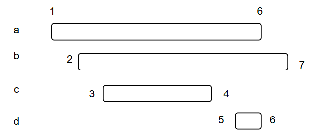

# 题目笔记

# 1、二分查找 [a,b)

左开右闭的原因应该是下下取整

```cpp
class Solution {
public:
    int search(vector<int>& nums, int target) {
        int left = 0;
        int right = nums.size(); // 定义target在左闭右开的区间里，即：[left, right)
        while (left < right) { // 因为left == right的时候，在[left, right)是无效的空间，所以使用 <
            int middle = left + ((right - left) >> 1);
            if (nums[middle] > target) {
                right = middle; // target 在左区间，在[left, middle)中
            } else if (nums[middle] < target) {
                left = middle + 1; // target 在右区间，在[middle + 1, right)中
            } else { // nums[middle] == target
                return middle; // 数组中找到目标值，直接返回下标
            }
        }
        // 未找到目标值
        return -1;
    }
};
```

# 2、滑动窗口代码模板

```c++
//最长模板
初始化 left，right，result，bestResult
while("右指针没有到结尾"){
    窗口扩大，加入right对应元素，更新当前result
    while("result不满足要求"){
        窗口缩小，移除left对应元素，left右移
    }
    更新最优结果bestResult
    right++;
}
返回bestResult
//最短模板
初始化 left，right，result，bestResult
while("右指针没有到结尾"){
    窗口扩大，加入right对应元素，更新当前result
    while("result满足要求"){
        更新最优结果bestResult
        窗口缩小，移除left对应元素，left右移
    }
    right++;
}

```

# 3、螺旋矩阵

圈数是矩阵中心到边的距离（n/2）

坚持循环不变量原则

# 4、哈希表

优先使用

std::unordered_map：底层是哈希表实现的

# 5、用最少的数量引爆气球

关键点：最小右边距，决定了最多的交集

# 6、无重叠区间

删除顺序是b、a，迭代过程中优先保留最小右边距



‍
