# 辐射度量学

# Power

## Radiant energy

## Radiant flux（power）

功率，单位事件释放的能量

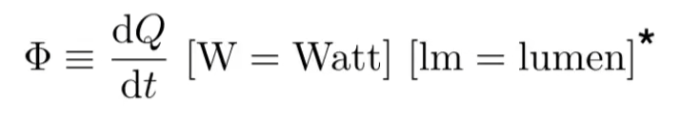

# 光线度量的定义

## 

## 发光强度Radiant Intensity——单位立体角上辐射的power

### 立体角的定义

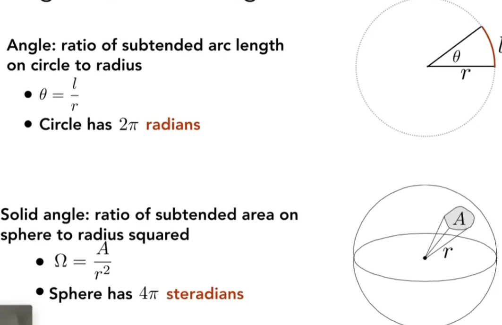

$\omega$  可以作为方向向量

#### 单位（微分）立体角 $d\omega$

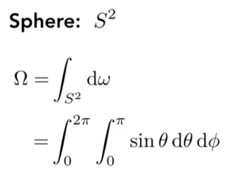

### 均匀的I

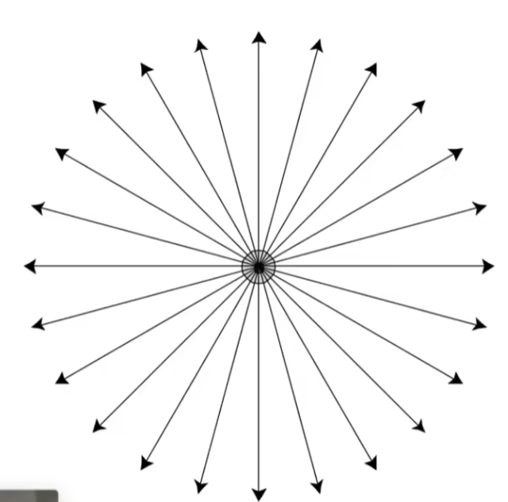

$$
\Phi =  I \int_{S^2}d{\omega}
$$

$$
I = \frac \Phi {4 \pi}
$$

## 辉度Irradiance——单位面积上接收 的power（来自各个方向）

均匀分布情况下$E(x) = \frac  \Phi A$

### 与能量衰减的联系 irradiance 在衰减

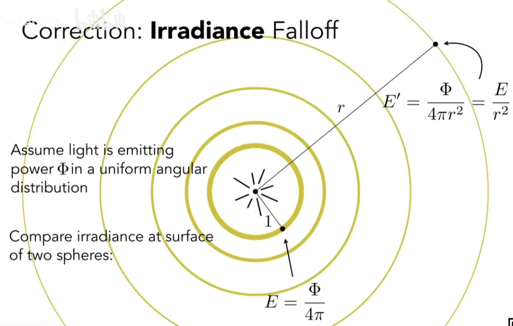

### 与Lambert’s Cosine Law的联系

## 光亮度Radiance

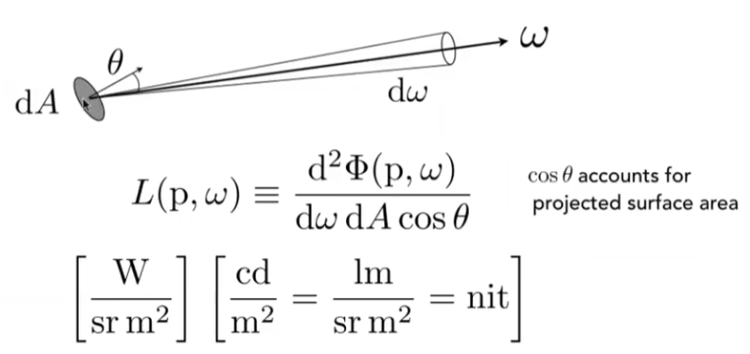

### 两种解释

#### Exiting Radiance

单位面积的Intensity

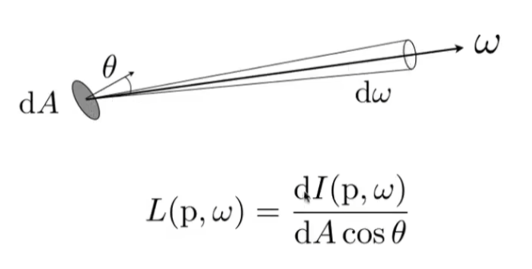

#### Incident Radiance

dA在某方向上收到的Irradiance

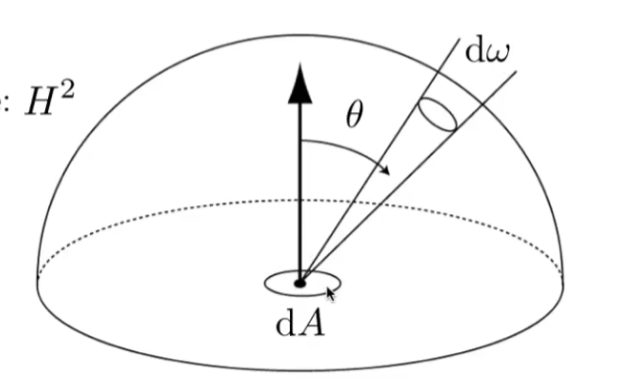

# BRDF的定义

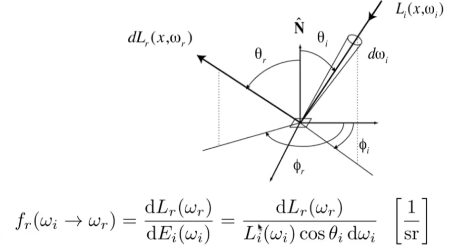

# 渲染方程

# 光照模型

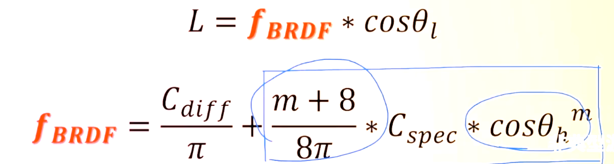

## D：NDF法线分布函数

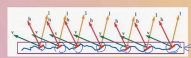

## V：可见性函数

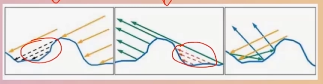

## F：菲涅尔项

高光存在反射和散射，强度不应该是常数

# 材质

## 金属

反射高，不存在次表面反射
